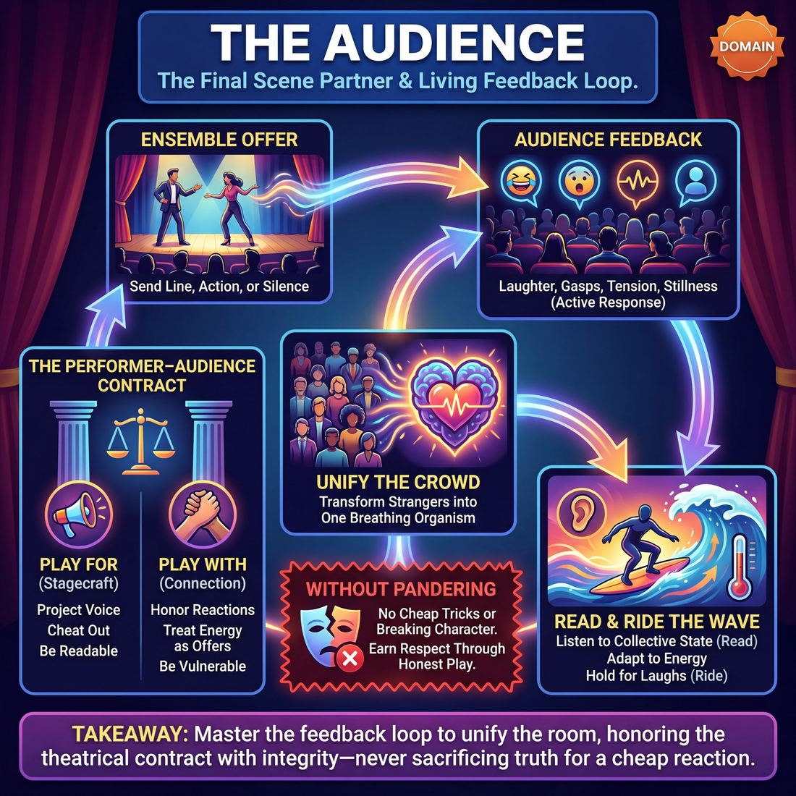

# 🎭 The Audience

> *Honor the performer–audience contract; read, ride, and unify the room — without pandering.*

{ .infographic }

## 🎭 The arena

The fifth and final domain of improvisation is the ultimate crucible of performance: **The Audience**. If the previous domains (Self, Partner, Scene, Ensemble) are about building the engine of a show, this domain is about driving that vehicle in front of a crowd. It governs the relationship between the improvisers on the stage and the people sitting in the dark. This is the arena where private play becomes public art. It marks the shift from simply executing technique in a rehearsal room to actively performing—projecting choices, managing energy, and honoring the theatrical contract that makes live theater possible.

In this domain, the audience is never treated as a passive receptacle or an adversary to be conquered. Instead, they are the final, macro-level scene partner. The relationship governed here is a continuous, living feedback loop. The ensemble sends out an offer—a line, a physical choice, a moment of silence—and the audience responds with laughter, gasps, tension, or stillness. Mastering this arena means learning to read that collective response, ride its waves, and unify a room full of strangers into a single, breathing organism, all without ever compromising the truth of the scene to pander for a cheap reaction.

!!! abstract "The Core Relationship"
    This domain governs the **performer–audience contract**. It is the delicate balance of playing *for* the audience (ensuring they can see, hear, and understand the work) while playing *with* the audience (treating their energy, attention, and reactions as active offers in the show).

## 🧭 The goal

The ultimate objective in this domain is to **honor the performer–audience contract; read, ride, and unify the room — without pandering.**

Improv is not a private exercise performed in a vacuum; it is a live theatrical event. Until the audience arrives, a show is just a rehearsal. The goal here is to bridge the gap between the stage and the seats, treating the crowd not as a passive monolith to be entertained, but as an active, breathing participant in the show's ecosystem. 

To achieve this, improvisers must actively pursue three relational targets:

*   **Reading the room:** Constantly taking the temperature of the crowd. Are they leaning in? Are they confused by the staging? Are they restless? The goal is to develop a real-time, ego-free awareness of the audience's collective state.
*   **Riding the energy:** Adapting to the feedback the room provides. This means holding for laughs so the audience can fully enjoy a moment without missing the next line, pushing through lulls with decisive action, and letting the crowd's energy fuel the ensemble's momentum.
*   **Unifying the crowd:** The highest expression of this goal. A masterful show transforms a dark room full of disconnected strangers into a single organism that gasps, laughs, and falls silent at the exact same moments.

!!! abstract "The Performer–Audience Contract"
    This unspoken agreement is the foundation of live theater. The audience agrees to suspend their disbelief, offer their attention, and forgive the lack of sets or scripts. In return, the improvisers agree to be visible, vulnerable, and clear—projecting their voices, staging their scenes so they can be seen, and committing fully to the reality they are building.

Crucially, this connection must be forged **without pandering**. It is incredibly easy to make a crowd laugh by breaking character, making cheap shock-value jokes, or throwing a scene partner under the bus. But pandering violates the contract; it tells the audience that the world you are building doesn't actually matter. 

!!! warning "The Pandering Trap"
    **Pandering** is begging for the audience's approval rather than earning their respect. The goal of this domain is to thrill the audience by playing at the top of your intelligence and staying fiercely true to the reality of the scene, trusting that honest, committed play is the most entertaining choice you can make.

## 💎 Its principles — the Why

When we step onto the stage, the improvisation ceases to be a private exercise and becomes a public offering. The principles of this domain govern how we manage that transition. They ask us to treat the crowd not as passive consumers, but as active participants in a shared theatrical event. 

### The Audience Is the Final Scene Partner
Improv is a continuous feedback loop. The audience provides the initial suggestion, but their contribution doesn't end there. Their laughter, sudden gasps, and heavy silences are all offers. Treating the audience as your final scene partner means you do not perform *at* them; you perform *with* them.

*   **What it asks of you:** You must "listen" to the room's energy just as intently as you listen to your ensemble's dialogue. If the audience erupts, you must pause and ride the wave rather than talking over the laugh. If they lean in, you must feel that tension and honor it. 

!!! tip "On stage: Reading the silence"
    Not all silence is bad. **Dead silence** (accompanied by coughing, shifting in seats, or looking away) means the audience is confused or bored; you need to clarify the base reality or raise the stakes. **Rapt silence** (stillness, leaning forward) means they are deeply invested in the emotional truth of the moment. Never rush to break rapt silence with a joke.

### Play for the Back Row
This is the principle of theatrical generosity. The most brilliant, nuanced scene in the world is worthless if the people who paid for tickets in the last row cannot see or hear it. 

*   **What it asks of you:** It demands fundamental stagecraft. You must project your voice from your diaphragm, **cheat out** (angle your body so your face remains visible to the house even when talking to a partner), and make physical choices that are distinct and readable from fifty feet away. 

!!! warning "Watch out: The 'TV Acting' trap"
    Improvisers who consume a lot of film and television often default to "camera acting"—mumbling, whispering, or relying on micro-expressions. On an improv stage, this shrinks the world and excludes the audience. Your choices must be theatrical enough to reach the back wall.

### Truth Over Pandering
The audience wants to laugh, and the immediate dopamine hit of giving them a laugh is intoxicating. But chasing cheap reactions at the expense of the scene's reality ultimately breaks the performer–audience contract. When you pander, you signal to the audience that the world you are building is disposable.

*   **What it asks of you:** Discipline and trust. It requires you to trust that playing the grounded reality of the scene will ultimately yield a richer, more satisfying reaction than a desperate gag. 

!!! example "In a scene: Pandering vs. Truth"
    You are playing a 19th-century blacksmith. Your partner accidentally drops an invisible horseshoe. 
    
    *   **Pandering:** You break character, look directly at the audience, and say, "Oops, looks like someone needs an Apple Watch to track their clumsiness!" (You get a cheap chuckle, but the reality of the scene is destroyed).
    *   **Truth:** You stare at the dropped shoe, wipe the sweat from your brow, and say, "Ezekiel, if you ruin one more piece of iron, the Sheriff will have our hands." (You build the stakes, maintain the world, and earn a deeper investment from the room).

## 🧠 Its skills & techniques — the What & How

Mastering the audience domain requires shifting your mindset from "performing *at* a dark room" to "conversing *with* a living organism." The craft at this layer is highly mechanical but yields deeply emotional results. It breaks down into three core skill sets: making yourself understood, taking in the room's data, and actively steering the collective energy.

### 1. Stage Presence & Clarity
Before you can manipulate the room's energy, the audience must be able to effortlessly see, hear, and understand you. If they have to work to decode your physical or vocal choices, they cannot relax into the show.

*   **Cheating Out:** The mechanical act of angling your body and face toward the audience, even when addressing a scene partner. It ensures the crowd catches your micro-expressions.
*   **Vocal Projection & Articulation:** Speaking from the diaphragm to reach the back row without screaming. It also means enunciating clearly, especially during fast-paced or highly emotional scenes.
*   **Owning the Space:** Moving with intention. Novices often shuffle or shift their weight nervously; masters plant their feet, claim their physical territory, and make deliberate crosses.
*   **Directing Focus:** Using stage pictures, levels (standing vs. sitting), and stillness to tell the audience exactly where to look at any given moment.

!!! example "In a scene"
    Two improvisers are arguing in a car. If they face each other directly (in profile to the audience), the crowd loses their facial reactions. By **cheating out**—staring straight ahead through an imaginary windshield while arguing—the audience sees every eye roll and clenched jaw, instantly amplifying the comedy.

### 2. Room Reading
This is the intake valve of the domain. It is the ability to sense the specific temperature, demographic, and mood of the crowd in real-time, without letting that data make you panic.

*   **Listening to the Silence:** You must learn to distinguish between the restless, coughing silence of a bored crowd and the pin-drop, leaning-in silence of a captivated one.
*   **Gauging the Laughs:** Are the laughs polite, nervous, or deep belly laughs? The quality of the laughter tells you what the audience is craving.
*   **Sensing the Demographic:** A rowdy midnight college crowd requires a different pacing and energy than a quiet Sunday matinee. You don't change your core truth, but you adjust your delivery vehicle.

!!! note "Adjusting vs. Pandering"
    **Room reading** is noticing the audience is quiet and deciding to slow down and ground the scene to pull them in. **Pandering** is noticing the audience is quiet and desperately throwing in a cheap pop-culture reference or vulgarity just to get a reaction.

### 3. Audience-Energy Management
Once you can read the room, you must learn to drive it. This is the output valve—how you actively shape the audience's experience and unify the room.

*   **Holding for Laughs:** The critical technique of pausing your dialogue when the audience laughs. If you speak while they are laughing, they will miss the next line, and worse, they will train themselves to stop laughing so they don't miss the plot.
*   **Surfing the Wave:** Knowing when to let a laugh peak and exactly when to deliver the next line to keep the momentum rolling. 
*   **Breaking the Fourth Wall:** Deliberately dropping the proscenium to address the audience directly. When used as a specific, surgical lever, it can instantly endear a character to the crowd or reset the energy of a flagging show.

!!! warning "Watch out: Stepping on the laugh"
    The most common mechanical error in this domain is **talking over the laugh**. When a player delivers a great punchline, gets a massive reaction, and immediately starts their next sentence, they kill the momentum. The audience feels punished for enjoying the show. Plant your feet, stay in character, and let them laugh.

## 🪧 Engines, distinctions & scoping

The core engine driving this domain is the **Live Feedback Loop**. Unlike film or scripted theater, an improv audience is watching the *process* of creation, not just the final product. They are acutely aware that what is happening has never happened before and will never happen again. This shared vulnerability creates a real-time energetic exchange: the audience’s reactions feed the performers, whose adjusted play then feeds the audience. 

When this engine is running smoothly, the audience ceases to be a collection of individuals and becomes a single, unified organism breathing with the ensemble. To navigate this domain effectively, improvisers must internalize several critical distinctions and understand the scope of their responsibility to the house.

### Critical Distinctions

**1. Truth vs. Pandering**
The most vital distinction in this domain is the line between entertaining the audience and begging for their approval. 
*   **Truth** means trusting that honest, grounded reactions and committed character choices will earn deep, sustained engagement. The humor arises organically from the reality of the scene.
*   **Pandering** means sacrificing the reality of the scene for a cheap, immediate reaction. It is a breach of trust.

| The Approach | What it looks like | The Audience's Experience |
| :--- | :--- | :--- |
| **Playing the Truth** | Reacting honestly to a bizarre initiation; maintaining the stakes of the scene. | "I can't believe they are treating this absurd situation so seriously. This is hilarious." |
| **Pandering** | Mugging for the crowd; shoehorning in a local sports reference; breaking character to laugh. | "They want me to laugh at this. It's funny for a second, but I don't care what happens next." |

!!! warning "Watch out: The 'Bail Out' Laugh"
    When a scene feels difficult or confusing, improvisers often panic and make a meta-joke about how bad the scene is. This gets an immediate laugh of relief from the audience, but it destroys the scene's reality and signals to the crowd that the performers are no longer in control. 

**2. The Proscenium vs. The Shared Room**
Improvisers must distinguish between playing *behind* the **fourth wall** (the imaginary barrier between the stage and the house) and playing *with* the room. 
*   **The Proscenium:** The audience acts as voyeurs watching a self-contained world. The performers project and cheat out, but they do not acknowledge the crowd.
*   **The Shared Room:** The performers break the fourth wall, using direct address or acknowledging a real-world event (like a siren outside or a dropped glass in the front row). Mastery lies in knowing *when* to use which mode, rather than blurring them accidentally.

### Scoping the Domain

The Audience domain encompasses both the **physical reality** of the theater and the **psychological reality** of the crowd. 

*   **Physical Scope:** This includes stagecraft. It is the improviser's responsibility to ensure the back row can hear the dialogue, the sightlines are clear, the stage picture is balanced, and the physical actions read clearly from fifty feet away. 
*   **Psychological Scope:** This includes the performer-audience contract. It begins the moment the lights go down and ends at the curtain call. It involves managing the crowd's energy—knowing when they need a high-energy palate cleanser, when they are ready for a slow, patient scene, and when to pause and let them finish laughing before delivering the next line.

!!! abstract "Key Idea: The Final Variable"
    You can master yourself, your partner, the scene, and the ensemble in a rehearsal room. But the Audience domain can only be scoped and practiced under the lights. They are the final, unpredictable variable that completes the theatrical circuit.

## 📈 The journey across this domain

The journey through the Audience domain is a profound shift in relationship. It moves from viewing the crowd as a terrifying judge, to treating them as a demanding customer, and finally embracing them as an essential, breathing scene partner. 

Early on, improvisers are overwhelmed by the sheer presence of the crowd. As they grow, they learn the mechanical skills of stagecraft—projection, positioning, and pausing. At the highest levels of mastery, the improviser transcends mechanics to actually *conduct* the room, turning a disparate group of ticket-buyers into a single, unified organism.

Here is how that progression unfolds across the core skills of this domain:

| Stage | **Room Reading** | **Audience-Energy Management** | **Stage Presence & Clarity** |
|---|---|---|---|
| **1 Novice** | Tries to gauge the room but panics or panders under pressure | Talks over laughs, killing momentum | Remembers to cheat out, then turns away under load |
| **2 Adv. Beginner** | Notices when the room is "with" them | Pauses for laughs mechanically; tries direct address on cue | Cheats out and projects when reminded |
| **3 Competent** | Reads the room's general temperature | Rides a laugh then re-engages; chooses *when* to break the 4th wall | Choices read clearly to the back row |
| **4 Proficient** | Adjusts tone to the specific crowd without pandering | Surfs energy waves to build a set; uses direct address as a deliberate lever | Commanding, generous presence |
| **5 Master** | **Unifies the room** — converts a fragmented audience into one organism breathing together (observable: synchronized collective laughter/gasp timing) | Conducts audience energy like an instrument; knows precisely when to include vs. play behind the proscenium | Owns the space effortlessly and honestly |

### The phases of growth

**1. Survival and Mechanics (Novice to Advanced Beginner)**
In the beginning, the audience is a source of cognitive load. A novice might remember to cheat out, but the moment the scene gets complicated, they turn their back. When the audience *does* laugh, the novice often panics and "steps on the laugh"—talking right through the noise and killing the momentum. Growth here is about building the muscle memory to project your voice and hold your ground when the room reacts.

!!! warning "The Pandering Trap"
    A common developmental hurdle in the early stages is using pandering as a crutch. When a novice feels the scene failing, they sacrifice truth for a cheap, immediate laugh to relieve the tension. While it feels like a win in the moment, it prevents the improviser from advancing to deeper, more resonant play.

**2. Awareness and Riding (Competent to Proficient)**
As panic subsides, the improviser develops a "split awareness." They are fully invested in their scene partner, but they can also feel the temperature of the room. They learn to **ride the laugh**: holding their physical intention, letting the audience's laughter peak, and delivering the next line at the exact moment the room is ready to hear it. Their physical choices become sharp enough to be read clearly by the back row.

**3. Unification and Conducting (Master)**
The master improviser does not just react to the room; they play it like an instrument. They know exactly when to invite the audience in (breaking the fourth wall, direct address) and when to seal the scene off behind the proscenium to draw the audience forward in their seats. 

!!! abstract "The Ultimate Shift: Unifying the Room"
    The hallmark of a Stage 5 Master is **unification**. They take a room full of strangers who arrived with different moods, distractions, and energies, and forge them into a single entity. You can observe this physically: the audience stops chuckling individually and begins to gasp, hold their breath, and erupt in synchronized, collective timing. The performance shifts from happening *in front of* the audience to happening *with* them.

## 🧩 How it connects to the other domains

The Audience is the outermost ring of the improviser’s awareness. In the progression of the five domains (**Self → Partner → Scene → Ensemble → Audience**), it is the final container that holds all the others. 

You cannot successfully leapfrog to the Audience layer without the structural support of the inner rings. When improvisers try to bypass their partner or the scene to interact directly with the crowd, the result is usually cheap pandering or "mugging." True performance mastery requires letting the inner domains do the heavy lifting.

!!! abstract "The Concentric Circles of Trust"
    Think of the domains as a sound system. **Self** is the power source, **Partner** is the instrument, **Scene** is the amplifier, and **Ensemble** is the mixing board. **The Audience** is the acoustic space where the music finally lands. If the power is weak or the instrument is out of tune, no amount of mixing will make it sound good to the room.

Here is how the Audience domain relies upon—and feeds back into—the inner layers:

*   **From Self:** The audience is highly empathetic. If your **Self** is panicked, tense, or judging your own choices, the audience feels a sympathetic anxiety and pulls back. When you are grounded and confident, the audience relaxes, trusting that they are in safe hands. In return, the audience's laughter and gasps feed your Self with energy and validation.
*   **From Partner:** The audience is a room full of willing voyeurs. They rarely want you to perform *at* them; they want the thrill of watching you be genuinely affected *by* your **Partner**. When the connection between two improvisers is electric and authentic, the audience leans in. 
*   **From Scene:** The audience needs the foundational reality of the **Scene** (the *Who, What, Where*) to anchor their imagination. If the scene's base reality is muddy, the audience spends their cognitive energy trying to solve the puzzle of what is happening, rather than enjoying the emotional stakes or the comedic game. Clear scenes allow the audience to stop thinking and start feeling.
*   **From Ensemble:** While two partners can win a laugh, it is the **Ensemble** that manages the macro-pacing, variety, and thematic callbacks of an entire show. A unified ensemble signals to the audience that the show has a deliberate shape. When the ensemble moves as one, the audience surrenders to the collective experience.

!!! warning "Watch out: The 'Look at Me' Trap"
    A common trap for Adv. Beginners is abandoning the **Partner** and **Scene** domains the moment the audience laughs. They turn out front, break the reality of the scene, and start playing directly to the crowd for more validation. This trades long-term investment for a short-term spike in energy, ultimately deflating the show.

## 🎓 How to train this domain

Training the Audience domain presents a unique paradox: you are usually rehearsing without one. To build these muscles, you must artificially inject audience dynamics, spatial awareness, and performance pressure into your practice space. 

Here are practical ways to train your ensemble to play *with* the room rather than just *in* it.

**1. The Surrogate Audience**
The most accessible tool you have is the rest of your team. In rehearsal, the players not in the scene (the backline) must act as a hyper-responsive audience. 
*   **How to do it:** Instruct the backline to laugh out loud, gasp, or groan at the scene work. 
*   **The goal:** This teaches performers to hear reactions, hold for laughs, and feel the rhythm of a live room without losing their grounding in the scene.

!!! warning "Watch out: The Silent Rehearsal Room"
    Improvisers often watch rehearsals with quiet, analytical "director brains." If your rehearsal room is dead silent, performers will unconsciously train themselves to rush through moments, talk over potential laughs, and play in a vacuum. Demand audible reactions from the sidelines.

**2. The "Hold for the Laugh" Drill**
Novices often panic when a laugh hits, either freezing awkwardly or talking right over it, killing the momentum. This drill builds the muscle memory of **riding the wave** (suspending the scene's action while the audience reacts, then seamlessly resuming).
*   **How to do it:** Two players do a scene. The coach holds a physical sign that says "LAUGH" (or rings a bell). When the cue happens, the players must freeze their dialogue but *maintain their physical and emotional energy*. When the cue is lowered, they pick up exactly where they left off. 

**3. The Back Row Check**
To train **Stage Presence & Clarity**, you must break the habit of playing intimately to a partner while ignoring the architecture of the theater.
*   **How to do it:** Have the coach or a teammate stand at the absolute furthest point in the rehearsal room (or better, an actual theater). As the scene plays, the "Back Row Director" raises their hand anytime they cannot hear the dialogue, see the emotion on a face, or understand the physical silhouette. 
*   **The goal:** Performers learn to cheat out (angling their bodies slightly toward the house so their faces are visible) and project their voices from the diaphragm without shouting.

!!! tip "On stage: The 'Confessional' Exercise"
    To practice **Audience-Energy Management** and breaking the fourth wall, run scenes where a bell is periodically rung. On the bell, the speaking character must turn directly to the audience, deliver their unfiltered inner monologue for two sentences, and snap back into the scene on a second bell. It trains the mechanical shift between intimate scene-work and direct audience connection.

**4. The Ultimate Crucible: Stage Time**
While drills build the mechanics, **Room Reading** can only be mastered in front of strangers. A Tuesday night open mic with eight tired people requires a vastly different energy than a sold-out Saturday night crowd. Encourage your ensemble to seek out low-stakes stage time (jams, indie shows, open mics) specifically to practice reading the temperature of different rooms and adjusting their performance dials accordingly.

## 📚 References & Further Reading

### Foundational sources
*   **Keith Johnstone, *Impro: Improvisation and the Theatre* (1979)** — The definitive text on status, spontaneity, and the performer's relationship with the crowd. Johnstone explicitly treats the audience as the ultimate judge of the work, focusing on how to avoid being boring and how to read the room's energy.
*   **Viola Spolin, *Improvisation for the Theater* (1963)** — The foundational manual of theater games. Spolin emphasizes "showing" over "telling" and keeping the audience engaged through active, physical play rather than purely verbal wit, establishing the baseline for improv stagecraft.
*   **Charna Halpern, Del Close, Kim "Howard" Johnson, *Truth in Comedy: The Manual of Improvisation* (1994)** — The core text on avoiding pandering. It argues that the most satisfying audience reactions come from recognizing truth rather than hearing a contrived joke, establishing the "play to the top of your intelligence" ethos.

### Practitioner guides & manuals
*   **Mick Napier, *Improvise: Scene from the Inside Out* (2004)** — Napier challenges conventional improv rules while offering sharp, practical advice on stagecraft. He specifically addresses the trap of the audience's laugh, warning improvisers not to sacrifice the reality of a scene just to chase immediate validation.
*   **Matt Besser, Ian Roberts, Matt Walsh, *The Upright Citizens Brigade Comedy Improvisation Manual* (2013)** — A comprehensive guide to the UCB style. It provides rigorous instruction on staging scenes clearly for the house, projecting, and earning the audience's trust by playing grounded base realities before escalating the comedy.
*   **Will Hines, *How to Be the Greatest Improviser on Earth* (2016)** — Offers highly practical advice on stage presence, being authentic, and the mechanics of becoming the most riveting person on stage. Hines breaks down how to confidently hold the audience's attention without forcing the comedy.
*   **Patti Stiles, *Improvise Freely* (2021)** — A modern guide from the Johnstone lineage that focuses heavily on audience connection, theatrical generosity, and breaking rigid rules to find genuine spontaneity that resonates with a live crowd.

### Lineage & teachers
*   **Del Close & iO Theater** — Championed the philosophy of treating the audience like "poets and geniuses." Close demanded that improvisers never talk down to the crowd, insisting that a unified ensemble playing truthfully will always captivate a room.
*   **Keith Johnstone & Loose Moose Theatre** — Pioneered formats like Theatresports that explicitly break the fourth wall. This lineage treats the audience not as passive observers, but as active, voting participants in the theatrical event, directly managing their reactions.
*   **The Second City** — Established the rigorous stagecraft, vocal projection, and theatrical presentation required to make improvisation play effectively to large, paying audiences, bridging the gap between experimental improv and professional revue comedy.

### Research & theory
*   **Robert R. Provine, *Laughter: A Scientific Investigation* (Penguin Books, 2000)** — A foundational psychological study demonstrating that laughter is primarily a social, contagious phenomenon rather than just a cognitive reaction to jokes. This is crucial for understanding how an audience unifies and breathes as a single organism.
*   **Julian Hanich, *The Audience Effect: On the Collective Cinema Experience* (Edinburgh University Press, 2018)** — Explores the phenomenology of collective viewing and "joint deep attention." While focused on cinema, its research on how the physical presence and reactions of other audience members shape our own emotional responses directly applies to live improv.

### Talks, videos & courses
*   **Dave Morris, *The Way of Improvisation* (TEDxVictoria, 2013)** — A widely viewed lecture that breaks down the core principles of improv, including how to actively listen, embrace failure, and play with the audience's energy in real-time.
*   **Jimmy Carrane, *Improv Nerd* (Podcast)** — A long-running live interview series with veteran improvisers. Carrane frequently explores the psychological side of the performer-audience relationship, dealing with stage fright, and the mechanics of earning genuine laughs without pandering.

### Communities & adjacent reading
*   **Peter Brook, *The Empty Space* (Atheneum, 1968)** — A classic theatrical text that breaks down the relationship between the actor and the audience. Brook's contrast between "deadly" (boring, disconnected) theater and "immediate" (present, alive) theater perfectly captures the goal of the improv performer.
*   **Stephen Nachmanovitch, *Free Play: Improvisation in Life and Art* (TarcherPerigee, 1990)** — Explores the spiritual and artistic connection between the improviser and the audience, treating live performance as a shared, living event rather than a one-way broadcast.

## 💬 Quotes & Anecdotes

!!! quote "— Viola Spolin, *Improvisation for the Theater* (1963)"
    The audience is the most revered member of the theater. Without an audience, there is no theater. Everything done is ultimately for the enjoyment of the audience. They are our guests, fellow players, and the last spoke in the wheel which can then begin to roll. They make the performance meaningful.

!!! quote "— Del Close"
    Treat your audience like poets and geniuses and they'll have the chance to become them.

!!! quote "— Charna Halpern, Del Close, and Kim "Howard" Johnson, *Truth in Comedy* (1994)"
    When players worry that a scene isn't funny, they may resort to jokes. This usually guarantees the scene won't be funny.

!!! quote "— Keith Johnstone, *Impro: Improvisation and the Theatre* (1979)"
    The improviser has to realise that the more obvious he is, the more original he appears. I constantly point out how much the audience like someone who is direct, and how they always laugh with pleasure at a really 'obvious' idea.

!!! quote "— Keith Johnstone, *Impro: Improvisation and the Theatre* (1979)"
    After a while a pattern is established in which each performance gets better and better until the audience is like a great beast rolling over to let you tickle it.

!!! quote "— Mick Napier, *Improvise: Scene from the Inside Out* (2004)"
    Once the audience understands your road map for the scene, make choices that surprise them. In improvisation, those surprises usually result in your audience's laughter.

### Where it comes from
The concept of the audience as an active participant rather than a passive spectator is foundational to modern improv, championed heavily by Viola Spolin. Spolin viewed the audience as "fellow players" who complete the theatrical game. Later, Del Close and Charna Halpern codified the "truth over pandering" ethos in Chicago. They argued that audiences are highly intelligent and that improvisers should never stoop to cheap jokes or break the reality of the scene to beg for a laugh. Keith Johnstone, working in Calgary and London, similarly observed that audiences don't want improvisers to be "clever"; they want them to be obvious, truthful, and vulnerable.

### A telling example
**Illustrative Scene: The Pandering Trap vs. The Truth**

To see how the performer–audience contract is honored or broken, consider a scene where two improvisers are playing astronauts repairing a satellite in deep space. One improviser accidentally drops their imaginary wrench. 

*   **Breaking the contract (Pandering):** The improviser drops the wrench, breaks character, looks directly at the audience, and says, "Well, I guess gravity works differently in this improv theater!" The audience might give a cheap chuckle, but the reality of the scene is instantly destroyed. The improviser has signaled that the world they are building doesn't matter, sacrificing the scene's potential for a quick, disposable laugh.
*   **Honoring the contract (Truth):** The improviser drops the wrench, watches it float away into the abyss of space, and turns to their partner with genuine panic: "Commander, that was our last wrench, and my oxygen is dropping." The audience leans in. The improviser has used the physical mistake to raise the stakes, maintaining the reality of the world and earning a much deeper investment from the room.

## 🧭 Explore the framework

- 💎 **Principles (the Why):** [The Audience Is the Final Scene Partner](05_P1__the-audience-is-the-final-scene-partner.md), [Play for the Back Row](05_P2__play-for-the-back-row.md), [Truth Over Pandering](05_P3__truth-over-pandering.md)
- 🧠 **Skills (the What & How):** [Room Reading](05_S1__room-reading.md), [Audience-Energy Management](05_S2__audience-energy-management.md), [Stage Presence & Clarity](05_S3__stage-presence-and-clarity.md)
