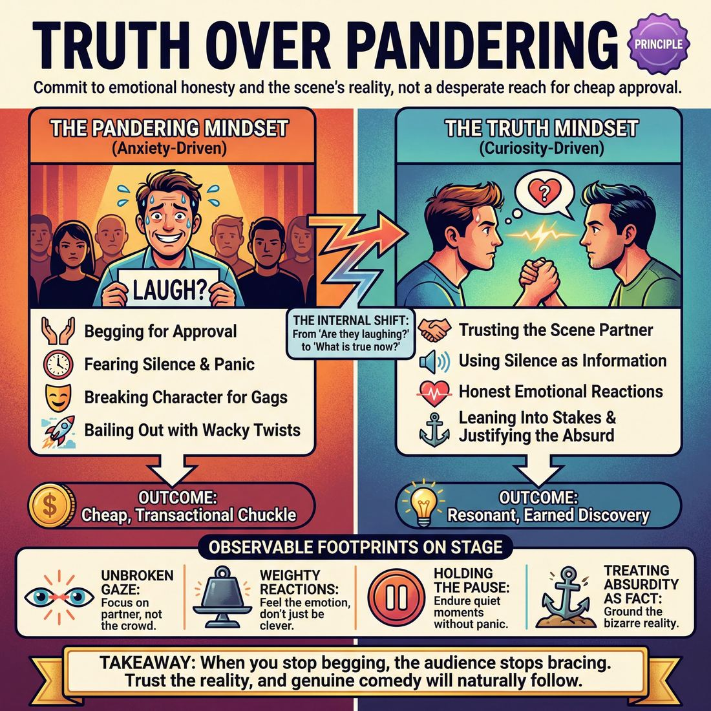

# 💎 Truth Over Pandering

> *Earn the laugh by playing honestly, not by begging.*

{ .infographic }

## 💎 The core belief

At its core, **Truth Over Pandering** is the conviction that the most profound, hilarious, and memorable moments on stage emerge from genuine human experience, not from begging the crowd for approval. In improvisation, **truth** does not mean strict, boring realism; it means emotional honesty, sincere reactions, and absolute commitment to the reality of the scene. **Pandering**, by contrast, is the desperate reach for an unearned reaction—selling out a scene partner for a cheap punchline, breaking character to wink at the audience, or sacrificing the established world for a momentary gag. This principle demands that improvisers trust the scene to do the heavy lifting, holding fast to the belief that if we play our characters with absolute sincerity, the comedy will naturally follow.

We hold this conviction because the performer–audience contract is fundamentally built on trust. When an improviser panders, they signal a lack of faith in their own work, implicitly telling the audience, "I know this isn't working, so here is a shiny distraction." While a cheap trick might win a reflexive chuckle, it shatters the reality of the piece and caps the scene's potential. Conversely, when we prioritize truth, we invite the audience to lean in. We earn their laughter not by tickling them, but by reflecting the absurd, recognizable, and deeply relatable realities of human nature. An earned laugh is a shared discovery; a pandered laugh is a cheap transaction.

!!! abstract "The Core Ethos"
    Earn the laugh by playing honestly, not by begging. A scene grounded in emotional truth will always outlast and outperform a string of disconnected, crowd-pleasing gimmicks.

## 🌱 Why it governs everything

When an improviser truly internalizes **Truth Over Pandering**, their entire relationship with the audience transforms. They stop viewing the crowd as a demanding judge that must be appeased with constant jokes, and start treating them as a silent scene partner who craves authenticity. 

This principle governs everything because it dictates the *source* of the comedy. Before holding this value, a performer’s primary engine is anxiety: *Are they laughing? If not, what can I do to make them laugh right now?* This leads to **mugging** (exaggerating facial expressions for a cheap reaction), dropping character, or abandoning a grounded scene to do something wacky. 

Once the value of truth takes root, the performer's engine shifts from anxiety to curiosity. Every choice—dialogue, physicality, emotional reaction—is filtered through a new question: *What is true for this character in this exact moment?* 

This internal shift produces a radical change in outward behavior:

| The Pandering Mindset | The Truth Mindset |
| :--- | :--- |
| **Silence is terrifying.** It means I am failing and must immediately invent a joke. | **Silence is information.** It means the audience is listening, and I have time to react honestly. |
| **Bailing out.** If the scene feels slow, I will introduce a crazy twist or break the fourth wall. | **Leaning in.** If the scene feels slow, I will deepen the emotional stakes and focus on my partner. |
| **Transactional comedy.** I give the audience a gag; they pay me with a laugh. | **Resonant comedy.** I show the audience genuine human behavior; they laugh in recognition. |

Because this principle changes the performer's core motivation, it acts as a stabilizing anchor. It gives improvisers the courage to endure the quiet moments of a scene without panicking. 

!!! example "In a scene: The Shift in Action"
    Imagine a quiet, grounded scene about two roommates arguing over who should wash the dishes. 
    
    **Without the principle:** The improviser feels the lack of laughter, panics, and suddenly decides their character is an alien who doesn't know what a plate is. They get a quick, confused chuckle, but the reality of the scene is destroyed.
    
    **With the principle:** The improviser trusts the reality. They let their character's genuine, petty frustration boil over, delivering a hyper-specific, deeply felt monologue about a single unwashed fork. The audience erupts—not because of a gag, but because they recognize their own ridiculous domestic squabbles.

Ultimately, prioritizing truth governs the stage because it projects confidence. When you stop begging for laughs, the audience stops bracing for desperate punchlines. They allow themselves to be drawn into the world you are building, trusting that the comedy will arise naturally from the reality of the moment.

## 👀 How it shows up

Because a principle is an internal conviction, you cannot see it directly—but you can absolutely see its footprints on stage. When an improviser truly believes that honesty is funnier than begging, the desperation leaves their body. Their physical, vocal, and pacing choices shift from "look at me" to "look at this reality."

Here are the primary observable markers of an improviser playing for truth:

*   **The unbroken gaze:** They maintain eye contact with their scene partner. They do not "open up" to the audience to deliver a punchline, nor do they engage in mugging to solicit a laugh from the back row.
*   **Honest reactions over clever inventions:** When hit with surprising information, they react with genuine emotional weight—gasping, crying, or laughing *in character*—rather than instantly firing back a witty, detached one-liner.
*   **Holding the silence:** They do not panic when the room is quiet. If a moment requires a long, tense pause to process a betrayal, they take it, trusting the reality of the scene over the urge to fill the dead air with chatter.
*   **Justifying the absurd:** When a bizarre offer is made, they don't point out how crazy it is to the audience (a pandering move often called **hanging a lantern** or playing the "voice of reason" at the expense of the scene). Instead, they treat the absurdity as a completely real, grounded fact of their universe.

!!! example "In a scene: The Breakup"
    Two improvisers are playing a couple breaking up in a coffee shop.
    
    **Pandering:** Player A says, "I'm leaving you." Player B panics at the heavy tone, drops character, and yells, "Well I'm leaving you for the barista, who is secretly Batman!" The audience chuckles at the random pop-culture reference, but the scene's reality is gone.
    
    **Truthful:** Player A says, "I'm leaving you." Player B takes a long, silent beat, looks down at their cup, and says with total sincerity, "I paid for that muffin. Leave it." The audience laughs much harder because the pettiness is a recognizable, human truth.

As improvisers internalize this principle, their observable behavior evolves from rigid restraint to effortless, grounded play:

| Stage | Observable Behavior on Stage |
| :--- | :--- |
| **Novice** | Actively resists the urge to make a joke, but often overcorrects. They may appear stiff, overly serious, or mistake "truth" for mundane, conflict-free conversations about doing the laundry. |
| **Intermediate** | Commits to the base reality and reacts honestly to their partner. They stop breaking character, but may still occasionally rush a moment or force a clever line when they feel the audience's energy dipping. |
| **Master** | Mines explosive, specific comedy entirely from their character's genuine worldview. They hold tension effortlessly, play the stakes of the scene to the hilt, and make the audience roar with laughter simply through a subtle, perfectly timed shift in posture or a deeply honest sigh. |

!!! tip "On stage"
    If you feel the sudden urge to break the fourth wall, make a sarcastic comment about the scene itself, or sell out your partner for a quick laugh—stop. Anchor yourself physically. Look your partner in the eye and react to what they just said as if it were undeniable fact. The truth is always enough.

## 🧪 Living it in practice

To internalize the principle of **Truth Over Pandering**, improvisers must actively train themselves to resist the intoxicating pull of immediate, cheap laughter. Because the urge to please an audience is deeply ingrained, choosing truth requires rewiring your instincts through deliberate mindsets, habits, and drills.

### Mindsets to Adopt
Before you step on stage, the internal monologue must shift from *“How can I make them laugh?”* to *“How can I make this real?”*

*   **"I am enough."** You do not need a wacky voice, a bizarre limp, or a pop-culture reference to be worthy of the audience's attention. Your authentic presence is inherently compelling.
*   **Play the reality; let the audience find the comedy.** Treat the humor as a byproduct of the situation, not the objective of the actor. 
*   **Trust the silence.** Pandering often happens in the panicked rush to fill dead air. Silence is where tension, emotion, and truth live.

!!! tip "On stage"
    Treat the desperate urge to say something "clever" as a dashboard warning light. It means you are in your head and disconnected from the scene. When it flashes, stop talking. Take a breath, observe how your partner is making you feel, and react strictly to *that*.

### Habits to Cultivate
Living this principle means animating specific foundational skills in every scene:

*   **Grounded reactions:** When a scene partner introduces an absurd element, react as a real human being would. If they say they just ate a glass lightbulb, do not say, "Yum, I'll have one too!" React with genuine concern, horror, or confusion. 
*   **Committing to the physical reality:** Treat your **object work** and environment with respect. If you establish a heavy door, it stays heavy. Pandering often manifests as breaking the physical reality of the scene just to get to a punchline faster.
*   **Playing the "Voice of Reason":** Often called the "straight man," this skill relies entirely on truth. By reacting honestly to the absurdity of your partner, you frame their behavior as unusual, which is what actually generates the comedy.

!!! example "In a scene: The Live Tiger"
    **The Offer:** "I just bought a live tiger for our studio apartment!"
    
    **Pandering (Chasing the crazy):** "Awesome, I bought a bazooka! Let's fight!" *(The reality is shattered; the scene becomes a cartoon.)*
    
    **Truthful (Grounding the absurdity):** "David, we can barely afford rent. Where is it? Is it in the bathroom?" *(The stakes are real, the relationship is grounded, and the comedy is amplified.)*

### Drills for the Rehearsal Room

| Drill | How it works | What it trains |
| :--- | :--- | :--- |
| **The "Boring" Scene** | Two players perform a mundane task (e.g., folding laundry, waiting for a bus) for three minutes. No conflict, no jokes, no inventions. Just exist. | Comfort with simply being on stage without the crutch of comedy. |
| **Look, Don't Speak** | Players enter the stage and must hold unbroken eye contact for a full 10 seconds before the first line is spoken. | Kills the urge to jump in with a pre-planned gag; forces the scene to start from a place of genuine connection. |
| **High-Stakes Absurdity** | Take a ridiculous, cartoonish suggestion (e.g., "Alien abduction at a Wendy's") and play it as a deadly serious, Oscar-caliber drama. | Proves that you do not need to "wink" at the audience to make an absurd premise entertaining. |

## ⚖️ Tensions & nuance

Committing to **Truth Over Pandering** does not mean you must perform bleak, kitchen-sink drama, nor does it mean you ignore the audience entirely. The principle is a compass for *how* you generate comedy, not a ban on being funny. 

Navigating this principle requires balancing honest reactions with the inherent absurdity of improv comedy. Here is how this principle interacts with other demands of the stage:

### Truth vs. Absurdity
A common misunderstanding is confusing "truth" with "realism." You do not have to play a grounded human in a mundane situation. You can play a sentient toaster, a goblin king, or an astronaut made of jelly. The "truth" applies to the **internal logic and emotional reality** of that character. If you are a jelly-astronaut, how do you *genuinely* feel when you are left behind on Mars? 

*   **Truthful absurdity:** Playing the jelly-astronaut's heartbreak with total sincerity.
*   **Pandering absurdity:** The jelly-astronaut suddenly doing a trendy TikTok dance because the scene felt a little quiet.

### Truth vs. Reading the Room
Improv is a live, shared experience. You have a contract to entertain the audience, and ignoring a restless or disengaged crowd under the guise of "staying true to the scene" is a failure to read the room. The nuance lies in *how* you fix it. If a scene is dying, you do not save it by breaking character to make a cheap local sports joke. Instead, you heighten the emotional stakes, make a bold physical choice, or edit the scene entirely—solving the theatrical problem without sacrificing the integrity of the work.

### Truth vs. The "Wink"
Sometimes, acknowledging the artificiality of the stage—breaking the **fourth wall**—is actually the most truthful thing you can do. If a massive siren goes off outside the theater, ignoring it is untruthful. Acknowledging it can release the tension in the room. The line between truth and pandering is drawn by your intent: are you sharing a genuine moment of reality with the audience, or are you begging them for a lifeline?

!!! example "In a scene: The Broken Prop"
    Imagine a wooden chair collapses under you mid-scene.
    
    *   **Untruthful:** Ignoring it completely and continuing to sip your imaginary tea while sitting on the floor, pretending nothing happened.
    *   **Truthful:** Reacting with genuine surprise, incorporating the fall into the character's reality ("This tavern is falling apart!"), or sharing a brief, honest laugh with your scene partner before re-engaging with the scene.
    *   **Pandering:** Rolling around on the floor, making exaggerated sad faces at the audience, and abandoning the scene entirely to milk the accident for easy laughs.

### Truth vs. Game of the Scene
In comedic improv, the **Game** (the central comedic pattern or unusual thing) requires you to heighten and explore a specific joke. Sometimes, heightening requires a character to do something extreme or foolish. This is not pandering if the extreme action is driven by the character's established worldview. It only becomes pandering when the actor steps outside the character's logic to deliver a punchline that belongs to the performer, not the persona.

!!! tip "On stage: The 'Justification' Check"
    If you are about to say something purely because you know it will get a laugh, ask yourself: *Can I justify why my character would actually say this right now?* If yes, say it with conviction. If no, let the joke go.

## 🚫 Common misunderstandings

When improvisers first encounter the principle of "Truth Over Pandering," they often swing to extremes—either abandoning comedy altogether or treating the audience with outright disdain. Because this principle deals with the invisible motives behind our choices, it is incredibly easy to misinterpret.

Here are the most common ways this principle gets misunderstood, and how to realign your thinking:

| The Misunderstanding | The Correction |
| :--- | :--- |
| **"Truth means we have to do serious, dramatic scenes."** | Truth refers to **internal logic** and **emotional commitment**, not genre. A scene about two squirrels arguing over a buried acorn can be deeply truthful if the improvisers play the stakes honestly. You do not need to perform a kitchen-sink drama to avoid pandering. |
| **"We should ignore the audience completely."** | You are still putting on a show. You must project your voice, stage yourself so you can be seen, and pace the show well. "Truth over pandering" means you don't *beg* the audience for approval; it does not mean you pretend they aren't in the room. |
| **"Breaking the fourth wall is always pandering."** | Breaking the fourth wall (acknowledging or speaking directly to the audience) can be highly truthful if it fits the format of the show. Pandering is a *motive* (desperation for a laugh), not a specific technique. |
| **"If they laughed, it was a good move."** | A cheap laugh gets an immediate vocal reaction, but it subtly erodes the audience's long-term trust. A truthful move might only get a knowing smile in the moment, but it builds the investment required for massive, explosive laughs later in the set. |

!!! warning "Watch out: The 'Gagging' Trap"
    A frequent symptom of misunderstanding this principle is **gagging**—making a joke at the expense of the scene's established reality. If your scene partner says, "I'm leaving you, Harold," and you cross your eyes and make a funny noise to get a chuckle from the back row, you have gagged the scene. You traded the truth of the moment for a cheap, pandering laugh, throwing your partner under the bus in the process.

!!! abstract "Playing *for* vs. Playing *to*"
    A helpful way to correct these misunderstandings is to adjust your prepositions. We want to play **for** the audience (offering them a gift of a fully realized, honest scene) rather than playing **to** the audience (winking at them, asking "Do you like this? Is this funny?"). When you play *for* them, you respect their intelligence.

## 🔗 Why it matters

Adopting this principle transforms improvisation from a desperate plea for approval into a confident act of theatrical discovery. When an ensemble collectively decides that they will not beg for laughs, the entire energetic frequency of the show shifts. You stop chasing the audience, and as a result, the audience starts following you.

Holding this value deeply creates a ripple effect that touches every aspect of the performance:

*   **The audience relaxes:** When performers pander, the audience senses the desperation. They tense up, feeling either manipulated or embarrassed for the actors. When performers play truthfully, the audience exhales. They know they are in the hands of confident artists who don't need to be rescued.
*   **The comedy deepens:** A laugh earned through a cheap pop-culture reference or a mugging facial expression evaporates the moment it happens. A laugh earned through a painfully accurate observation of human behavior—a moment of pure recognition—resonates. It is the difference between a polite chuckle and a breathless roar.
*   **Patience emerges:** The burden of having to be "funny" every ten seconds is lifted. Improvisers feel permission to endure silence, to let a reaction land, and to build a scene brick by brick rather than throwing fireworks at the stage.

To see the macro impact of this principle, look at how it changes the fundamental relationship between the stage and the seats:

| The Dynamic | A Pandering-Driven Show | A Truth-Driven Show |
| :--- | :--- | :--- |
| **The Performer's State** | Anxious, scanning the crowd, hunting for the next gag. | Grounded, focused on their partner, reacting in the moment. |
| **The Audience's Role** | Judges holding a scorecard, waiting to be entertained. | Co-conspirators leaning in to discover what happens next. |
| **The Show's Legacy** | A disposable series of bits, forgotten by the car ride home. | A cohesive, satisfying experience that leaves the crowd talking. |

!!! abstract "The Ultimate Payoff"
    Prioritizing truth over pandering elevates the art form itself. It proves to the audience that improvisation is not just a frantic parlor trick or a disposable party game, but a legitimate, powerful form of theater that can move people just as much as it amuses them.

## 📚 References & Further Reading

### Foundational sources
*   **Charna Halpern, Del Close, Kim "Howard" Johnson, *Truth in Comedy: The Manual of Improvisation* (1994)** — The definitive text that shifted modern long-form improv away from cheap gags and toward the belief that the highest comedy comes from discovering the truth of the moment. It explicitly argues against "going for the joke" and establishes that audiences laugh hardest at recognizable, honest human behavior.
*   **Keith Johnstone, *Impro: Improvisation and the Theatre* (1979)** — Explores the danger of "gagging" (inventing jokes out of fear of the audience) and champions the power of being obvious, truthful, and spontaneous. Johnstone explains how the desperation to be clever actually alienates the audience and destroys the reality of the scene.
*   **Viola Spolin, *Improvisation for the Theater* (1963)** — While focused on theater games, Spolin's foundational work warns against "playwriting" and showing off for the crowd. She argues that when players focus entirely on the reality of the game and their fellow actors, the audience is naturally drawn in, eliminating the need to solicit their approval. Her writings on escaping the "approval/disapproval" dynamic directly address the anxiety that causes improvisers to pander.

### Practitioner guides & manuals
*   **T.J. Jagodowski, David Pasquesi, Pam Victor, *Improvisation at the Speed of Life: The TJ and Dave Book* (2015)** — A masterclass in treating the scene as a real, existing world to be discovered rather than a platform for inventing jokes. The authors emphasize that improvisers should never step outside the reality of the scene to comment on it, as doing so breaks the trust of the audience.
*   **Matt Besser, Ian Roberts, Matt Walsh, *The Upright Citizens Brigade Comedy Improvisation Manual* (2013)** — Codifies the UCB approach to playing "at the top of your intelligence." The manual explicitly warns against "gagging," dropping character, or making choices solely to get a laugh, insisting that the comedy must come from a grounded base reality and justified absurdities. It teaches that "hanging a lantern" on a bizarre choice is a form of pandering that ruins the scene's integrity.
*   **Mick Napier, *Improvise: Scene from the Inside Out* (2004)** — Challenges improvisers to commit fully to their choices and avoid the fear-based panic that leads to bailing out of scenes. Napier diagnoses how the anxiety of a quiet audience causes performers to abandon their characters and pander, offering strategies to stay grounded in the work and trust your initial choices.

### Lineage & teachers
*   **iO Theater (formerly ImprovOlympic)** — The Chicago institution founded by Del Close and Charna Halpern that championed the "truth in comedy" ethos. Their training demanded emotional honesty over cabaret-style punchlines, teaching generations of improvisers that the relationship between scene partners is more important than the immediate reaction of the crowd.
*   **The Annoyance Theatre** — Founded by Mick Napier, this theater's philosophy emphasizes fearless commitment to character and reality. They train performers to hold onto their choices without apologizing, winking at the audience, or breaking the fourth wall to acknowledge the absurdity of the scene.
*   **TJ & Dave (T.J. Jagodowski and David Pasquesi)** — The quintessential duo demonstrating patient, truthful, non-pandering improv. Their legendary weekly shows serve as the ultimate practical example of treating the audience as witnesses to a genuine reality rather than judges to be appeased with constant punchlines.

### Research & theory
*   **Sanford Meisner, Dennis Longwell, *Sanford Meisner on Acting* (1987)** — Outlines the Meisner technique's core tenet of "living truthfully under imaginary circumstances." This provides the psychological foundation for treating absurd improv realities with genuine emotional weight, proving that authentic reactions are far more compelling than manufactured cleverness. Meisner's insistence on placing focus entirely on the scene partner directly combats the improviser's urge to "mug" or play to the crowd.

### Talks, videos & courses
*   **Alex Karpovsky (Director), *Trust Us, This Is All Made Up* (2009)** — A documentary capturing a live performance and the underlying philosophy of T.J. Jagodowski and David Pasquesi. The film showcases what it looks like to trust the scene entirely, endure the silence of the room, and build a compelling narrative without ever reaching for cheap laughs or breaking the reality of the world.

### Communities & adjacent reading
*   **Patricia Ryan Madson, *Improv Wisdom: Don't Prepare, Just Show Up* (2005)** — Applies improv principles to daily life, emphasizing the importance of paying attention and trusting the reality of the present moment. Her focus on "doing what needs to be done" rather than "trying to be clever" perfectly mirrors the internal shift from a pandering mindset to a truthful one.

## 💬 Quotes & Anecdotes

!!! quote "— Del Close and Charna Halpern, *Truth in Comedy* (1994)"
    The truth is funny. Honest discovery, observation, and reaction is better than contrived invention.

!!! quote "— Charna Halpern, *Interview with Pam Victor* (2013)"
    There is nothing funnier than the truth. The audience laughs because we share the same world, and they can relate to you.

!!! quote "— Del Close and Charna Halpern, *Truth in Comedy* (1994)"
    Real humor does not come from sacrificing the reality of a moment in order to crack a cheap joke, but in finding the joke in the reality of the moment.

!!! quote "— TJ Jagodowski, *People and Chairs Interview* (2015)"
    We would like our improvisation to represent reality. To look and feel real and in that, move at all the different paces the real world moves at.

!!! quote "— Del Close and Charna Halpern, *Truth in Comedy* (1994)"
    When players worry that a scene isn't funny, they may resort to jokes. This usually guarantees the scene won't be funny.

### Where it comes from
The ethos of prioritizing truth over cheap laughs was codified and popularized by Del Close and Charna Halpern in Chicago during the 1980s and 90s, culminating in their seminal 1994 book *Truth in Comedy: The Manual of Improvisation*. They pushed back against the gag-heavy, punchline-driven short-form games of the era, arguing that long-form improvisation should be treated as a legitimate theatrical art form. They believed that humor should arise naturally from the relationships and the reality of the scene, rather than from performers stepping out of character to pander to the crowd. 

However, the roots of this idea go back even further to Viola Spolin, the "mother of improv." Her theater games in the 1940s and 50s were specifically designed to bypass the performer's ego and the desperate urge to "be funny," focusing instead on genuine connection, active listening, and playing the reality of the moment.

### A telling example
**Illustrative Scene: The Blaring Alarm**

To see the difference between pandering and truth, imagine a scene where two astronauts are in a space capsule, and a critical alarm suddenly starts blaring.

**The Pandering Choice:** 
One astronaut breaks the reality of the moment, turns to the audience, crosses their eyes, and says, "Well, I guess I shouldn't have pressed the big red button that says 'Do Not Press'!" 
*The result:* The improviser gets a quick, cheap chuckle, but the stakes of the scene are instantly destroyed. The audience no longer believes they are watching astronauts in space; they are just watching a comedian on a stage begging for a laugh. The scene has nowhere to go.

**The Truthful Choice:** 
The alarm blares. The astronaut looks at their partner, genuine terror in their eyes, and says with absolute sincerity, "I told you to check the O-rings." The partner, defensive and panicked, replies, "I did! I checked them three times!" 
*The result:* The audience laughs at the recognizable, deeply human reaction of instantly shifting blame during a crisis. The reality of the scene remains entirely intact, the stakes are heightened, and a compelling, character-driven story can now unfold.

## 🧭 Explore the framework

- 🎭 **Domain:** [The Audience](05_D__the-audience.md)
- 🔁 **Other principles here:** [The Audience Is the Final Scene Partner](05_P1__the-audience-is-the-final-scene-partner.md), [Play for the Back Row](05_P2__play-for-the-back-row.md)
- 🧠 **Skills of this domain:** [Room Reading](05_S1__room-reading.md), [Audience-Energy Management](05_S2__audience-energy-management.md), [Stage Presence & Clarity](05_S3__stage-presence-and-clarity.md)
