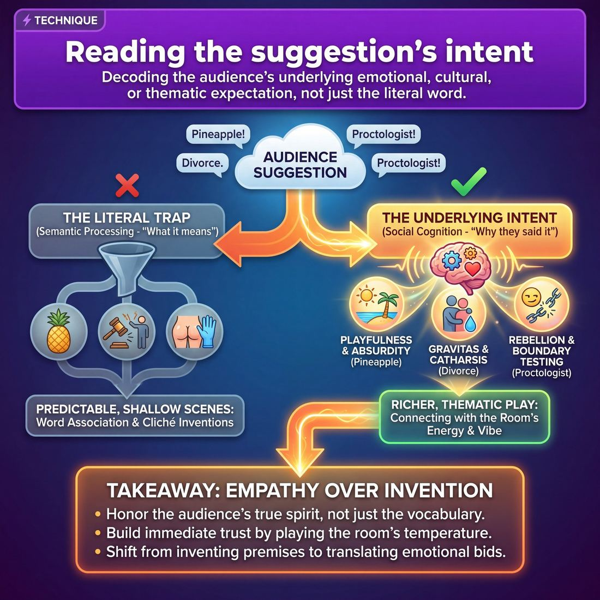

# 🎯 Reading the suggestion's intent

> *A drillable muscle that trains **Room Reading**.*

{ .infographic }

## 🎯 The essence

**Reading the suggestion's intent** is a targeted technique where improvisers pause to unpack the emotional, cultural, or thematic weight of an audience suggestion before initiating a scene. Rather than taking a word at its literal, dictionary definition, this practice forces players to execute a single, vital action: decoding *why* the audience offered that specific word in that specific moment. It shifts the improviser's focus from mere word association to active empathy, training them to read the room's underlying vibe and honor the true spirit of the prompt.

!!! abstract "The Core Action"
    Looking past the literal definition of a suggestion to identify and play the audience's underlying emotional, cultural, or thematic expectation.

## 🎓 What it trains

This technique isolates and drills **Room Reading**—specifically, the ability to decode the audience's underlying desire when they offer a prompt. 

When an audience member yells out a suggestion, they are rarely just offering a random noun; they are offering a *vibe*, a *challenge*, or an *expectation*. This technique trains improvisers to look past the literal word and identify the emotional, thematic, or energetic core of the offer.

**The specific problems this muscle solves:**

*   **The Literal Trap:** Novices often take a suggestion like "pineapple" and immediately mime eating one. This muscle trains you to see "pineapple" as tropical, prickly, or a symbol of 1970s hospitality, unlocking richer thematic scenes rather than superficial ones.
*   **The "Troll" Suggestion:** When a crowd yells something provocative or cliché (like "proctologist" or "divorce"), a Stage 1 improviser will often panic, reject the idea, or pander to the lowest common denominator. Reading intent allows you to recognize the audience's desire for taboo, vulnerability, or high stakes, and deliver that energy intelligently without resorting to cheap gags.
*   **Audience Alienation:** Ignoring or steamrolling a weird suggestion breaks trust. This technique teaches you how to honor the *spirit* of the suggestion so the audience feels respected and validated, even if the literal word never appears in the scene.

!!! abstract "The Deeper Principle: The Performer–Audience Contract"
    This technique reinforces the fundamental contract between the stage and the house. The audience's job is to provide a spark; the improviser's job is to build the fire. By reading the *intent* behind the spark, you honor the audience's contribution while maintaining your artistic agency. You learn to give the room what it *actually* wants, rather than just what it asked for.

By practicing this, improvisers move away from mechanically accepting words at face value and begin to read the room's general temperature—eventually learning to adjust their tone to the specific crowd without ever pandering to it.

## 💡 Why it works

Reading the suggestion's intent works by shifting the improviser’s brain out of **semantic processing** (analyzing what a word means) and into **social cognition** (understanding why a human being said it). 

An audience member is making a social bid. They are handing you an emotional payload wrapped in a vocabulary word. This technique exploits the human desire to be truly heard and understood, bypassing superficial data to connect with the room's underlying energy.

!!! abstract "The Engine: Empathy over Invention"
    The pressure to invent a clever premise from a single word is paralyzing. Reading the intent removes this pressure entirely. Instead of asking, *"What is a funny scene about a toaster?"* the improviser asks, *"What kind of energy is this room asking for?"* You stop inventing and start translating.

Here is why this cognitive shift is so powerful:

*   **It bypasses predictable associations:** Literal interpretations almost always lead to first-thought premises (e.g., "Pirate" leads to a ship scene with eye patches). Looking for the intent unlocks thematic, relationship-driven play that is infinitely richer.
*   **It establishes immediate trust:** The performer–audience contract relies on the audience feeling safe in your hands. When you play the *vibe* of their suggestion, you subconsciously signal to the crowd: *I see you, I understand what you want, and I've got this.* 
*   **It unifies a fragmented room:** Audiences arrive as individuals. By identifying the collective emotional temperature behind a suggestion—whether it's mischievous, exhausted, intellectual, or rowdy—you can reflect that exact frequency back to them. 

To see the mechanism in action, look at how the exact same words can carry vastly different fuel depending on the intent:

| The Suggestion | The Literal Trap | The Underlying Intent (The Real Fuel) |
| :--- | :--- | :--- |
| **"Divorce."** *(Offered quietly by an older man in the front row)* | A cliché scene of a couple fighting in a lawyer's office. | **Gravitas / Catharsis.** The room is offering real human pain. They are giving you permission to play grounded, emotional truth. |
| **"Pineapple!"** *(Yelled by a giggling group of friends)* | A scene set in a grocery store or a tropical island. | **Playfulness / Silliness.** They want high energy, absurdity, and joy. The specific fruit doesn't matter; the joy does. |
| **"Proctologist!"** *(Shouted aggressively from the back row)* | A crude, predictable doctor scene. | **Rebellion / Boundary Testing.** They want to see if you will flinch. They are asking for something edgy, taboo, or mischievous. |

!!! tip "The Psychological Override"
    By training yourself to read the intent, you short-circuit the panic of "I don't know anything about this topic!" You don't need to know the mechanics of a nuclear submarine if the audience yelled it simply because they want to see a high-stakes, claustrophobic power struggle.

## 🧩 The setup

To effectively isolate and drill the muscle of parsing an audience's true request, this exercise strips away scene work entirely. The focus is purely on receiving a word and immediately unpacking its thematic and emotional weight.

*   **Players & Arrangement:** Full ensemble (6–12 players). Have the group stand in a wide semi-circle facing the facilitator. This physical arrangement mimics the performer-to-audience relationship, keeping their attention focused outward.
*   **Space & Materials:** An open rehearsal room or stage. 
*   **Time:** 10–15 minutes total. Dedicate about 1 to 2 minutes to unpacking each suggestion before clearing the slate and moving to the next.
*   **Roles:**
    *   **The Audience Proxy (Facilitator):** Provides a curated list of suggestions. You will want a mix of mundane objects (e.g., "Toaster"), loaded concepts (e.g., "Betrayal"), and specific locations (e.g., "A DMV").
    *   **The Receivers (Players):** Rapidly call out the underlying themes, emotional weight, or likely intent behind the suggestion. 
*   **Prerequisites:** Basic word association skills. Players should already understand the foundational improv concept that a suggestion is an inspiration, not a mandatory literal prop.

!!! tip "Visualizing the Web"
    For the first few rounds, a **whiteboard and markers** are highly recommended. Writing the suggestion in the center and mapping the players' pitched intents around it helps visual learners see the difference between a *literal* association (Pineapple $\rightarrow$ Fruit) and an *intent-based* association (Pineapple $\rightarrow$ Hospitality, Spikiness, Tropical Vacation).

!!! quote "How to introduce it (Facilitator Script)"
    "When an audience yells out a suggestion, they aren't just giving us a noun—they are handing us a vibe, a genre, or a secret request. If they yell 'Pineapple,' they might want tropical relaxation, or they might want something prickly and weird. If they yell 'Divorce,' they are handing us heavy emotional baggage or a desire for dark comedy. 
    
    In this drill, we aren't starting scenes. I am going to give you a suggestion, acting as the audience. I want you to rapid-fire shout out the *intent* behind it. Don't give me the dictionary definition. Tell me: What is the audience actually asking to see? What is the emotional weight of this word? Let's find the hidden request."

## ⚙️ The mechanics

To isolate and train this muscle, we use a rapid-fire drill called **The Intent Decoder**. This exercise forces players to pause their instinct to immediately play the literal word, and instead systematically unpack the human data attached to the suggestion.

### The Core Objective
To practice observing the *delivery* of a suggestion, inferring the audience member's underlying desire, and launching a scene that honors that deeper intent rather than just the literal vocabulary.

### The Flow of Play

1.  **The Delivery:** The Coach (acting as the audience member) gives a suggestion to the line-up of players. Crucially, the Coach delivers the word with a specific, clear attitude, posture, or energy (e.g., a bored sigh before saying "laundry," a giddy bounce while saying "puppy," or a cynical sneer while saying "marriage").
2.  **The Diagnosis:** One player steps forward and explicitly names three layers of the suggestion out loud:
    *   **The Literal:** The dictionary definition of the word.
    *   **The Vibe:** The observable physical and vocal energy of the person who gave it.
    *   **The Intent:** The inferred desire—what this person actually wants to see, feel, or do to the performers.
3.  **The Three Initiations:** Three different pairs of players step out, one by one, to deliver a single opening line (an **initiation**). 
    *   **Pair 1** initiates based *only* on the Literal word.
    *   **Pair 2** initiates based on the Vibe.
    *   **Pair 3** initiates based on the Intent.
4.  **The Reset:** The Coach calls "Scene" after the third initiation. The players step back, and the Coach delivers a new suggestion with a completely different energy.

!!! example "In a scene: Unpacking 'Pineapple'"
    The Coach leans back, crosses their arms, and aggressively shouts: *"Pineapple!"*
    
    **The Diagnosis:**
    *   **Literal:** A spiky tropical fruit.
    *   **Vibe:** Aggressive, disruptive, challenging, slightly drunk.
    *   **Intent:** They want to throw us off balance. They want to see chaos, conflict, or high-stakes energy.
    
    **The Initiations:**
    *   *Literal:* "Welcome to the Dole plantation, here are your harvesting gloves."
    *   *Vibe:* *(Player kicks a chair)* "I am sick and tired of you ignoring me!"
    *   *Intent:* "I told you to burn the evidence, not alphabetize it!" *(Honors the desire for high-stakes chaos, completely dropping the fruit).*

### Rules & Constraints

*   **No questions allowed:** The players cannot ask the Coach to clarify or repeat the suggestion. They must read the data they were given in the moment.
*   **The Intent constraint:** The third initiation (The Intent) is **strictly forbidden** from using the literal suggestion word or its direct physical associations. It must be entirely thematic or emotional.
*   **Keep it to the launch:** This is an initiation drill. Do not play out the scenes. Deliver the first line, establish the base reality, and immediately cut.

!!! tip "On stage"
    In a real show, you won't do this out loud. But this drill builds the cognitive muscle to run this algorithm in a split second. When a bachelorette party yells "Tequila!", you won't just mime taking shots; you'll recognize the intent is *celebration and reckless abandon*, and you might initiate a scene about two astronauts joyriding a Mars rover.

### Categorizing the Intent
As players get faster at the diagnosis step, they will start to recognize common "buckets" of audience intent. 

| Suggestion Type | Observable Vibe | The Underlying Intent | How to Honor It |
| :--- | :--- | :--- | :--- |
| **The Test** (e.g., "Proctologist!", "Dildo!") | Smirking, looking at friends for approval, challenging. | "I want to see if I can make you uncomfortable or break your rules." | Play it with absolute, grounded sincerity. Strip the joke of its shock value by treating it as mundane. |
| **The Gift** (e.g., "My grandmother's garden") | Warm, sincere, slightly vulnerable, leaning in. | "I want to share something I love and see it treated with respect." | Play a scene with high emotional connection, warmth, and discovery. |
| **The Inside Joke** (e.g., "Steve's Honda!") | Pointing at a friend, laughing before the word is out. | "I want my friend group to feel seen and special." | You can't know the joke, so honor the *dynamic*. Play a scene about a tight-knit group with a shared, hyper-specific obsession. |

## 🎬 Sample round

!!! example "Sample round: The 'Intent Translation' Drill"
    In this exercise, players stand in a line. The coach acts as the audience, throwing out common types of suggestions. The player must verbally break down the suggestion out loud before stepping forward to initiate.

    **Coach:** "Can I get a non-geographical location?"
    *(Pretending to be an edgy audience member)* "A slaughterhouse!"

    **Player 1 (Parsing the intent):**
    *   **The Literal:** A slaughterhouse.
    *   **The Intent:** "The audience member is trying to be provocative and make us uncomfortable. They want dark, gritty, or shocking energy."
    *   **The Initiation (Honoring the intent):** *(Mimes putting on a heavy apron, speaking with grim exhaustion)* "Look, kid, you don't name the cows. You name 'em, you start caring. Now hand me the bolt gun."
    *   *Annotation:* The player leans into the dark, gritty tone the audience member wanted, rather than panicking at the taboo word or making cheap meat puns. They read the room's desire for edge and delivered it through grounded character work.

    **Coach:** "Give me an object you'd find in your kitchen."
    *(Pretending to be a 'wacky' audience member)* "A spork!"

    **Player 2 (Parsing the intent):**
    *   **The Literal:** A spork.
    *   **The Intent:** "They picked a 'random' or goofy word. They want something silly, chaotic, or slightly absurd."
    *   **The Initiation (Honoring the intent):** *(Holding up a tiny imaginary object with intense reverence)* "Gentlemen, the military applications of this utensil will revolutionize the middle school cafeteria."
    *   *Annotation:* The player elevates the silliness of the word by treating it with deadpan, high-stakes absurdity. They match the audience's desire for a laugh without devolving into pure, ungrounded zaniness.

    **Coach:** "What's a problem you had today?"
    *(Pretending to be a weary adult)* "Traffic on the 405."

    **Player 3 (Parsing the intent):**
    *   **The Literal:** Traffic on the 405 freeway.
    *   **The Intent:** "Universal frustration. They want to see shared misery, feeling trapped, or the mundane annoyance of daily life."
    *   **The Initiation (Honoring the intent):** *(Staring blankly ahead, hands gripping an imaginary steering wheel)* "If we die in this Prius, I want you to know... I never actually liked your true crime podcast."
    *   *Annotation:* The player captures the feeling of being trapped and frustrated. Instead of just talking *about* cars, they use the audience's suggested energy (claustrophobia and annoyance) as a pressure cooker for a relationship dynamic.

## 🎚️ Variations & progressions

To build the muscle of reading a suggestion's intent, you can scale the difficulty of the practice from basic word-association to advanced, real-time audience psychology. Here is how to ramp up the challenge as improvisers move through the maturity stages.

**1. The "A to C" Intent Drill (Advanced Beginner)**
At this stage, improvisers often panic and cling to the literal suggestion. To break this, practice taking a suggestion and naming not a related word, but the **underlying theme or emotion**. 
*   *Mechanic:* The coach gives a suggestion (e.g., "A haunted house"). The improviser must immediately state the intent (e.g., "They want to see us get scared," or "They want a mystery"). 
*   *Goal:* Train the brain to pause and ask *why* the word was offered before acting on *what* the word is.

**2. The "Troll Filter" (Competent)**
Competent improvisers can read the room's general temperature, but edgy or cliché suggestions can still derail them. This variation deliberately uses "bad" suggestions to practice elevating the intent without pandering.
*   *Mechanic:* Solicit or provide notoriously difficult, provocative, or juvenile suggestions. The improvisers must initiate a scene that honors the *dynamic* of the suggestion without doing the cheap, expected joke.

!!! example "In a scene: Filtering the Troll"
    **Suggestion:** "A strip club!" *(Yelled by a rowdy bachelorette party).*
    
    **Literal/Pandering response:** Mime dancing on a pole and making cheap sex jokes. 
    
    **Reading the intent:** The audience wants high energy, transgression, and a party vibe. 
    
    **The Pivot:** Initiate a scene about two highly enthusiastic, overly-intense crossing guards treating their intersection like a VIP nightclub. You capture the *energy* they wanted without rolling in the mud.

**3. Casting the Suggester (Proficient)**
Proficient improvisers can adjust their tone to the specific crowd. In this variation, the focus shifts from the *word* to the *delivery*.
*   *Mechanic:* The coach (or a rotating cast of teammates) yells out a mundane suggestion, but layers it with a specific vocal tone—timid, sarcastic, furious, or drunk. The improvisers must initiate the scene matching the **emotional intent of the delivery**, regardless of the word itself. 
*   *Goal:* Teaches improvisers to listen to the musicality and energy of the audience member, using it as the emotional baseline for the scene.

**4. The Unspoken Suggestion (Master)**
Master improvisers unify the room by reading the collective energy before a word is even spoken. 
*   *Mechanic:* The team walks out and takes *no* verbal suggestion. Instead, they must stand in silence for five seconds, read the physical posture, energy, and ambient noise of the room, and initiate based entirely on that **vibe check**. 
*   *Goal:* If the room is restless and chatty, the intent is "we need to be grabbed"—start with high stakes and volume. If the room is leaning in and quiet, the intent is "we are ready for a story"—start with grounded, intimate character work.

!!! tip "On stage: The 'Yes, And' of Intent"
    When you read the intent correctly, the audience feels deeply heard, even if you never explicitly say their suggested word. You are saying "Yes, and..." to their *energy*, which is the fastest way to build trust and unify a fragmented crowd.

## 🧑‍🏫 Coaching notes

When coaching this technique, your primary job is to break the habit of literal, word-association thinking. You are training the improviser's ear to catch the subtext, emotion, and energy of the audience member who spoke, moving them away from treating the suggestion as a mere noun to plug into a scene.

!!! tip "Coaching: The Golden Cue"
    **"Play the *how*, not just the *what*."**  
    Remind players that a suggestion yelled aggressively, one whispered timidly, and one offered with a cheeky giggle are three entirely different suggestions—even if the literal word is exactly the same. Coach them to react to the delivery.

### Effective Side-Coaching Cues
Use these short, punchy prompts from the sidelines while players are taking suggestions or stepping out for the first beat:

*   **"What was their tone?"** (Forces the player to recall the audience member's voice, not just the word.)
*   **"Look past the noun. What's the vibe?"** (Pushes players away from literal definitions and toward thematic or emotional interpretation.)
*   **"Match the room's energy."** (Useful when the crowd is rowdy but the players are starting too low, or vice versa.)
*   **"Why did they suggest *that*?"** (Encourages players to deduce the audience's underlying curiosity or mischief.)

### What 'Good' Looks and Sounds Like
As a coach, watch for these observable behaviors that indicate the technique is clicking:

*   **The Absorption Pause:** The improviser doesn't instantly jump into a frantic, pre-planned bit the millisecond the word is spoken. They take a visible breath to let the suggestion's energy land.
*   **Tonal Mirroring (or Deliberate Contrast):** The physical and vocal choices of the opening moment reflect the audience's delivery. If the suggestion was offered with high-status confidence, the scene starts with high-status energy.
*   **Handling the "Troll" Suggestion:** This is the ultimate test of reading intent. If an audience member throws out a provocative or cliché suggestion, a novice panics or panders to the base humor. A player successfully reading intent recognizes the challenge—*they want to see us squirm*—and subverts it by playing the scene with grounded, hyper-sincere professionalism. 

!!! example "In a scene"
    **Audience member:** *(Sighs heavily, sounds exhausted)* "Laundry."  
    
    **Literal response (Novice):** Two players immediately start folding invisible shirts and talking about detergent.  
    
    **Reading the intent (Competent):** The improviser hears the exhaustion. They step out, slump their shoulders, and initiate a scene about the crushing, repetitive weight of adult responsibilities. They play the *sigh*, not the socks.

## 🧭 Debrief & reflection

After a round of practicing this technique, the debrief shifts the players' focus from *what* they created to *how* they translated the audience's raw material. The goal is to move improvisers away from treating suggestions as mere vocabulary words, and toward treating them as emotional or thematic blueprints.

Use these questions to guide the reflection and lock in the learning:

*   **"What was the tone of the person giving the suggestion?"** Did they shout it like a challenge, offer it timidly, or say it with a knowing laugh? How did that tone inform your first move?
*   **"Did we play the literal word, or the reason they gave it?"** If the suggestion was "dentist," did we immediately mime holding a drill (literal), or did we play a scene about dreading an inevitable, painful confrontation (intent)?
*   **"How did the room react to the initiation?"** Did the audience lean in, laugh in recognition, or seem confused? This helps players gauge if their read of the intent actually aligned with the room's collective energy.
*   **"What assumptions did we make about the suggestion?"** Unpacking the cultural or emotional baggage attached to the word helps players see how much free context the audience just handed them.

!!! abstract "What a good debrief surfaces"
    A successful reflection reveals the difference between a **transactional** opening (using the word just to check a box) and a **relational** opening (using the word to connect with the audience's underlying desire). 
    
    Players should walk away realizing that a suggestion like "taxes" isn't just a location prompt for an accounting office—it's a thematic gift about bureaucracy, frustration, or the sudden dread of adulthood. When players realize they can play the *vibe* of the word rather than just the definition, they unlock a much deeper connection with the crowd.

## ⚠️ Common pitfalls

When the cognitive load spikes during the opening moments of a show, improvisers often revert to basic hearing rather than active listening. Instead of reading the room, they cling to the literal words being shouted. Here is where the technique of reading intent most commonly breaks down, and how to course-correct.

!!! warning "Watch out: The Literal Translation"
    **The Trap:** Hearing the noun but missing the music. A novice hears the suggestion "dentist" and immediately mimes holding a drill, completely ignoring that the audience member offered the word with a heavy, exhausted sigh. 
    
    **The Fix:** Treat the suggestion as a line of dialogue. *How* was it said? If "dentist" was sighed, start the scene with a feeling of dread, reluctance, or inevitability, rather than just defaulting to the physical location.

!!! warning "Watch out: Pandering to the Troll"
    **The Trap:** When an audience member yells something provocative, edgy, or inappropriate, a novice either panics and shuts down, or **panders** by delivering a cheap, lowest-common-denominator scene. 
    
    **The Fix:** Read the *intent*, not the vocabulary. The intent behind a shock-value suggestion is usually, "I want to see you squirm," or "I want to see something taboo." Honor that intent by playing a scene about a *different* taboo—like two people confessing they don't recycle, played with the breathless intensity of a scandalous crime. You satisfy the room's desire for transgression without rolling in the mud.

!!! warning "Watch out: Missing the Room's Veto"
    **The Trap:** Focusing so intensely on the single person who shouted the suggestion that you miss the collective groan, sigh, or awkward silence from the rest of the audience. 
    
    **The Fix:** Remember that you are playing for the whole room, not just the loudest voice. If a suggestion lands with a thud, read the room's temperature. You can playfully reject it ("I heard that groan, let's get another one"), or use that collective disappointment as the emotional starting point for your scene. 

!!! warning "Watch out: Paralysis by Analysis"
    **The Trap:** Over-intellectualizing the suggestion on the backline. You spend so much time trying to decode the deep psychological meaning behind the word "spatula" that you freeze, and the scene starts with hesitation and dead air.
    
    **The Fix:** Don't write a thesis; grab a vibe. Trust your first visceral reaction to the suggestion's energy. If the word was shouted with chaotic, rapid-fire energy, step out with chaotic energy. The specific justification can arrive later.

## 🌟 What mastery looks like

At the highest level of execution, an improviser reading the suggestion’s intent transcends the literal definition of the word provided. They are no longer just listening to *what* was said; they are forensically analyzing *how* and *why* it was offered. 

Mastery of this technique is highly observable: the improviser instantly translates the energy of the suggestion into the initiation of the scene, resulting in an audience that feels deeply understood. 

When observing a master perform this technique, you will see the following behaviors:

*   **Vibe translation over literal translation:** If a suggestion is yelled aggressively, the master initiates with high-stakes, combative, or defensive energy, regardless of what the actual noun was. 
*   **Immediate audience alignment:** The audience’s reaction to the first line of the scene is a collective, resonant laugh of recognition. They realize the improviser didn't just hear their word; they caught their joke.
*   **Zero pandering:** The master honors the intent without stooping to cheap tricks. If a rowdy crowd offers something crass, the master elevates the underlying mischievous energy into something theatrical and clever, rather than just playing out a crass scene.
*   **Micro-expression reading:** The master observes the body language, tone of voice, and hesitation (or eagerness) of the audience member giving the suggestion, using those physical cues as the emotional baseline for the scene.

!!! example "In a scene: The literal vs. the intent"
    **The Suggestion:** "Taxes!" yelled enthusiastically by a teenager in the front row.
    
    *   **The Novice (Literal):** Initiates a scene sitting at a desk with a calculator, complaining about the IRS. The audience politely waits for a joke.
    *   **The Master (Reading Intent):** Recognizes the irony of a teenager enthusiastically yelling about a mundane adult chore. The master initiates a scene playing an overly-exuberant, adrenaline-junkie accountant treating a W-2 form like an extreme sport. The audience erupts immediately because the improviser matched the *ironic enthusiasm* of the suggestion, not just the noun.

Ultimately, mastery looks like effortless alchemy. The improviser takes a raw, sometimes clumsy audience offering and instantly spins it into a premise that makes the crowd feel like they are brilliant co-writers of the show.

## 🔗 Why it matters

Taking a suggestion is the first handshake between the cast and the crowd. By mastering the technique of **reading the suggestion's intent**, improvisers perform the foundational act of **Room Reading**. It proves to the audience that they are not just being heard, but *understood*.

When an improviser accurately decodes the spirit behind a suggestion—whether it was offered earnestly, playfully, or even as a slight provocation—they immediately honor the performer–audience contract. They demonstrate that the audience is a respected collaborator, not just a random word generator.

Consider how intent changes the required response:

*   **The Earnest Offer:** A quiet audience member suggests "Regret." If the cast immediately plays this for cheap, zany laughs, they violate the room's trust. Reading the intent means honoring the emotional weight of the word.
*   **The Party Vibe:** A rowdy Friday night crowd yells "Tequila!" Reading the intent means recognizing the room is hungry for high energy, pacing, and perhaps a little chaos—not a somber, grounded documentary about agave farming.
*   **The Cheeky Challenge:** A slightly provocative audience member shouts "Prostate exam!" Reading the intent means recognizing the trap. Instead of pandering with crude mime or rejecting the offer entirely, the improvisers can subvert the intent by playing a highly intellectual, emotionally grounded scene between two anxious doctors. 

!!! abstract "The Subtext of the Room"
    Improv relies heavily on playing the subtext—what is happening *underneath* the dialogue. Reading the suggestion's intent trains the improviser to listen to the audience's subtext before the scene even begins. 

Ultimately, this technique connects to the wider craft by preventing an "us versus them" dynamic. It bridges the gap across the proscenium. When a crowd feels their true intent was caught, respected, and brilliantly utilized, they relax. They trust the performers. This is the crucial first step toward the domain's ultimate goal: converting a room full of fragmented strangers into a single, unified organism that breathes and laughs together.

## 📚 References & Further Reading

### Foundational sources
*   **Charna Halpern, Del Close, and Kim "Howard" Johnson, *Truth in Comedy: The Manual of Improvisation* (Meriwether Publishing, 1994)** — The definitive text on long-form improv and the Harold structure. It introduces the vital concept of "A to C" thinking, which trains improvisers to use an audience suggestion to free-associate toward a deeper theme (the "C") rather than playing the literal word (the "A"). This is the foundational text for moving past the literal trap.
*   **Keith Johnstone, *Impro: Improvisation and the Theatre* (Faber and Faber, 1979)** — A groundbreaking exploration of the performer-audience relationship. Johnstone’s philosophies on status, spontaneity, and audience interaction are essential for understanding the psychological contract of the theater—specifically, how to give a crowd the emotional experience it actually wants versus the literal gag it asks for.

### Practitioner guides & manuals
*   **Mick Napier, *Improvise: Scene from the Inside Out* (Heinemann Drama, 2004)** — Napier provides specific, actionable exercises for taking a suggestion and avoiding the panic that leads to literal, superficial scenes. He emphasizes making strong, intent-driven choices immediately, arguing that the energy and vibe of the initiation matter far more than mechanically translating a vocabulary word into a stage prop.
*   **Matt Besser, Ian Roberts, and Matt Walsh, *The Upright Citizens Brigade Comedy Improvisation Manual* (Comedy Council of Nicea LLC, 2013)** — Codifies the UCB method of pulling a premise from a suggestion. It details how to use "half-ideas" and find the spirit or "unusual thing" behind a prompt. The manual explicitly breaks down how to unpack the thematic weight of a word before stepping out to initiate a scene.
*   **Will Hines, *How to Be the Greatest Improviser on Earth* (Campfire Graphic Novels, 2016)** — Offers highly practical advice on handling "tricky" or "troll" suggestions (e.g., crude, provocative, or cliché words). Hines explains how to play the underlying intent and emotional weight of a blue suggestion rather than pandering to the lowest common denominator or alienating the crowd.

### Lineage & teachers
*   **Del Close & iO (ImprovOlympic)** — The Chicago lineage that pioneered long-form improv, fundamentally shifting the use of audience suggestions from literal short-form game prompts into thematic inspirations for entire multi-scene pieces. They championed the idea that the suggestion is an inspiration, not a mandate.
*   **The Upright Citizens Brigade (UCB)** — Popularized the "game of the scene" and the specific technique of pulling a premise from a suggestion's underlying theme. Their curriculum explicitly trains comedians to read the room's vibe and translate a single word into a broader comedic philosophy.

### Research & theory
*   **R. Keith Sawyer, *Improvised Dialogues: Emergence and Creativity in Conversation* (Greenwood Publishing, 2003)** — A rigorous social-scientific study of Chicago improv theater. Sawyer analyzes how audience suggestions frame the collaborative emergence of unscripted scenes, detailing how actors use social cognition and "theory of mind" to build coherent narratives from a single prompt.
*   **Susan Bennett, *Theatre Audiences: A Theory of Production and Reception* (Routledge, 1997)** — A key text in performance studies that explores the "performer-audience contract." Bennett’s work is crucial for understanding how audiences co-create the theatrical event, shedding light on the social bid inherent in offering a suggestion and why ignoring that intent breaks trust.
*   **Gordon Bermant, "Working with(out) a net: improvisational theater and enhanced well-being" (*Frontiers in Psychology*, 2013)** — An academic paper exploring the cognitive and social dynamics of improv. It touches on how performers process audience suggestions in real-time and the psychological benefits of empathetic, spontaneous collaboration over rigid semantic processing.

### Talks, videos & courses
*   **UCB ASSSSCAT Monologues** — The long-running flagship show format of the UCB Theatre. Watching guest monologists take a single audience suggestion and unpack its thematic weight through a true, grounded story is a masterclass in demonstrating "A to C" thinking and room reading in real-time.
*   **Jimmy Carrane, *Improv Nerd* Podcast** — A long-running interview series featuring veteran improvisers. Episodes frequently dive into the mechanics of audience dynamics, handling difficult suggestions, and the psychology of reading the room to establish immediate trust.

### Communities & adjacent reading
*   **Patricia Ryan Madson, *Improv Wisdom: Don't Prepare, Just Show Up* (Bell Tower, 2005)** — Written by a Stanford drama professor, this book discusses trusting the spontaneous, empathetic response over a pre-planned literal idea. It aligns perfectly with the philosophy of reading the room and translating a vibe rather than forcing a mechanical premise.
*   **Stephen Nachmanovitch, *Free Play: Improvisation in Life and Art* (TarcherPerigee, 1990)** — Explores the broader artistic philosophy of receiving inspiration (like an audience suggestion) and letting it organically shape the work. It reinforces the concept of empathy over invention, teaching artists to listen to the underlying energy of an offer.

## 💬 Quotes & Anecdotes

!!! quote "— Matt Besser, Ian Roberts, and Matt Walsh, *The Upright Citizens Brigade Comedy Improvisation Manual* (2013)"
    "When you go from A to B, you often end up just listing synonyms for the suggestion or a subset of elements that belong in the category represented by the suggestion. [...] The way you can learn to make less obvious moves is to manually go through the process of 'going A to C.' You could also think of this process as 'going to your next thought.'"

!!! quote "— Mick Napier, *Interview with People & Chairs* (2015)"
    "If the suggestion is 'bowling alley,' then someone's gonna put their hand in the air in order to hold a ball, or they're gonna hold a hand dryer if they're clever. Or if someone says 'graveyard,' they're gonna grab a shovel to dig, and it's just these associations that we make. So those become trying after a while, and difficult to pay attention to because it's the same constructs."

!!! quote "— Charna Halpern, Del Close, and Kim 'Howard' Johnson, *Truth in Comedy* (1994)"
    "When invoking a human quality, abstract qualities are projected onto the group creation in the form of physical details. When invocating an object, the visual details inspire human traits, emotional responses, memories and character quirks."

### Where it comes from

The practice of unpacking a suggestion's deeper meaning rather than its literal definition was pioneered by Del Close and Charna Halpern in the development of the Harold. Opening games (like the "Pattern Game" or "Invocation") were designed specifically to extract themes, memories, and emotional responses from a single word before any scenes began. 

This concept was later codified by the Upright Citizens Brigade (UCB) as "A to C thinking." In the UCB framework, "A" is the audience's suggestion, "B" is the immediate, literal association, and "C" is the thematic or emotional leap derived from "B." By keeping "B" in their head and playing "C" out loud, improvisers avoid predictable, literal scenes and instead play the underlying intent or theme.

### A telling example

**The "A to C" leap in action**  
If an audience yells "Flea Market" (A), the literal, first-thought association (B) might be "flies" or "junk." If an improviser immediately mimes swatting flies at a table of old lamps, they are stuck in the literal trap—playing exactly what the audience already pictured. 

However, if the improviser uses "A to C" thinking, "fly" (B) might lead to "airplane" (C). The improvisers might then initiate a scene about two out-of-touch billionaires taking a private jet to go bargain hunting for used trinkets. The scene honors the original suggestion's prompt but elevates the premise by playing the thematic associations rather than the literal dictionary definition.

**The "Pineapple" Trap**  
As Mick Napier points out, literal associations lead to predictable object work. If the suggestion is "Pineapple," a novice team will immediately mime chopping fruit or standing on a beach. A team reading the *intent* and thematic weight of the word might recognize "Pineapple" as a traditional symbol of hospitality. They might initiate a scene about an aggressively overbearing Southern host who refuses to let her guests leave, playing the *vibe* of the suggestion rather than the fruit itself.

## 🧭 Explore the framework

- ⬆️ **Skill it trains:** [Room Reading](05_S1__room-reading.md)
- 🎭 **Domain:** [The Audience](05_D__the-audience.md)
- 🔁 **Sibling techniques:** [Energy-calibration](05_S1_T1__energy-calibration.md)
