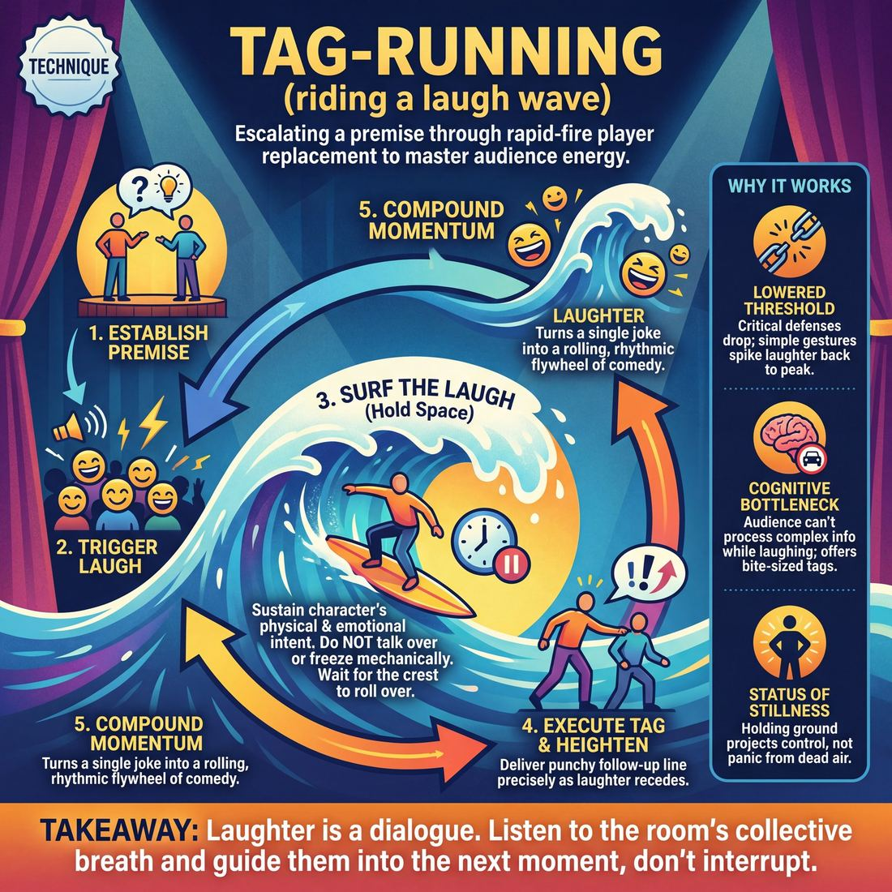

# 🎯 Tag-running (riding a laugh wave)

> *A drillable muscle that trains **Audience-Energy Management**.*

{ .infographic }

## 🎯 The essence

**Tag-running** is a high-velocity exercise where improvisers rapidly replace one another in a scene—using physical "tags" on the shoulder—to escalate a single comedic premise through a series of quick, punchy beats. While it looks like a drill for rapid-fire invention, it is actually a targeted workout for **Audience-Energy Management**. 

The exercise isolates one critical muscle: learning to "surf" a laugh. By delivering back-to-back heightening moves, players are forced to feel the room's energy, hold their fire while the audience erupts, and strike with the next line at the exact moment the laughter crests and begins to recede. This compounds the momentum, turning a single joke into a rolling wave of comedy without ever talking over the crowd.

## 🎓 What it trains

Tag-running isolates and drills the ability to read, ride, and compound the momentum of a live crowd. It trains an improviser’s internal metronome to synchronize with the audience's real-time reactions, teaching them to treat the room as an active scene partner rather than a passive receptacle.

At its core, this technique solves a pervasive problem: the fear of dead air. Novice improvisers often panic when they trigger a massive laugh. Unsure of what to do with the sudden burst of energy, they commit one of two cardinal sins:

*   **Talking over the laugh:** Rushing into the next line forces the audience to abruptly stop laughing so they don't miss crucial information. This inadvertently trains the crowd *not* to laugh, killing the room's momentum.
*   **Freezing mechanically:** Stopping dead, dropping the character's physical intention, and waiting awkwardly for silence shatters the reality of the scene.

By practicing tag-running, performers build the muscle memory required to hold their ground, sustain their character's physical and emotional point of view, and deliver a follow-up line (the **tag**) at the precise moment the audience's laughter begins to roll over. 

!!! abstract "The Deeper Principle: Laughter is a Dialogue"
    The performer–audience contract relies on mutual listening. When the audience laughs, they are speaking to you. If you talk over them, you are interrupting your scene partner. Tag-running teaches you to listen to the room's collective breath, giving the audience permission to fully enjoy the moment before you expertly guide them into the next one.

## 💡 Why it works

Tag-running works because it exploits a temporary vulnerability in the audience: once people are already laughing, their critical defenses drop. You are capitalizing on a moment of involuntary physical release to compound the comedy without having to build a brand-new setup. 

Here is the engine under the hood of this technique:

*   **The Lowered Comedy Threshold:** To get an initial laugh, you have to do the heavy lifting of establishing a reality, building tension, and subverting an expectation. But once the audience is laughing, the tension is broken. Their threshold for what is funny plummets. A simple word, a raised eyebrow, or a tiny physical gesture is suddenly enough to spike the laughter back to its peak.
*   **The Cognitive Bottleneck:** The human brain struggles to process complex new verbal information while the body is convulsing with laughter. If you rush into your next big line of dialogue, the audience must instantly suppress their joy to hear what happens next—effectively punishing them for finding you funny. Tag-running respects this bottleneck by offering bite-sized, easily digestible tags that feed the laugh without demanding heavy cognitive processing.
*   **The Status of Stillness:** Rushing past a laugh signals panic—a fear that if you stop talking, the audience will lose interest. Conversely, holding space and surfing the wave projects immense confidence. It tells the room, "I am in control, and I have plenty more where that came from."

!!! abstract "The Momentum Flywheel"
    Laughter is not a steady state; it is a wave that crests and recedes. Tag-running turns that wave into a flywheel. By hitting the audience with a tag just as their laughter begins to naturally decay, you push the energy back up. This creates a rhythmic, rolling momentum that can make a single comedic premise last three times as long.

!!! tip "On stage"
    The mechanism of tag-running gives you a hidden gift: **time**. While the audience is busy laughing at your initial move, you have a three-to-five-second window to breathe, assess your scene partner, and calmly discover what your tag will be. You don't have to invent it before the laugh starts.

## 🧩 The setup

Here is everything you need to arrange before putting this technique on its feet. Because this drill focuses on the musicality and timing of laughter, the physical setup must remove all friction so players can move at the speed of thought.

*   **Players & Group Size:** 6 to 10 players (a standard team or class size). 
*   **Arrangement:** Two players begin center stage. The rest of the ensemble forms a tight **backline** (standing in the downstage wings). They must be physically primed—weight on the balls of their feet, ready to sprint.
*   **Space & Materials:** An open stage or rehearsal room. **Crucial:** Ensure the pathways from the wings to center stage are completely clear of chairs, bags, or props. Players need unobstructed runways to execute rapid-fire tags.
*   **Time:** 
    *   *Per round:* 2–3 minutes of continuous, escalating tags.
    *   *Total time:* 15–20 minutes, ensuring multiple different base scenes are generated so everyone gets reps at both initiating and tagging.
*   **Roles:**
    *   **Base Players:** Two improvisers who initiate a grounded scene and establish a clear comedic premise or **Game**.
    *   **Taggers:** The rest of the ensemble, who dart in to tag a player out, deliver a heightened beat, and—most importantly—*hold their ground* to ride the resulting laugh.
    *   **The Facilitator:** In a rehearsal setting without a real audience, the facilitator (and the non-playing ensemble) must provide genuine, vocal laughter to simulate the "wave."
*   **Prerequisites:** Players must already know the basic mechanics of a **tag-out** (physically tapping a player's shoulder to replace them and inherit their scene partner) and have a foundational grasp of heightening a comedic pattern.

!!! tip "The Facilitator as the Laugh Track"
    If your rehearsal room is small, the energy wave won't happen naturally. Instruct the ensemble on the backline to laugh out loud—loudly and generously—when a tag hits. The improvisers need an audible wave of sound to practice surfing; they cannot learn to ride a laugh in a silent room.

!!! quote "How to introduce it"
    "Today, we are going to practice surfing. We're doing a standard tag-run, but the focus is entirely on the musicality of the room. When a tag lands and the room laughs, that laughter is a wave of energy. 
    
    If you tag in too early, you talk over the laugh and kill the momentum—that's wiping out. If you wait too long, the energy dies and the room goes flat. Your goal is to deliver your tag, freeze, let the laugh wash over you, and the *exact millisecond* the laugh begins to crest and roll back, the next person tags in. We are going to build a continuous, unbroken chain of audience energy."

## ⚙️ The mechanics

!!! abstract "Core Objective"
    To keep the audience's energy airborne by chaining scenes together. Players must learn to identify the exact apex of a laugh, hold space for it, and initiate a tag just before the laughter fades, using the residual energy to fuel the next scene.

This technique requires the full ensemble: two players on stage, a vigilant backline, and the rest of the class acting as a highly responsive audience. 

Here is the step-by-step flow of a tag-run:

1. **The Ignition:** Two players step out and initiate a fast-paced, high-stakes scene. Their immediate goal is to make a strong, clear comedic choice that triggers a genuine laugh from the room.
2. **The Crest (Holding Space):** The moment the audience laughs, the players on stage must instantly freeze their dialogue while maintaining their physical and emotional reactions. They "hold" the laugh, letting it swell to its peak. 
3. **The Strike (The Tag):** A player on the backline reads the laugh. Just as the laughter hits its apex and *begins* its downward slope, the backline player steps forward and tags one of the improvisers out. 
4. **The Handoff:** The tagged player exits cleanly. The remaining player pivots to face the new improviser. 
5. **The Escalation:** The incoming player delivers their first line immediately, surfing the fading tail of the previous laugh. The energy of the new scene must match or exceed the energy of the laugh they just rode.
6. **The Chain:** The new duo finds the next laugh, holds it, and another backline player tags in. This loop repeats, building a compounding wave of momentum.

### The Anatomy of a Laugh (When to Tag)

To run tags effectively, the backline must understand the lifecycle of a laugh. Timing the tag is a game of milliseconds.

| Phase | What the Audience is Doing | What the Stage Does | What the Backline Does |
| :--- | :--- | :--- | :--- |
| **1. The Spark** | The punchline or physical move lands. Silence breaks. | Deliver the move clearly. | Watch and listen intently. |
| **2. The Swell** | Laughter builds rapidly in volume. | Freeze dialogue; hold physical reaction. | Step forward, ready to move. |
| **3. The Apex** | Laughter hits maximum volume and sustains. | Bask in the energy; do not speak. | **Execute the tag.** |
| **4. The Decay** | Laughter begins to taper off into chuckles. | Pivot to the new scene partner. | Deliver the first line of the new scene. |
| **5. The Reset** | Silence returns. | *Too late.* Energy has reset to zero. | *Too late.* You are starting from scratch. |

### Rules & Constraints

* **No talking over the laugh:** If a player speaks while the audience is in the "Swell" or "Apex" phase, they are training the audience to suppress their laughter. 
* **Tags must be physical and decisive:** A weak, hovering tag confuses the audience and kills the momentum. The incoming player must step out with purpose and make clear physical contact.
* **Match the volume:** The first line of the new scene must be spoken loudly enough to cut through the "Decay" phase of the laugh, but not so loud that it feels like shouting.

!!! tip "On stage: The 'Freeze and Breathe' rule"
    When you get a laugh, freeze your mouth but keep your body alive. If you just delivered a shocking revelation, hold your gasp. If you just dropped a cake, stay frozen in horror. This physical hold acts as a visual anchor for the audience's laughter, giving the backline a perfect target to tag.

### Ending and Resetting
A successful tag-run usually sustains for 4 to 6 rapid-fire scenes before the wave naturally crashes or the premise exhausts itself. Once the energy dips and a tag happens during the "Reset" phase (silence), the coach calls "Scene!" The stage clears, the room takes a breath, and two new players step out to ignite the next wave.

## 🎬 Sample round

!!! example "Sample round: The Inappropriate Breakup"
    **The Setup:** Mark and Sarah are center stage. The scene has just established a pattern: Mark is breaking up with Sarah at the worst possible moment. 

    **Mark:** "Look, Sarah, it's not you, it's me. But I just don't think we should share this parachute."
    *(The audience bursts into laughter at the absurd reveal.)*

    **[Step 1 & 2: The Catalyst & The Freeze]**
    *Instead of Sarah replying immediately and stepping on the laugh, she freezes in an expression of pure shock. The actors hold the tension, allowing the audience's laughter to swell.*

    **[Step 3: The Strike]**
    **Leo:** *(Sprints from the backline and physically tags Mark right as the laughter hits its absolute peak—not waiting for it to die down.)*
    *Leo assumes Mark's exact physical posture. Sarah remains frozen. The visual kinetic energy of the fast tag keeps the audience engaged.*

    **[Step 4: The Handoff]**
    *Leo does not speak immediately. He waits exactly two beats, making intense eye contact with Sarah, allowing the residual laughter to clear just enough so his line won't be drowned out.*

    **[Step 5: The Escalation]**
    **Leo:** "Look, Sarah, it's not you, it's me. But I just don't think we should share this bomb defusal suit."
    *(The audience laughs even harder, now fully recognizing and anticipating the pattern.)*

    **[Step 6: The Chain]**
    **Maya:** *(Tags Leo on the immediate upswing of the new laugh.)*
    *Maya steps in. The audience is now laughing simply at the sight of another tag—they are trained on the game. Maya holds her ground, letting the audience's anticipation peak before she speaks.*
    **Maya:** "Look, Sarah... I'm taking the last life jacket. You're a strong swimmer."
    *(The audience erupts. The wave has crested.)*

    **[The Button and Sweep]**
    **Mark:** *(Tags Maya, stepping back in for the final blow.)*
    *Mark waits for the room to drop into absolute, breathless silence.*
    **Mark:** "Look, Sarah... I'm changing the Netflix password."
    *(The audience groans and laughs at the sudden, petty drop in stakes. An improviser on the wing immediately runs a **sweep edit**—running across the downstage to clear the scene—while the energy is still ringing in the room.)*

Notice how Audience-Energy Management dictates the pacing. The physical movements (the tags) happen *during* the loud laughter to maintain visual momentum, but the verbal punchlines are delivered only *after* the laugh has crested, ensuring the performers never compete with the crowd's volume.

## 🎚️ Variations & progressions

To master tag-running, improvisers must first learn to tolerate the sound of a laugh, and then learn to manipulate it. You can scale the difficulty of this technique to match the ensemble's comfort with audience energy, moving from basic patience to advanced orchestration.

**Level 1: The Freeze and Breathe (Novice to Advanced Beginner)**
*   **The Focus:** Curing the habit of talking over laughs and killing momentum.
*   **The Mechanic:** When the room laughs, the improviser must freeze completely, take a visible breath, and wait for the laughter's volume to drop by half before speaking again. It feels mechanical and overly long to the performer at first, but it builds the essential muscle memory to hold the space.

**Level 2: The Single Tag (Competent)**
*   **The Focus:** Riding the laugh and re-engaging at the right moment.
*   **The Mechanic:** The improviser delivers a line that gets a laugh, holds the space, and delivers exactly *one* follow-up beat (an additional punchline, justification, or reaction that builds on the immediate previous beat) just as the laugh begins to crest and decay.

!!! example "In a scene"
    **Player A:** "I loved him like a brother." *(Audience laughs at the obvious lie)*  
    *(Player A holds the space, waiting for the laugh to peak)*  
    **Player A (The Tag):** "A brother I was actively trying to frame for arson." *(Second, larger laugh)*

**Level 3: The Escalator (Proficient)**
*   **The Focus:** Surfing energy waves to build a set.
*   **The Mechanic:** The improviser attempts to string together three or more tags, each one escalating the absurdity or emotional stakes. The goal is to hit the next tag slightly *faster* each time, accelerating the rhythm to whip the audience into a continuous, rolling wave of laughter. If a tag misses, they must immediately drop the run and return to base reality.

**Level 4: The Silent Surfer (Master)**
*   **The Focus:** Conducting audience energy like an instrument without relying on wit.
*   **The Mechanic:** The improviser gets an initial verbal laugh, but all subsequent tags must be purely physical or emotional. A raised eyebrow, a slow turn, a deepening frown, or a subtle shift in posture. This forces the performer to rely entirely on stage presence, eye contact, and micro-timing to squeeze secondary and tertiary laughs out of a single moment.

!!! tip "On stage"
    **Never step on the laugh.** If you deliver your tag while the audience is still laughing at full volume, they won't hear it. Wait for the exhale.

## 🧑‍🏫 Coaching notes

When coaching tag-running, your primary job is to act as an external metronome for the group's comedic timing. You are training their ear to recognize the physical "shape" of a laugh so they can eventually surf it instinctively. 

!!! tip "Coaching: The Golden Cue"
    **"Strike on the descent!"**  
    The single most important cue you can give. Players naturally want to rush. Coach them to listen for the audience's laughter to hit its absolute peak, and to initiate the next tag the *exact moment* the volume begins to roll back down. This catches the energy before it dies, without stepping on the joke.

### Active Side-Coaching
Don't wait for the scene to end to give notes; direct the traffic in real-time. Use these sharp, actionable callouts from the sidelines:

*   **"Hold... hold... GO!"** — Manually conduct their timing. Force the eager player to wait out the laugh, then release them at the perfect moment.
*   **"Louder than the room!"** — Remind the incoming player that their first line must cut through the residual laughter. If they start at a normal conversational volume, the tag will be swallowed.
*   **"Heighten!"** or **"Take it further!"** — Use this if a player tags in with a lateral move (a joke of the exact same intensity). Push them to escalate the stakes or absurdity.
*   **"Clear the picture!"** — Call this if outgoing players are lingering in the space. A tag run requires a clean visual frame; lingering bodies muddy the punchline.

### What 'Good' Looks and Sounds Like
As players move from Novice (talking over laughs) to Competent (riding the laugh and re-engaging), you will observe distinct shifts in the room:

*   **The Sound:** You will hear a continuous, rolling wave of laughter that never fully drops to zero. It swells, begins to fade, and is immediately spiked back up by a crisp, projected line of dialogue. 
*   **The Sight:** Physical movements become decisive. The incoming player enters with immediate, undeniable purpose. They don't wander in and *then* decide what to say; they hit the stage already in character.
*   **The Feel:** The panic dissipates. Instead of rushing out of a fear of silence, the players look relaxed, alert, and entirely in control, feeding off the audience's energy rather than being flattened by it.

## 🧭 Debrief & reflection

After the adrenaline of a fast-paced tag run, the debrief grounds the players. It shifts their focus away from *what* they said (the content of the jokes) and toward *when* they said it and *how* the room felt. 

Use these questions to help players articulate the invisible dynamics of the room:

*   **"How long did the laugh actually last?"** Prompt them to realize that laughs have a distinct shape: an initial spike, a sustained crest, and a gradual decay. 
*   **"What did it feel like to wait before tagging?"** Explore the tension of holding the stage in silence. Novices often feel exposed during a laugh; this question helps normalize the sensation of pausing.
*   **"Did anyone feel like they 'stepped on' a laugh? What happened to the room's energy?"** Discuss how talking too soon forces the audience to abruptly stop laughing so they can listen, effectively killing the wave for the next player.
*   **"How did you know the run was over?"** Help them identify the physical sensation of the wave flattening out—when the premise is exhausted, the tags yield diminishing returns, and the audience needs a reset.

**What a good debrief surfaces:**
A successful reflection period moves players from Stage 1 (talking over laughs in a panic) toward Stage 3 (riding the laugh and re-engaging). Players will typically confess that waiting felt agonizingly long on stage, even though it looked perfectly timed from the outside. They will also start to articulate the difference between a polite chuckle (which needs immediate, driving follow-up) and a rolling belly-laugh (which demands space).

!!! abstract "The Core Realization"
    The ultimate "aha" moment in this debrief is the discovery that **the audience is a scene partner**. When players stop treating the crowd as a passive wall and start treating them as a breathing organism that needs time to react, they stop rushing and start *conducting*.

## ⚠️ Common pitfalls

!!! warning "Watch out: Stepping on the laugh"
    The most common and destructive novice trap is **talking over the laugh**. When a scene hits a massive peak and the crowd erupts, adrenaline spikes. Under this cognitive load, a novice will rush out to deliver their tag before the audience has finished reacting. This forces the crowd to abruptly stop laughing so they can hear the new line, instantly killing the momentum you are trying to build. 

When executing a tag-run, the margin for error in timing is razor-thin. Here are the most common ways this technique breaks down under pressure, and how to fix them:

*   **The Energy Dip (Waiting too long):** The advanced-beginner overcorrection to stepping on laughs is to wait until the room is dead silent before speaking. This is mechanical and drains the room's energy. 
    *   *The Fix:* You must enter on the **decay of the laugh**—the moment the laughter has peaked and is just beginning to roll back down, but before it disappears. You are catching a wave, not waiting for the ocean to go flat.
*   **Premise Drift (Tagging the wrong thing):** In the excitement of a hot run, players often tag in with a funny idea that has nothing to do with the specific comedic game that triggered the laugh. The audience gets confused, and the wave crashes.
    *   *The Fix:* Before you move your feet, identify the exact variable that caused the laugh. If the laugh was about a character's bizarre obsession with soup, your tag must heighten the soup obsession, not introduce a new quirk about their posture.
*   **The Mechanical Queue:** When a tag-run starts, players on the backline sometimes physically line up in the wings, waiting for their turn to tag. This signals to the audience that a "bit" is happening, stripping away the magic of spontaneous discovery.
    *   *The Fix:* Stay loose on the backline. Only step forward when you have a specific heightening move. If you don't have one, stay put and support the players who do.

!!! tip "On stage: The 'Breathe and Step' fix"
    If you find yourself consistently rushing tags, train yourself to take one deep, audible breath *after* you tap the player out, but *before* you speak your line. That single second of physical grounding is usually exactly how long it takes for the laugh to reach its perfect decay point.

## 🌟 What mastery looks like

At the highest level of execution, an improviser performing a tag-run stops being a scene partner and becomes a conductor. They treat the audience's energy like an instrument, unifying a fragmented room into a single organism that breathes, gasps, and laughs in perfect synchronization. 

When a team achieves mastery in tag-running, the exercise looks less like a series of separate scenes and more like a perfectly choreographed fireworks finale. 

Here are the observable hallmarks of a master-level tag-run:

*   **Finding "The Pocket":** Masters do not wait for absolute silence to initiate the next tag, nor do they panic and talk over the peak of the roar. They strike in "the pocket"—that split-second moment when the audience's laughter has just crested and they are collectively drawing a breath.
*   **Zero Throat-Clearing:** The improviser entering the scene does not need a setup line or a moment to establish the who/what/where. They enter already at the heightened emotional or comedic peak of the new reality. The physical tag itself is sharp, and the first word spoken is the payload of the edit.
*   **Predatory Listening on the Backline:** The players not in the scene are coiled springs. They are not thinking of their own jokes; they are hyper-focused on the rhythm of the current scene, physically leaning in so the tag can happen the millisecond the game demands it.
*   **The Decisive Apex:** A master knows exactly when the premise has been fully mined. Rather than pushing for one tag too many and letting the energy fizzle, they recognize the absolute peak of the run and execute a definitive sweep or transition, leaving the audience wanting more.

!!! abstract "The Stacking Effect"
    In a novice tag-run, the energy graph looks like a series of isolated hills: a joke, a laugh, a return to baseline, a new setup. In a master-level run, the graph looks like a staircase. The next tag hits *before* the previous laugh has fully dissipated, using the audience's momentum to launch the next beat even higher.

!!! example "In a scene"
    Player A is tagged out while passionately defending their romantic attraction to mayonnaise. The audience erupts.
    
    **Novice:** Waits for the room to go completely quiet, steps in, takes a breath, and says, "So, about that sandwich..." *(The energy resets to zero).*
    
    **Master:** Tags Player A the *millisecond* the laugh peaks, instantly drops to one knee with an imaginary ring box, and yells, "Will you marry me, Hellmann's?!" *(The audience, already primed and inhaling, explodes into a second, larger wave of laughter without ever catching their breath).*

## 🔗 Why it matters

Tag-running is the high-intensity interval training for **Audience-Energy Management**. It forces improvisers to stop treating laughter as a polite interruption and start treating it as a kinetic force to be harnessed. By stringing together rapid-fire tags, performers learn the precise timing required to keep a crowd suspended in a state of escalating joy. It pushes an improviser from mechanically pausing for laughs (an Advanced Beginner trait) to actively surfing energy waves to build a set's momentum (a Proficient skill). 

In the broader domain of the audience, this technique is a primary tool for honoring the performer-audience contract. When a tag run hits its stride, it does more than elicit chuckles; it **unifies the room**. The audience recognizes the pattern, anticipates the escalation, and begins to breathe and laugh as a single organism. You are no longer just playing *for* them; you are playing *with* their energy, conducting the room like an instrument.

Beyond managing the crowd, tag-running acts as a stress test for the ensemble's collective comedic brain, strengthening several foundational improv muscles at once:

*   **Pattern Recognition (The Game):** A tag run only works if the entire backline instantly understands the comedic premise. It trains the ensemble to collectively ask, *"If this is true, what else is true?"* at lightning speed, heightening the core joke rather than inventing new ones.
*   **Egoless Support:** There are no stars in a tag run. It requires improvisers to deliver their single line, get the laugh, and immediately yield the stage to the next idea. It builds a hive-mind mentality where the momentum of the piece matters more than any individual's stage time.
*   **Pacing and Rhythm:** It teaches the vital, millisecond difference between stepping on a laugh (talking too soon and killing momentum) and tagging on the *crest* of a laugh (striking just as the laughter peaks to compound the energy).

!!! abstract "The Surfer's Mindset"
    Think of a single, well-earned laugh as catching a wave. You get a brief, thrilling ride, and then the energy dissipates on the shore. **Tag-running** is the art of learning how to hop from wave to wave without ever touching the sand. It transforms a fleeting moment of amusement into a sustained, unforgettable sequence of theatrical momentum.

## 📚 References & Further Reading

### Foundational sources
*   **Matt Besser, Ian Roberts, and Matt Walsh, *The Upright Citizens Brigade Comedy Improvisation Manual* (2013)** — The definitive text on the mechanics of the "tag run." The authors explicitly detail how to use rapid-fire tag-outs to heighten the "Game of the Scene," demonstrating how an ensemble can escalate a single comedic premise to its absolute limit without having to build new setups from scratch.
*   **Mick Napier, *Improvise: Scene from the Inside Out* (2004)** — Essential reading on the psychology of the improviser. Napier addresses the panic that causes players to rush or talk over the audience. His philosophy underpins the confidence required to hold your ground, maintain your physical point of view, and let a laugh wash over you rather than mechanically freezing or rushing to the next line.

### Practitioner guides & manuals
*   **Greg Dean, *Step by Step to Stand-Up Comedy* (2000)** — While written for stand-up, Dean’s breakdown of "accelerating the laugh" and the rhythm of tags perfectly describes the mechanics of surfing a laugh wave in improv. He explicitly discusses the technique of breathing with the audience—striking with the next punchline or tag at the exact moment the crowd exhales their laughter, which creates the "momentum flywheel" effect.
*   **Charna Halpern, Del Close, and Kim "Howard" Johnson, *Truth in Comedy: The Manual of Improvisation* (1994)** — The foundational text on long-form improv and the Harold. While it does not use the modern UCB terminology of a "tag run," it introduces the basic mechanic of the "tag-out" as a way for the ensemble to manipulate time, space, and character dynamics on the fly to support the scene.

### Lineage & teachers
*   **Upright Citizens Brigade (UCB)** — The theater and training center most responsible for formalizing the "tag run" as a structural tool. UCB codified the practice of using the backline as an active engine for heightening, turning the tag-out from a simple editing device into a high-velocity comedic drill.
*   **iO Theater (formerly ImprovOlympic)** — The Chicago institution where the physical mechanic of the tag-out was developed and popularized under Del Close and Charna Halpern, teaching ensembles to treat the stage as a fluid, shared space rather than a rigid two-person boundary.

### Research & theory
*   **Vanessa Pope, Rebecca Stewart, and Elaine Chew, "Audience Laughter Distribution in Live Stand-up Comedy" (2018)** — An acoustic analysis of live comedy revealing that professional comedic timing is as much about *preventing* laughter (managing the cognitive bottleneck) as eliciting it. The study demonstrates that performers actively control the room's energy via the relative timing of laughter gaps, validating the concept of treating laughter as a dialogue.
*   **Florian Cafiero et al., "Timing In stand-up Comedy: Text, Audio, Laughter, Kinesics (TIC-TALK)" (2026)** — A multimodal study of comedic timing demonstrating that a performer's kinetic energy negatively predicts the audience's laughter rate. This empirical finding—a "stillness-before-punchline" pattern—validates the improv principle that physical stillness and holding space are required to let a laugh peak before initiating the next tag.
*   **Sophie Scott, "Why We Laugh" (2015)** — A foundational TED Talk and body of cognitive neuroscience research on laughter as a social, contagious behavior rather than just a reaction to humor. Scott’s work explains the "involuntary physical release" of laughter and why an audience's critical defenses drop once they are already laughing together, making them highly susceptible to rapid-fire tags.

### Talks, videos & courses
*   **Greg Dean, *How to Build a Stand-Up Comedy Routine* (Online Course)** — Dean’s recorded lectures on "accelerating the laugh" and "breathing with the audience" provide a practical masterclass on the exact timing required to hit a tag just as the audience exhales.
*   **Sophie Scott, *The Science of Laughter* (2015)** — Various public lectures (including her work at University College London) detailing the physiological mechanics of the human rib cage during laughter, which explains the "cognitive bottleneck" that prevents audiences from processing complex new verbal information while laughing.

### Communities & adjacent reading
*   **Steve Martin, *Born Standing Up: A Comic's Life* (2007)** — A masterclass memoir on the rhythm of the crowd and the physical sensation of riding a laugh. Martin’s meticulous deconstruction of his own timing provides profound insight into the performer-audience contract and the discipline required to control a room's energy without pandering.

## 💬 Quotes & Anecdotes

!!! quote "— Matt Besser, Ian Roberts, and Matt Walsh, *The Upright Citizens Brigade Comedy Improvisation Manual* (2013)"
    A tag-out is a support technique whereby an improviser from the back-line takes the game of the scene to a new time (and sometimes a new place) by substituting him or herself for one or more of the characters already in the scene.

!!! quote "— Charna Halpern, *Interview with Pam Victor* (2013)"
    Ah, the mystery laugh!!! Yep. No explanation for it. It happens a lot... Just accept it. Don't look around with a perplexed face like, "What's so funny?" The magic is there and who knows what's affecting your audience. It could be a reaction [to] something honest in the moment.

!!! quote "— Keith Johnstone, *Impro for Storytellers* (1999)"
    Laughter misleads. Sometimes it's just drunks, teenagers and other improvisers who are laughing, while the bulk of the audience sits with folded arms.

### Where it comes from
The "tag-out" is a foundational editing mechanic in long-form improvisation, heavily developed in Chicago during the 1980s and 1990s at theaters like ImprovOlympic (iO). The specific terminology of a "tag-out run"—where the backline executes a rapid succession of tags to heighten a single comedic premise—was formally codified by the Upright Citizens Brigade (UCB) in their teachings and manual. 

The concept of "holding for laughs" or "riding a laugh," however, predates improv entirely. It is a classic stage acting and stand-up comedy technique used to ensure the audience's vocal reaction doesn't drown out the next line of dialogue, effectively treating the audience's laughter as a line of dialogue from a scene partner.

### A telling example
**The "Yes, and..." of Laughter**
Imagine an illustrative scene where a player confesses they are terrified of the ocean, and their scene partner casually reveals they are currently on a submarine. The audience erupts in laughter. 

*   **Wiping out:** The first player panics at the noise and immediately yells, "Get me off this boat!" while the audience is still laughing. The crowd must abruptly stop laughing to hear the new information, effectively killing the energy in the room.
*   **Surfing the wave:** The first player freezes, eyes wide with terror, holding their physical reaction. They let the audience laugh for three full seconds. Just as the laughter begins to naturally crest and die down, a player from the backline runs up, tags the second player out, and says, "Captain, the torpedoes are jammed!" The first player screams. The laughter spikes again, compounding the momentum into a rolling wave.

## 🧭 Explore the framework

- ⬆️ **Skill it trains:** [Audience-Energy Management](05_S2__audience-energy-management.md)
- 🎭 **Domain:** [The Audience](05_D__the-audience.md)
- 🔁 **Sibling techniques:** [Landing/cushioning a beat](05_S2_T2__landing-cushioning-a-beat.md), [Breaking the 4th Wall / Direct Address](05_S2_T3__breaking-the-4th-wall-direct-address.md)
