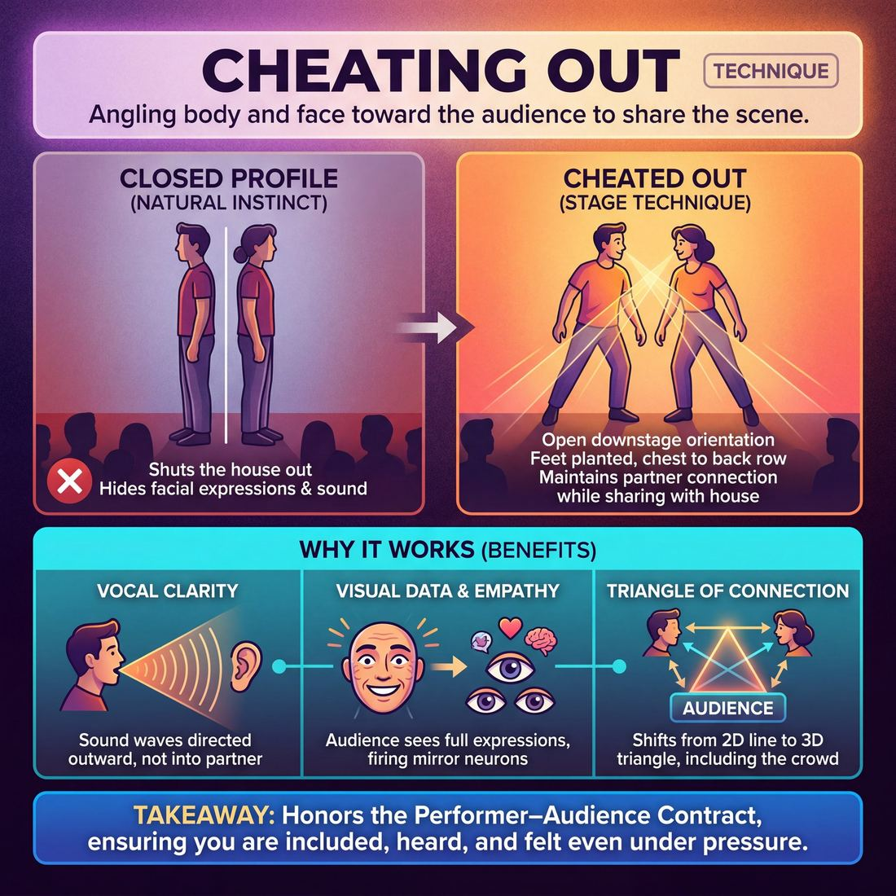

# 🎯 Cheating out

> *A drillable muscle that trains **Stage Presence & Clarity**.*

{ .infographic }

## 🎯 The essence

**Cheating out** is a foundational stagecraft technique where performers angle their bodies and faces slightly toward the audience, even when speaking directly to a scene partner. Rather than standing in a closed, **profile** stance—facing each other at a 90-degree angle that shuts the house out—players open their physical orientation downstage. Practicing this adjustment forces an improviser to master a vital dual awareness: maintaining an authentic, intimate connection with their partner while simultaneously ensuring their physical choices, emotional reactions, and voice are generously shared with the back row.

## 🎓 What it trains

At its core, cheating out is the primary technique for developing **Stage Presence & Clarity**. It trains an improviser’s physical awareness of the room and builds the muscle of *split focus*—the ability to maintain deep emotional connection with a scene partner while physically angling the body to share that connection with the house.

Humans are naturally wired to face the person they are speaking to. On stage, this instinct creates a "closed" scene where the audience loses access to vital data: facial expressions, micro-reactions, and vocal projection. 

By drilling this technique, improvisers build several critical micro-muscles:

*   **Spatial awareness:** Developing a subconscious map of the stage geometry, the proscenium (the invisible "fourth wall" separating the stage from the audience), and the sightlines to the back row.
*   **Physical independence:** Learning to decouple the direction of your emotional attention from the direction of your toes and sternum. 
*   **Vocal clarity:** Ensuring your voice travels outward into the theater rather than being muffled into your partner's chest.

!!! abstract "The Performer–Audience Contract"
    Improv is not a private conversation that people happen to be watching; it is a shared, communal experience. Cheating out is the physical manifestation of the **Audience** domain. It honors the contract with the crowd, silently signaling: *"You are included in this."*

Because the natural instinct to turn inward is so strong, an improviser's physical openness is often the first thing to collapse under **cognitive load**—the mental strain of inventing a scene. Drilling this technique moves the physical geometry of the stage into automatic muscle memory, ensuring that even in moments of panic, the audience is never shut out.

## 💡 Why it works

Cheating out resolves the tension between natural human behavior and the artificial geometry of a stage. In real life, conversing face-to-face is polite; on stage, it creates a closed loop that physically and psychologically excludes the audience. 

The technique works by exploiting three underlying mechanisms:

* **The Empathy Hack (Visual Data):** An audience connects to a scene primarily through emotional reactions, which live in micro-expressions—the widening of eyes, a subtle wince, a suppressed smile. When you stand in full profile, you hide half of this emotional data. Cheating out gives the audience full access to your face, allowing their mirror neurons to fire so empathy can take hold.
* **Directional Acoustics:** Sound waves are physical. When you speak upstage or directly into your partner's chest, your voice is absorbed by the back curtain or your partner's shirt. Angling your body downstage directs the sound waves out into the house, ensuring the back row hears the premise without you having to artificially shout.
* **The Triangle of Connection:** By opening your stance, you shift the geometry of the scene from a straight, two-dimensional line (Actor ↔ Actor) to a three-dimensional triangle (Actor ↔ Actor ↔ Audience). The audience is no longer a voyeur peering through a keyhole; they become a silent, included participant.

!!! abstract "The Engine Under the Hood: Vulnerability"
    Beyond acoustics and sightlines, cheating out forces vulnerability. It strips away the improviser's ability to hide entirely in their partner's gaze. By keeping your chest and face open to a dark room of strangers, you are subconsciously signaling: *We are confident in what we are making, and you are safe with us.*

## 🧩 The setup

To isolate the physical muscle of cheating out, set up a constrained two-person scene drill. 

* **Players:** Pairs on stage. The rest of the ensemble sits in the "house" to act as a live audience.
* **Space & Materials:** A clearly defined stage and audience area. The facilitator must stand at the *very back* of the room to accurately judge visibility. Optional: Two chairs placed center stage, angled outward at a 45-degree angle toward the audience (the classic **"V" stance**).
* **Time:** 2–3 minutes per pair; roughly 15–20 minutes total for a standard-sized group.
* **Roles:** 
    * *Active players:* Perform a standard scene while hyper-focusing on their physical orientation. 
    * *The Audience:* Actively monitor the players' faces, raising a hand if a player turns completely in profile and "closes off" their face.
    * *Facilitator:* Side-coaches from the back row, calling out real-time adjustments to angles, posture, and projection.
* **Prerequisites:** Basic two-person scene mechanics. Players should be comfortable enough with initiating and responding that adding a strict physical constraint won't paralyze their scene work.

!!! example "Facilitator Script"
    "Today we are going to practice *cheating out*. In real life, when we talk to someone, we face them squarely. On stage, if you do that, you give the audience your shoulder and hide your facial expressions. For this drill, you will do a normal two-person scene, but you must keep your downstage foot planted and your chest angled toward the back row. You will feel like you are talking past your partner's ear. It will feel entirely unnatural to you, but it will look completely natural to us."

!!! tip "On stage"
    If your rehearsal space doesn't have a raised stage, put down a line of tape to represent the **downstage edge** (the front of the stage closest to the audience). This gives players a concrete physical boundary to orient their bodies against, making the abstract concept of "the audience" a tangible line in the room.

## ⚙️ The mechanics

!!! abstract "Core Objective"
    To maintain a genuine, unbroken connection with your scene partner while keeping your body, face, and voice physically open and accessible to the audience. 

At its core, cheating out is a physical compromise between two competing realities: the fictional world where you are talking to your partner, and the literal world where an audience needs to see and hear you. 

### The Physical Mechanics
Before running the drill, players must understand the basic physical geometry of the technique:

*   **The 45-Degree Angle:** Instead of standing in full profile, both players pivot their hips and shoulders outward so they are facing the audience at roughly a 45-degree angle.
*   **The Footwork:** The **downstage foot** (closest to the audience) points slightly toward the crowd. The **upstage foot** (furthest from the audience) steps slightly back. This naturally opens the pelvis and chest toward the house.
*   **The Neck Pivot:** Because the body is angled outward, players must turn their heads slightly upstage to maintain eye contact with their partner. 

!!! tip "On stage"
    Always gesture with your **upstage arm**. If you reach across your body with your downstage arm, you will naturally close your shoulders off to the audience and block your own face.

### The Calibration Drill
To build this muscle so it holds up under pressure, use this runnable isolation drill. 

**Roles:** 
*   **The Players:** Two improvisers on stage.
*   **The Tracker:** The coach (or a designated side-line player) sitting in the back row of the house.

**The Flow of Play:**

1.  **The Profile Start:** Two players stand center stage, facing each other in strict, 100% profile. They begin a grounded, dialogue-heavy scene (e.g., two friends arguing over a restaurant bill). 
2.  **The Adjustment:** After three lines of dialogue, the Tracker calls out, *"Cheat!"* Both players immediately adjust their footing to the 45-degree angle, opening their chests to the house while continuing the scene without dropping the emotional stakes.
3.  **The Stress Test:** The Tracker begins moving around the audience seating area—shifting from the center aisle to the far left and right wings. 
4.  **The Feedback Loop:** If the Tracker reaches a spot where they can no longer see at least three-quarters of a player's face, or if a player turns back into full profile, the Tracker claps once and calls, *"Profile!"*
5.  **The Correction:** The offending player must immediately physically correct their stance back to 45 degrees, using the movement as a natural part of their character's physical life, and continue the scene.
6.  **Reset:** After 2 to 3 minutes of sustained play, call scene. Two new players take the stage and begin at Step 1.

**Rules & Constraints:**
*   **No breaking the reality:** When the Tracker calls *"Profile!"*, players may not drop character, apologize, or freeze. The physical correction must be integrated smoothly into the acting.
*   **Eye contact is sacred:** Players must maintain unbroken eye contact with each other. If a player looks directly at the audience to check their angle, the Tracker calls *"Eyes!"* 

!!! note "The Load Factor"
    Novice players will easily hold the cheat during silence, but will immediately turn inward the second they have to think of a clever line. The goal of this drill is to make the 45-degree stance the body's default resting position, so it remains intact even when the brain is working hard.

## 🎬 Sample round

!!! example "In a scene: The Kitchen Confession"
    Let’s look at a two-person scene where physical positioning dictates the audience's connection to the emotion. 

    **Context:** Maya and Leo are playing a tense scene in a kitchen. Maya is chopping carrots; Leo has just walked in with bad news.

    *   **Leo:** "I got the call from the vet." 
        *(Leo enters and stands in full profile, facing Maya completely. The audience only sees the side of his head and his shoulder. The energy is trapped between the two performers.)*
    *   **Maya:** *(Stops chopping. She turns her head to look at Leo, but keeps her shoulders and chest angled toward the audience—**The 'V' Formation**.)* "And?"
    *   **Leo:** *(Realizing he is closed off, Leo drops his upstage foot back slightly and pivots his torso 45 degrees toward the house—**Opening the Hinge**.)* "He's going to be fine. But he needs the cone." 
        *(Because Leo has cheated out, the audience can now clearly see the mixture of profound relief and mild annoyance on his face. If he had stayed in profile, this nuanced reaction would have been lost to the wings.)*
    *   **Maya:** *(Steps out from behind the imaginary counter, moving downstage to share Leo's plane. She plants her downstage foot toward the front row, maintaining eye contact with Leo while her body remains open to the crowd—**Sharing the Picture**.)* "Oh, thank god. I'll get the peanut butter."

    **The Breakdown:**
    
    *   **The Pivot:** Notice how Leo didn't need to look at the audience to include them. By simply dropping his upstage foot back, his chest opened up, giving the audience a front-row seat to his internal emotional shift. 
    *   **The Shared Plane:** When Maya stepped out from the counter, she didn't walk *up* to Leo (which would force them into a tight, closed-off profile). She stepped *downstage*, creating a shared, open picture that invites the audience into the moment while maintaining the reality of the scene.

## 🎚️ Variations & progressions

To move from a Novice who forgets their body under pressure to a Master who owns the space effortlessly, you must gradually increase the cognitive and physical demands of the scene. 

Here is how to ramp the difficulty of cheating out, moving from static mechanics to dynamic, high-load scene work.

### 1. The Static "V" (Novice to Advanced Beginner)
At this stage, the goal is pure muscle memory. 
*   **The Drill:** Two players stand center stage in a strict "V" formation, feet planted. They have a mundane, low-stakes conversation (e.g., discussing what they had for breakfast). 
*   **The Focus:** Do not move the feet. Practice turning the *head* to look at the partner, while keeping the *chest* and *hips* facing the audience. 

!!! tip "The 'Nose and Toes' Check"
    A great shorthand for beginners: "Where are your toes pointing?" If the toes are pointing at the scene partner, the chest is closed off. Keep the downstage toes pointing at the audience.

### 2. The Pacing Scene (Competent)
Once players can hold a static cheat, introduce movement. A Competent improviser can read the room and ensure their choices reach the back row, even while in motion.
*   **The Drill:** Players are given a physical task that requires moving across the stage (e.g., setting a large dining table, cleaning a garage). 
*   **The Focus:** Every time a player stops to deliver a line, they must consciously "land" in a cheated-out position before speaking. They practice walking naturally, but stopping theatrically.

### 3. The Upstage/Downstage Split (Proficient)
This variation tests extreme stage geometry. It forces players to maintain a commanding, generous presence even when the physical staging works against them.
*   **The Drill:** One player is anchored far downstage; the other is anchored far upstage. They cannot close the distance.
*   **The Focus:** The downstage player must speak to their partner *behind* them without turning their back on the audience (looking over the upstage shoulder). The upstage player must project their voice and energy *through* the downstage player to reach the house.

!!! example "In a scene"
    Player A is downstage, driving a car. Player B is upstage, sitting in the "backseat." Player A must argue with Player B by glancing in the rearview mirror and cheating their profile out, rather than turning completely around in the driver's seat and showing the audience the back of their head.

### 4. The Three-Person Triangle (Mastery)
Adding a third person exponentially increases the difficulty of stage pictures. Masters can effortlessly adjust to multiple focal points without ever closing off the scene.
*   **The Drill:** Three players engage in a fast-paced, high-emotion scene. 
*   **The Focus:** The players must constantly maintain a "flattened triangle." If one player moves, the other two must instinctively adjust their footing so that no one is ever **eclipsed** (hidden behind another player's body) and no one's back is ever fully turned to the house.

!!! note "Testing the Muscle"
    Anyone can cheat out when they are only thinking about cheating out. The true test is whether a player maintains their open body angle when they are suddenly hit with a massive plot twist, a fast walk-on, or a wave of genuine emotion. Ramp the emotional stakes of these drills to test if the muscle memory holds.

## 🧑‍🏫 Coaching notes

When an improviser is overwhelmed by inventing a narrative or processing a complex offer, their body will instinctively seek the safety of a closed circle. Your job as a coach is to build this muscle memory through gentle, relentless repetition until the physical posture becomes automatic.

!!! tip "Coaching: 'Show us your buttons'"
    The single most effective, instantly understandable cue for cheating out is: **"Show us your buttons."** 
    
    If the audience cannot see the imaginary buttons on the front of an improviser's shirt, their torso is closed off. This cue bypasses complex spatial processing mid-scene and prompts an immediate, physical correction of the shoulders and chest.

### What to watch for
Train your eye to look at the actors' feet and shoulders, not just their faces. The root of poor stage visibility usually starts at the floor.

*   **The Profile Trap:** Actors standing exactly 90 degrees to the audience, talking directly to each other's noses. Half the audience loses the facial expressions, and voices are projected into the wings.
*   **The Downstage Block:** One actor stands slightly downstage of the other, forcing the upstage actor to turn their back to the house to make eye contact.
*   **The "Tennis Match":** Actors standing too far apart while facing inward, forcing the audience to physically turn their heads back and forth to follow the dialogue.

### Effective side-coaching cues
Keep your side-coaching brief and physical. Do not stop the scene to explain the geometry; just drop the cue in and let them adjust on the fly.

| What you observe | Quick side-coaching cue |
|---|---|
| Flat profile; actors facing each other squarely. | *"Open the hinge."* or *"Show us your buttons."* |
| A brilliant, silent emotional reaction is hidden. | *"Share that face with us."* or *"Let the audience see that."* |
| An actor's feet are pointed entirely at their partner. | *"Drop your downstage foot back."* |
| An actor turns their back to walk upstage. | *"Keep your front to the house as you move."* |

!!! example "In a scene"
    **Improviser A** *(turning fully away from the audience to look at B)*: "I can't believe you sold the family cow!"  
    **Coach** *(softly from the side)*: *"Cheat out. Share the anger with the room."*  
    **Improviser A** *(pivots their downstage foot back, opening their chest to the audience while keeping their eyes on B)*: "She was my best friend!"

### What 'good' looks and sounds like
When the room is successfully cheating out, you will observe the **"V" formation**: the two actors form a shallow "V" that opens toward the audience. 

They maintain deep, connected eye contact by turning their necks slightly, but their torsos remain open to the house. Acoustically, you will hear a distinct shift: their voices will bounce off the back wall of the theater rather than being swallowed by the side curtains. The scene will feel simultaneously intimate between the characters and generous to the crowd.

## 🧭 Debrief & reflection

After running a drill focused on cheating out, the debrief must bridge the gap between how the technique *feels* to the performer and how it *reads* to the audience. Because cheating out is an artificial stage behavior, players often need to process the physical awkwardness before they can trust the technique.

Use these questions to guide the conversation and lock in the physical muscle memory:

*   **"At what moments did you catch yourself turning fully inward?"** 
    This helps players connect their physical stance to their cognitive load. They will usually realize they closed off during moments of high emotion, complex object work, or when they were struggling to think of their next line.
*   **"Where did you feel physical tension in your body?"**
    Opening the downstage shoulder while keeping the head engaged with a partner requires a slight spinal twist. Asking this helps players identify the physical sensation of the "cheat," so they can use that feeling as a trigger to know they are doing it right.
*   **"How did your connection with your partner change when you couldn't rely on direct eye contact?"**
    This addresses the most common fear: losing intimacy. It prompts players to realize they can connect through peripheral vision, vocal tone, and shared focus.

### Translating the feedback

A good debrief surfaces the friction between natural human instinct and effective stagecraft. When players share their reflections, frame their experiences to reinforce the mechanics:

| When a player says... | The coach frames it as... |
| :--- | :--- |
| *"It felt completely fake and stagey."* | **The Proscenium Reality:** "It *is* artificial. But what feels like a 45-degree disconnect to you looks like 100% natural intimacy to the audience. We are translating reality for the stage." |
| *"I forgot my angle the second we started arguing."* | **Cognitive Load:** "High emotion or panic makes us revert to our daily habits. Turning inward is a symptom of your brain working hard. The goal is to make the open stance your default resting state." |
| *"It felt like I was ignoring my partner."* | **Shared Focus:** "You traded direct eye contact for audience inclusion. When you both look out, the audience gets to see your faces process the emotion simultaneously." |

!!! abstract "The Core Realization"
    The ultimate goal of this debrief is to help the player accept that **internal feeling does not equal external reality**. Once a player trusts that an "awkward" open stance actually looks beautiful and connected from the house, they will stop fighting the technique and start using it as a tool.

## ⚠️ Common pitfalls

!!! warning "Watch out: The Cognitive Load Collapse"
    The most common novice trap is the **Cognitive Load Collapse**. A beginner will step on stage, remember their training, and strike a perfect, open stance. But the moment the scene demands real brainpower—an unexpected initiation, an emotional reaction, or a complex game—they instinctively turn their whole body inward to face their partner. When the brain works hard, the body seeks the safety of a closed circle, shutting the audience out entirely. 

When improvisers are learning to cheat out, their bodies are fighting years of social conditioning. Here are the most common ways this technique breaks down, and how to fix them:

*   **The Profile Lock**
    *   *The Trap:* Standing exactly 90 degrees to the audience, so only one shoulder and half a face are visible. This usually happens when improvisers stand too close together.
    *   *The Fix:* Take a half-step back from your partner to widen the angle. Open your hips toward the audience to create the **"V" formation** with your partner, where the point of the "V" is upstage.
*   **The Tennis Match**
    *   *The Trap:* Whipping the head back and forth between the scene partner and the audience, trying to artificially "share" focus. It looks nervous and breaks the reality of the scene.
    *   *The Fix:* Cheat the *body* out, but keep the *focus* (your eyes and attention) on your partner. You don't need to look at the audience to share the scene with them.
*   **The Upstage Drift**
    *   *The Trap:* One partner steps too far downstage. To maintain eye contact without turning their back on the crowd, the other partner slowly backs upstage, eventually playing the scene from the back wall.
    *   *The Fix:* The downstage partner must share the responsibility of stage geography. If you feel your partner drifting back, step upstage to meet them on a shared plane.
*   **The "Dead Eyes" Cheat**
    *   *The Trap:* The improviser successfully opens their body to the audience, but stares blankly at the tech booth or the exit sign. The physical connection to the scene partner is completely severed.
    *   *The Fix:* Use your peripheral vision. Even if your nose is pointed slightly downstage, your eyes and energetic focus should remain locked on your partner. 

!!! tip "On stage: The Downstage Foot Rule"
    If you catch yourself or your team constantly turning inward, drill the **Downstage Foot Rule**. The foot closest to the audience must always be pointed toward the audience, and planted slightly ahead of the upstage foot. This physically prevents the hips from locking into a closed profile.

## 🌟 What mastery looks like

At the highest level of proficiency, cheating out ceases to look like a mechanical stage technique. The master improviser owns the space effortlessly and honestly, making the audience feel intimately included without ever breaking the reality of the scene. 

When observing a master improviser, you will see this technique manifest in several distinct behaviors:

*   **The Illusion of Intimacy:** They maintain a deep, believable emotional connection with their scene partner while their body remains open to the house. They achieve this by looking at their partner's **downstage eye** (the eye closest to the audience) or by angling their head just enough to share their expressions, creating the illusion of direct, face-to-face contact.
*   **Fluidity in Motion:** They can cross the stage, perform complex object work, or engage in high-energy physical comedy without ever accidentally turning their back on the audience. Their spatial awareness is so ingrained that their feet naturally find the open "V" stance whenever they come to a rest.
*   **Micro-Expressions Read:** Because their face is consistently shared with the house, the audience catches every subtle emotional shift, eye dart, or suppressed smile. This is how a master **unifies the room**—the entire audience breathes and reacts together because everyone, even in the back row, has a clear view of the internal emotional stakes.
*   **Effortless Re-adjustment:** If a less experienced scene partner accidentally "closes off" the stage (turning their back to the audience and forcing the master to do the same to maintain eye contact), the master subtly pivots, adjusts their footing, or moves downstage to re-open the stage picture without breaking the flow of the dialogue.

!!! example "In a scene"
    Two improvisers are having a tense, whispered argument about a hidden secret. 
    
    A novice will turn completely inward, squaring off face-to-face to simulate secrecy, effectively hiding their expressions from the house. 
    
    A master will stand almost shoulder-to-shoulder, looking out at the "horizon" or slightly past each other, projecting their stage-whispers out to the back row. The audience feels the intense intimacy of the argument because they can see the fear and anger on both faces, even though the actors are barely looking directly at one another.

!!! abstract "Key idea"
    Mastery of cheating out is ultimately about **generosity**. It is the physical manifestation of the performer–audience contract: *We are doing this for you, and we want you to see it all.*

## 🔗 Why it matters

Improv is a delicate balancing act between two realities: the intimate, fictional world of the scene and the physical reality of the theater. **Cheating out** is the technique that bridges them. It is a silent, structural promise that says, "We are having this private moment, but we are having it *for you*."

By mastering this muscle, you directly feed the broader skill of **Stage Presence & Clarity**. A brilliant emotional reaction, a subtle character tell, or a razor-sharp retort is useless if it is delivered to the upstage curtain. Cheating out ensures that your choices read clearly all the way to the back row. It transforms a closed-loop conversation into a generous, commanding performance, allowing your voice to project naturally without straining.

!!! abstract "The Paradox of Public Intimacy"
    The magic of cheating out lies in its theatrical artificiality. In real life, two people in a deep, emotional argument face each other squarely. On stage, facing each other squarely shuts the audience out. Cheating out requires you to manufacture the *feeling* of intense, unbroken eye contact and intimacy while physically remaining open to a room full of strangers. 

Ultimately, this technique serves the highest goal of the Audience domain: unifying the room. You cannot accurately read the room's temperature, ride a wave of laughter, or convert a fragmented crowd into a single breathing organism if your body language is closed off. 

When you cheat out, you keep the channel of communication wide open. It allows the audience to see the scene through your eyes, inviting their energy to flow onto the stage and your energy to wash back over them. It is the foundational physical habit that makes shared, electric theater possible.

## 📚 References & Further Reading

### Foundational sources
*   **Viola Spolin, *Improvisation for the Theater* (1963)** — The foundational text on theater games. Spolin emphasizes spatial awareness, "sharing the stage," and treating the audience as an active participant rather than a passive observer, laying the groundwork for the performer–audience contract.
*   **Uta Hagen, *Respect for Acting* (1973)** — A classic acting text that covers the physical mechanics of stagecraft. Hagen directly addresses the tension between naturalistic acting and the artificial geometry of the stage, explaining the necessity of "cheating out" to ensure the audience can see and hear the performance without breaking the reality of the scene.

### Practitioner guides & manuals
*   **Keith Johnstone, *Impro for Storytellers* (1999)** — Discusses stagecraft, stage pictures, and the importance of not blocking the face. Johnstone explains how maintaining audience focus and connection during unscripted work is vital, and how turning away from the house can inadvertently drop a performer's status and kill a scene's momentum.
*   **Mick Napier, *Improvise: Scene from the Inside Out* (2004)** — Emphasizes the physical reality of the stage. Napier advocates for less talking and more movement, while maintaining strong stagecraft, visibility, and vocal projection, helping improvisers decouple their emotional attention from their physical direction.
*   **Matt Besser, Ian Roberts, and Matt Walsh, *The Upright Citizens Brigade Comedy Improvisation Manual* (2013)** — While heavily focused on the "game of the scene," this manual teaches stagecraft basics like cheating out to ensure the comedic premise and subtle emotional reactions are clearly visible to the house, especially when cognitive load tempts players to turn inward.
*   **Jeff McKinnon, *Cheat Out: A Physical Theatre Curriculum for Beginners and Beyond* (2025)** — A practical guide focusing on physical theater, stagecraft, and ensemble building, highlighting how physical orientation changes the energy of a room and builds the muscle of split focus.

### Lineage & teachers
*   **The Second City & The Compass Players** — The Chicago lineage that formalized many of the "rules" of modern comedic improv. They blended Spolin's theater games with traditional proscenium stagecraft to ensure scenes played effectively to large, paying crowds, cementing cheating out as a mandatory skill.
*   **Arthur Lessac & Patsy Rodenburg** — Foundational voice and speech teachers (e.g., Rodenburg's *The Right to Speak*, 1992) whose work on vocal projection, stage acoustics, and the physical body underpins the necessity of opening the chest to the house to ensure directional acoustics work in the performer's favor.

### Research & theory
*   **Marco Iacoboni, *Mirroring People: The New Science of How We Connect with Others* (2008)** — Explains how mirror neurons fire when we observe facial expressions and actions. This provides the biological basis for the "Empathy Hack," proving why an audience must have full access to an actor's face to subconsciously feel what they feel.
*   **Paul Ekman, *Emotions Revealed* (2003)** — Details how micro-expressions transmit vital emotional data. Ekman's research highlights exactly what is lost to the audience if an improviser stands in full profile, hiding the subtle winces and suppressed smiles that make a scene authentic.
*   **Elaine Hatfield, John T. Cacioppo, and Richard L. Rapson, *Emotional Contagion* (1994)** — Explores how people subconsciously mimic and synchronize facial expressions, vocalizations, and postures with others, explaining why an open physical stance is required to "infect" a dark room of strangers with the emotion of a scene.

### Talks, videos & courses
*   **Paul Ekman Group, *Micro Expressions Training Tools (METT)*** — Online training modules that demonstrate how quickly emotional data flashes across the human face, reinforcing why the audience needs a clear, unbroken sightline to the performers at all times.
*   *(unverified)* **National Theatre (UK), *Stagecraft and Blocking Masterclasses*** — Various recorded workshops that demonstrate the physical geometry of the stage, including the 45-degree angle, the "V" stance, and how to pivot the neck without closing off the shoulders.

### Communities & adjacent reading
*   **Voice and Speech Trainers Association (VASTA)** — A community of professionals dedicated to the study and practice of voice and speech. Their resources cover stage acoustics, projection, and the physical relationship between performer and audience, reinforcing the acoustic need to cheat out.
*   **Applied Improvisation Network (AIN)** — A global community that uses improv techniques outside the theater, often focusing on the physical mechanics of connection, body language, and spatial awareness in everyday communication, public speaking, and leadership.

## 💬 Quotes & Anecdotes

!!! quote "— Mick Napier, *Improvise: Scene from the Inside Out* (2004)"
    Standing center stage and cheating out to the audience slightly is not the only position in which you can improvise a scene. It's so refreshing to see someone come all the way downstage, or downstage right, or upstage by a wall. It breaks up the monotony of talky scenes and is another way to put improvisers in unfamiliar physical territory.

!!! quote "— Viola Spolin, *Improvisation for the Theater* (1963)"
    Why does an audience come to see a play? 'They like to, it's fun.' Did you make the playing house you just did fun for an audience? 'No.' Why not? 'We didn't share our voices and didn't make it more interesting for them.'

!!! quote "— Del Close (as recalled by Adam McKay)"
    Treat the audience like poets and geniuses, and that's what they'll become.

### Where it comes from
"Cheating out" is a foundational piece of traditional proscenium stagecraft that predates improv by centuries. In classical theater, directors physically "block" actors to ensure sightlines and acoustics reach the house, deliberately compromising natural body language for the sake of the audience's experience. Because improvisers are their own directors, writers, and actors simultaneously, they must self-block in real time. Improv adopted the term to remind performers that while the fictional conversation may be private, the literal performance is public. The concept of the "fourth wall"—popularised by acting theorists like Konstantin Stanislavski and Uta Hagen—further highlights this tension: actors must imagine a wall to stay grounded in the reality of the scene, but physically cheat out so the audience can actually see through it.

### A telling example
Imagine two improvisers playing a tense scene as a married couple arguing over a map in a car. If they face each other directly (in full profile), the audience only sees their shoulders and the sides of their heads. The audience misses the husband's subtle eye-roll and the wife's suppressed smirk, and their voices are muffled as they speak into each other's chests. 

By "cheating out"—planting their downstage feet toward the crowd and angling their chests 45 degrees toward the audience while keeping their heads turned slightly toward each other—they maintain the illusion of looking at each other. This slight physical compromise gives the audience full access to their micro-expressions and projects their voices clearly into the house. It is the physical manifestation of Del Close's philosophy of respecting the audience: you cannot treat them like geniuses if you are physically hiding the emotional data of the scene from them.

## 🧭 Explore the framework

- ⬆️ **Skill it trains:** [Stage Presence & Clarity](05_S3__stage-presence-and-clarity.md)
- 🎭 **Domain:** [The Audience](05_D__the-audience.md)
- 🔁 **Sibling techniques:** [Projection](05_S3_T2__projection.md), [Make the choice readable](05_S3_T3__make-the-choice-readable.md)
