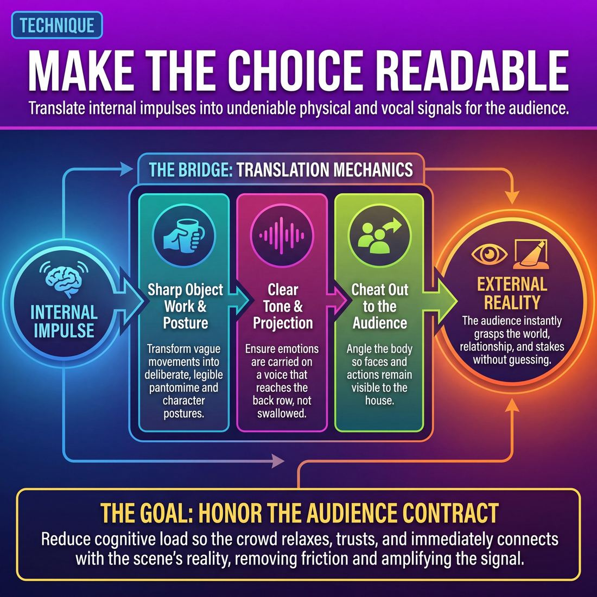

# 🎯 Make the choice readable

> *A drillable muscle that trains **Stage Presence & Clarity**.*

{ .infographic }

## 🎯 The essence

!!! abstract "In a nutshell"
    **Make the choice readable** is a targeted technique where improvisers practice translating internal impulses into clear, unambiguous physical and vocal signals. It forces players to bridge the gap between what they feel in their heads and what the audience actually sees. At its core, this exercise trains a single, vital habit: ensuring that every choice—from the weight of an imaginary coffee cup to a sudden, silent realization—is broadcast deliberately and legibly all the way to the back row.

## 🎓 What it trains

At its core, this technique builds the muscle of **Stage Presence & Clarity**. It solves one of the most pervasive problems in improvisation: the disconnect between a performer's rich internal experience and the external reality presented on stage.

Often, an improviser will make a brilliant, nuanced choice—a subtle shift in status, a specific emotional reaction, or the careful handling of an imaginary object. But if that choice is trapped behind a mumbled line, a turned back, or a muddy physical gesture, it effectively never happened. The audience (and the scene partner) is left guessing, and the scene loses momentum. 

By drilling the act of making choices readable, improvisers train themselves to translate internal impulses into undeniable external data. Specifically, it hones:

* **Physical articulation:** Transforming vague movements into sharp, deliberate **object work** (pantomime) and clear character postures that read instantly.
* **Vocal projection and tone:** Ensuring that emotional choices are carried on a voice that reaches the back row, rather than getting swallowed in the throat or lost to the floor.
* **Spatial awareness (Cheating out):** Developing the unconscious habit of **cheating out**—angling the body so the face and action remain visible to the house, even when interacting intimately with a scene partner.

!!! abstract "Honoring the Contract"
    This technique is rooted in the domain of **The Audience**. The audience wants to relax and trust you. When they have to squint to see your expression, strain to hear your premise, or puzzle over what imaginary object you are holding, that trust fractures. Making your choices readable honors the performer–audience contract: *we will show you exactly what world we are in, so you can simply enjoy the ride.*

## 💡 Why it works

Improv is an art form stripped of traditional theatrical safety nets. There are no costumes to indicate status, no lighting cues to set the mood, and no props to define the space. Because the stage is empty, the performer’s body and voice must carry the entire burden of communication. 

Making a choice readable works by fundamentally altering the **signal-to-noise ratio** of your performance. It exploits three core dynamics of live theater:

* **Reducing Audience Cognitive Load:** An audience cannot invest emotionally if they are actively trying to solve the puzzle of what is happening. When a choice is instantly readable, you remove cognitive friction. The crowd stops asking, *"Wait, is he her boss or her son?"* and immediately relaxes into the reality of the scene. 
* **Amplifying the Signal:** In everyday life, human communication is subtle—a micro-expression, a slight shift in posture. On stage, these subtleties are often lost to distance, becoming visual "noise." Making a choice readable means taking an internal impulse and scaling it up physically and vocally so it becomes an undeniable "signal."
* **Bypassing Partner Negotiation:** A readable choice is a massive gift to your scene partner. When you step on stage with a fully realized, legible physical posture and vocal tone, you bypass the analytical, "talking head" phase of a scene. Your partner doesn't have to guess your deal; their mirror neurons fire, and they react instinctively.

!!! example "In a scene"
    **Unreadable:** A player walks on stage, stands neutrally, looks at the floor, and says in a flat voice, "I can't believe you did that." The partner (and audience) has to guess if this is anger, devastation, or a dry joke.
    
    **Readable:** A player storms on stage, plants their feet wide, points a rigid finger, and barks, "I can't believe you did that!" The choice (furious authority) is instantly legible. The scene begins at a sprint.

!!! note "Clarity, not caricature"
    For experienced improvisers, making a choice readable does not mean resorting to cartoonish pantomime or overacting. It means **commitment to specificity**. A quiet, devastated character can be perfectly readable to the back row if the physical stillness and vocal fragility are held with absolute, unwavering intention.

## 🧩 The setup

To effectively drill these physical and vocal mechanics, you need to create an environment where players get immediate, undeniable feedback on how their choices are translating to the house. 

Here is how to set up the room to isolate and train this technique:

*   **👥 Players & Arrangement:** 8 to 12 players. Split the group evenly. Half will perform (usually in pairs), while the other half acts as the audience. 
*   **🏟️ Space & Materials:** A clearly defined stage area. Place the audience chairs in the *literal back row* of the room or theater—as far away from the stage as physically possible. Provide two chairs or rehearsal blocks on stage to encourage varied stage pictures (sitting vs. standing).
*   **⏱️ Time:** 2 to 3 minutes per scene. Allocate 15 to 20 minutes total so every player gets at least one full repetition under the lights.
*   **🎭 Roles:**
    *   **Performers:** Play a standard scene, but with a heightened focus on their physical silhouette, projection, and cheating out.
    *   **The "Back Row" (Audience):** Watch the scene actively. If a physical action is muddy, a line is mumbled, or a player turns their back and kills the scene's energy, the audience members simply raise their hands.
    *   **The Coach:** Stands off to the side. Pauses the action if performers ignore the raised hands, helps them adjust the physical picture, and resumes play.
*   **📚 Prerequisites:** Players should be comfortable with basic two-person scenes and object work. They should conceptually understand what cheating out means, even if they currently abandon it under the cognitive load of scene-building (a classic Stage 1 Novice hurdle).

!!! quote "How to introduce it"
    "In improv, a brilliant choice doesn't count if the audience can't see or hear it. Today, we are closing the gap between what you feel in your head and what the house actually experiences. 
    
    We are going to run two-person scenes. Half of you are going to sit as far back in this room as possible. Performers, your only goal is to make sure the back row knows exactly what you are doing, feeling, and saying at all times. Back row, if a performer turns away, drops their volume, or makes a physical choice that looks like a muddy blur, just raise your hand. 
    
    Performers, when you see a hand go up, do not stop the scene. Just adjust. Open your shoulders, project your voice, clarify your posture, and *make the choice readable*."

## ⚙️ The mechanics

This technique is often run as a calibration drill—sometimes called "Read My Choice" or "The Silhouette Test"—where the audience acts as a real-time mirror for the performer.

Here is the step-by-step flow of play:

**1. The Hidden Assignment**
The coach gives Player A a specific, secret prompt. This should be a distinct internal state, physical condition, or character trait (e.g., "You are deeply suspicious," "You have a blistering sunburn," or "You believe you are the highest-status person in the room"). 

**2. The Silent Silhouette**
Player A enters the stage alone. For the first 10 seconds, they may not speak. They must establish their choice entirely through posture, gait, facial expression, and object work. They must actively practice cheating out, ensuring the front of their torso and face remain visible to the audience, even if interacting with an imaginary object upstage.

**3. The Audience Audit**
The coach calls "Freeze!" and turns to the rest of the class (the Observers). The coach asks two questions:
*   *What physical details do you see?* (e.g., "Shoulders are hunched, eyes are darting, weight is on the back foot.")
*   *What is the choice?* (e.g., "They are terrified," or "They are hiding something.")

**4. The Calibration**
If the Observers guess incorrectly, or if the read is muddy (e.g., guessing "tired" instead of "sad"), Player A does not explain themselves. Instead, they must adjust their **silhouette**—the physical outline of their body—to amplify the choice until the room unanimously reads it correctly. 

**5. The Scene Integration**
Once the choice is physically readable, Player B enters to initiate a scene. Player A must now maintain their physical clarity while adding dialogue. The dialogue must be colored by the choice, but Player A is forbidden from explicitly naming it.

!!! example "In a scene"
    If the choice is "arrogant," Player A shouldn't say, "I am better than you." Instead, they maintain a lifted chin, take up physical space, and say, "I suppose I have a few minutes to look at your little project." The choice is read through the *combination* of physical presence and point of view.

### Rules & Constraints

*   **No labeling:** The performer may never name their emotion, trait, or condition out loud. The audience must read it, not hear a report about it.
*   **The Back Row Test:** Every physical choice must be scaled so that a person sitting in the very last row of the theater can identify it. 
*   **Maintain the baseline:** Once the choice is established, the player cannot drop it when they start speaking. The physical choice must remain the engine of the character.

!!! warning "Watch out: Clarifying vs. Telegraphing"
    Making a choice readable does not mean aggressively pantomiming it (e.g., rubbing your eyes and yawning loudly to show you are tired). That is **telegraphing**—forcing the audience to see the acting. **Clarifying** means committing to the genuine physical weight of the choice (e.g., letting your eyelids droop, slowing your response time, and letting your posture sag) so the audience observes a reality.

**End and Reset:** 
The round ends when Player A has successfully driven at least four lines of dialogue while maintaining a choice that the entire room can clearly read. The coach calls "Scene," and a new player steps up for a new hidden assignment.

## 🎬 Sample round

!!! example "Sample round: Broadcasting the Choice"
    **The Context:** Two players, Maya and Leo, are starting a scene in a kitchen. The goal is to make their internal choices—Leo's triumph and Maya's simmering jealousy—unmistakably readable to the back row before the scene gets bogged down in dialogue.

    **The Action & Annotations:**

    *Leo enters stage right, holding an imaginary piece of paper. He stops center stage, plants his feet, takes a massive, audible inhale, and lifts his chest toward the ceiling.*  
    **[Amplify the physical tell]** — Leo doesn't just think "I'm happy" and smile. He uses his entire posture and breath to broadcast "triumph" so clearly that a viewer with the sound muted would understand his state.

    *Maya stops chopping imaginary vegetables. Instead of just glaring at the cutting board in profile, she slowly turns her head, drops her shoulders, and angles her face 45 degrees downstage.*  
    **[Cheat out / Open the angles]** — Maya ensures the audience can actually see the tension in her jaw. If she stayed in a closed profile, the audience would miss the reaction entirely. 

    *Leo:* "They bought the house. Full asking price."

    *Maya holds her frozen, angled posture for a full three seconds. She grips the imaginary knife tighter, letting the silence hang while staring at Leo's shoes.*  
    **[Hold the moment / Let it land]** — She resists the novice urge to immediately speak or drop the physical offer. By holding the freeze, she gives the audience time to read the jealousy and build anticipation.

    *Maya (voice tight, projecting clearly to the back of the house):* "I'm so happy for you, David."  
    **[Vocal clarity matching the physical choice]** — The contrast between her supportive words and her rigid, highly readable body language creates instant, delicious tension that the entire room can feel.

## 🎚️ Variations & progressions

To build this muscle, you must systematically strip away the performer's crutches—usually dialogue—and manipulate the scale of the room. Here is how to ramp the difficulty as players move from basic visibility to commanding stage presence.

**1. The Gibberish Constraint (Novice to Adv. Beginner)**
When players are first learning to cheat out and project, they often rely on words to explain what they are doing. In this variation, the scene is played entirely in gibberish. 
*   **The focus:** If a player turns away under cognitive load, the audience instantly loses the thread. The player must physically face the audience and make their object work, emotional state, and relationship undeniably clear through posture and staging alone.

**2. The Back-Row Director (Competent)**
To train players to ensure their choices read clearly to the back row, place a coach or a designated "audience member" in the furthest, darkest seat in the house.
*   **The focus:** The back-row director holds up a hand the moment a choice becomes muddy, the physical silhouette collapses, or the player stops projecting their intent. The improviser must immediately adjust their physical volume until the hand goes down.

    !!! tip "On stage"
        If you are playing in a massive theater, your physical choices need a wider silhouette. If you are in a 30-seat basement, that same silhouette will look like grotesque pantomime. The Back-Row Director drill teaches players to calibrate their "readability" to the exact dimensions of the room.

**3. The 1-to-10 Dial (Proficient)**
Once a player can reliably make a choice readable, they must learn to scale it. The coach calls out numbers from 1 to 10 during a scene, representing the "volume" of the physical and emotional choice.
*   **The focus:** The player must adjust their tone and physicality to match the number without losing the core truth of the choice. This trains the Proficient skill of adjusting to a specific crowd—knowing how to play a "3" for an intimate, quiet room, or a "9" for a rowdy midnight festival crowd.

    !!! example "In a scene"
        **Choice:** *I am suspicious of my scene partner's soup.*
        **At a 2:** A slight hesitation before the spoon hits the mouth; a brief, darting glance at the partner.
        **At a 8:** Holding the bowl at arm's length, sniffing it aggressively, and physically leaning away from the partner while maintaining unbroken eye contact.

**4. The Micro-Shift (Master)**
At the highest level, making a choice readable isn't about playing big; it is about absolute internal clarity. In this progression, players are challenged to communicate a massive internal realization (e.g., *I just realized I am the villain*, or *I am falling in love right now*) using only a micro-expression or a shift in breathing.
*   **The focus:** The Master improviser owns the space so effortlessly that they can draw the entire audience's focus to a single twitch of the jaw or a drop of the shoulders. This drill trains the ability to unify the room, creating that synchronized, collective gasp when the audience reads a tiny, devastating choice all at exactly the same time.

## 🧑‍🏫 Coaching notes

As a coach, you are the proxy for the audience. If you are squinting, leaning in to hear, or confused about what an improviser is holding, the audience will be too. Your job is to demand clarity in real-time without breaking the emotional flow of the scene. 

!!! tip "Coaching: 'Hold the picture'"
    The single most important cue for making choices readable is asking players to pause. When an improviser makes a strong physical choice, strikes a pose, or has a major emotional reaction, call out: **"Hold that picture."** This forces them to sit in the choice for an extra beat, ensuring it registers fully with the audience before the scene moves on. It prevents players from rushing past their own brilliance.

### Effective Side-Coaching Cues

Use short, punchy directives while the players are in motion. Target specific elements of readability:

*   **"Share it with us." / "Cheat out."** — Use this when players are stuck in a tight profile or turning upstage. It reminds them to open their shoulders and faces to the house.
*   **"To the back row!"** — A quick prompt when physical scale or vocal projection is too small for the room. It encourages them to expand their presence.
*   **"Put it on your face."** — Use this when an improviser is making an internal emotional choice but failing to broadcast it physically. 
*   **"Show us the weight." / "Where are the edges?"** — Call this out during sloppy object work. It forces the player to define the physical reality of their mime so the audience can "see" the invisible object.
*   **"Slow down the action."** — A vital cue when players are rushing through a complex physical task (like making a coffee or picking a lock), turning it into a blur of hands.

### What 'Good' Looks and Sounds Like

When players are successfully making their choices readable, you will observe distinct shifts in their stage presence:

*   **The 45-Degree Rule:** Players naturally angle their bodies outward. Even when speaking directly to a scene partner, their downstage foot is planted, and their chest is open to the audience.
*   **Deliberate Pacing:** You will see a clear beginning, middle, and end to physical actions. A player picking up a heavy box will bend, establish the grip, lift with effort, and place it down, rather than teleporting it from the floor to a table.
*   **Acoustic Clarity:** Voices are supported by the diaphragm. Even a "whisper" in the context of the scene is a stage whisper that easily reaches the back row of the theater.
*   **Unified Focus:** When one player makes a strong, readable choice, their scene partner naturally gives them focus, rather than pulling attention away with unreadable fidgeting.

## 🧭 Debrief & reflection

After running these exercises, the debrief must bridge the gap between the performer’s internal experience and the audience’s external perception. The goal is to calibrate the player’s internal dial, helping them understand exactly how much physical and vocal energy is required for a choice to reach the back row.

Use these questions to guide the discussion:

**For the performers:**
* **"What exactly was your choice, and what specific tools did you use to broadcast it?"** Force players to articulate their mechanics (e.g., "I wanted to show I was arrogant, so I tilted my chin up and slowed my blink rate").
* **"Did your choice feel natural, or did it feel exaggerated?"** This helps players recognize when they are holding back out of a fear of "overacting."
* **"When you turned up the volume on your choice, did you lose your connection to your scene partner?"** A crucial check to ensure that cheating out and projecting doesn't destroy the intimacy of the scene.

**For the audience (the rest of the workshop):**
* **"At what exact moment did the choice become undeniable?"** Pinpoint the specific physical or vocal shift that made the character's deal clear.
* **"Was there any ambiguity?"** Ask the class to identify moments where the performer's silhouette was muddy or their object work was hard to read. 
* **"What one physical adjustment would have made the choice 10% clearer?"** Encourage actionable, mechanical feedback (e.g., "If you had squared your shoulders to the audience more, we would have seen the facial reaction").

!!! abstract "Key idea: The Calibration Gap"
    The most common revelation in this debrief is the **Calibration Gap**. Improvisers often believe that because they are feeling an emotion intensely on the inside, the audience can automatically see it. A good debrief proves that internal feeling is invisible; only external behavior is readable. Players will frequently realize that what felt like "too much" or "clowning" internally was actually just the baseline level of clarity required for a **Competent** stage presence. 

A successful reflection leaves the improviser trusting that they can be physically and vocally larger than they are in everyday life, without losing their honesty. They learn that clarity is a gift to the audience, not a compromise of their art.

## ⚠️ Common pitfalls

!!! warning "Watch out: The 'Private Scene'"
    The most common failure of readability happens the exact moment an improviser feels lost. Under cognitive load, the brain prioritizes survival over presentation. The improviser physically turns inward toward their partner, drops their volume, and shrinks their body language. They are no longer performing for the room; they are whispering in a lifeboat. 

When the brain is working hard to invent the next line, physical and vocal clarity are usually the first things dropped. Watch for these specific traps:

*   **The Profile Trap (Turning Inward)**
    *   *The Symptom:* You start the scene cheated out, but as soon as the dialogue gets complex, you turn 90 degrees to face your partner directly. The audience gets a great view of your shoulder and loses your facial expressions entirely.
    *   *The Fix:* Plant your downstage foot (the foot closest to the audience). Use it as a physical anchor to keep your hips open to the house, turning only your head or upper torso to engage your partner.
*   **Muddy Multitasking (The Blurry Choice)**
    *   *The Symptom:* You try to show that you are an angry, limping pirate who is also currently confused by a math problem. Because you are doing four things at once, the audience just sees a twitchy, grimacing mess. 
    *   *The Fix:* Isolate and sequence. Do one thing clearly. Limp. *Then* look at the math problem. *Then* get angry. A sequence of clean, distinct choices is infinitely more readable than a pile of simultaneous ones.
*   **The "Thinking" Mumble**
    *   *The Symptom:* When searching for an idea, your volume drops by 50% and your eyes dart to the floor. The audience strains to hear, realizes you aren't confident, and emotionally disengages.
    *   *The Fix:* If you need to think, think *in character* and think *loudly*. Hold your physical posture and project your silence. A confident, silent pause reads as dramatic tension; a mumbled pause reads as panic.
*   **Telegraphing (The Over-Correction)**
    *   *The Symptom:* In an effort to be readable, you start pantomiming every emotion (e.g., rubbing your eyes and wailing to show sadness) or **mugging** (making exaggerated, cartoonish faces at the crowd). It reads clearly, but it reads as fake.
    *   *The Fix:* Readability is about *clarity*, not *exaggeration*. Trust that a simple, honest physical choice—held still and angled properly—will read to the back row without needing to be blown out of proportion.

## 🌟 What mastery looks like

At the highest level of practice, making a choice readable transcends mere volume or mechanically cheating out. A master improviser **owns the space effortlessly and honestly**, projecting their internal reality to the back row without ever appearing to "act" or force the moment. The audience never has to squint, lean in, or guess to understand who the character is, what they are doing, or how they feel.

When this technique is executed brilliantly, you will observe:

*   **Absolute economy of movement:** The improviser strips away all nervous fidgeting, aimless pacing, and extraneous gestures. Because the baseline is still and grounded, the choices they *do* make stand out in sharp, unmistakable relief.
*   **Full-body silhouettes:** Their character and emotional state can be read instantly, even if the stage lights were cut and they were entirely backlit. The choice lives in their spine, their weight distribution, and their breath, not just their facial expressions.
*   **The "intimate shout":** They possess the vocal control to deliver a line that feels like a private, vulnerable whisper to their scene partner, yet is perfectly articulated and supported so the back row hears every syllable.
*   **Synchronized audience response:** Because the choice is universally and simultaneously understood, the audience reacts as a single organism. You will hear collective, synchronized gasps, laughs, or pin-drop silences, rather than scattered, delayed reactions from people trying to figure out what just happened.

!!! example "In a scene"
    Two improvisers are playing a tense, unspoken breakup. A novice might pace, sigh loudly, and wave their arms to ensure the audience knows they are upset. A master improviser stands perfectly still, cheats their downstage shoulder open just a fraction of an inch toward the house, and lets a single, silent realization of betrayal register in their posture for three full seconds before speaking. The choice is so physically grounded and clearly framed that the entire 200-seat theater collectively holds its breath.

Ultimately, mastery here is about **unifying the room**. By removing all friction between the performer's intent and the audience's perception, the master improviser conducts the audience's energy like an instrument, ensuring everyone in the house is experiencing the exact same reality at the exact same time.

## 🔗 Why it matters

Improvisation begins in the imagination, but it only becomes theater when it is transmitted to the room. Making your choices readable is the essential bridge between your internal ideas and the audience's external experience. 

At the domain level, this technique directly honors the performer–audience contract. The audience arrives wanting to relax, trust you, and be taken on a ride. As noted earlier, an audience forced to decode muddy mime or strain for mumbled dialogue experiences cognitive friction. They stop experiencing the scene and start trying to solve it. By making choices readable, you remove this friction, allowing the audience to fully invest in the reality you are building.

This muscle is the absolute engine of Stage Presence & Clarity. True stage presence isn't just about being loud or taking up physical space; it is about being *legible*. 

When you drill this technique, the benefits ripple outward across the wider craft:

* **For your scene partner:** A readable choice is a highly usable offer. If your partner instantly recognizes your physical posture as "exhausted royalty," they don't have to ask questions. The scene accelerates immediately from cautious discovery into confident play.
* **For your own confidence:** Committing to a clear, readable physical or vocal choice gets you out of your head. You stop being an improviser *thinking* about a scene and become a character *existing* in a space.
* **For the back row:** As you progress toward mastery, your choices scale. What reads clearly to your partner must also read clearly to the person sitting in the very last seat of the theater, ensuring the entire room can breathe, laugh, and react as one unified organism.

!!! abstract "Subtlety vs. Ambiguity"
    A common fear among improvisers is that making choices "readable" means overacting, mugging, or abandoning subtlety. But subtlety and ambiguity are not the same thing. A subtle choice is a small, specific detail that is clearly communicated. An ambiguous choice is a muddy signal that leaves everyone guessing. You can play a quiet, understated character—as long as the choice to be quiet and understated is unmistakably clear.

## 📚 References & Further Reading

### Foundational sources
*   **Viola Spolin, *Improvisation for the Theater* (1963)** — The definitive text on physicalizing choices and "showing not telling." Spolin’s exercises are designed to get actors out of their heads and into their bodies, treating the audience not as passive observers but as a vital part of the theatrical game who must be able to "read" the stage picture instantly.
*   **Keith Johnstone, *Impro: Improvisation and the Theatre* (1979)** — Johnstone’s seminal work on status is fundamentally about making internal power dynamics physically and vocally readable to the back row. He demonstrates how tiny shifts in posture, eye contact, and vocal tone broadcast undeniable signals to both scene partners and the audience.
*   **Jacques Lecoq, *The Moving Body (Le Corps Poétique)* (1997)** — Essential reading on physical theater, silhouette, and the mechanics of translating internal states into undeniable external movement. Lecoq’s teachings on the "neutral mask" and physical articulation are the direct ancestors of improv's "silhouette test."

### Practitioner guides & manuals
*   **Mick Napier, *Improvise: Scene from the Inside Out* (2004)** — Napier argues forcefully for making a strong, bold physical and vocal choice right at the top of the scene. By doing so, improvisers bypass the hesitation of verbal negotiation and immediately give their partner and the audience something concrete to read and react to.
*   **Matt Besser, Ian Roberts, and Matt Walsh, *The Upright Citizens Brigade Comedy Improvisation Manual* (2013)** — Details how to establish a clear "base reality" through precise object work, pantomime, and unambiguous character choices. The manual stresses that the "game" of a scene cannot be played if the foundational who, what, and where are not legible.
*   **Will Hines, *How to Be the Greatest Improviser on Earth* (2016)** — Focuses heavily on clarity, being present, and making choices that are instantly obvious. Hines breaks down the mechanics of ensuring that your internal comedic premise is actually making it across the footlights to your scene partner and the audience.
*   **Patti Stiles, *Improvise Freely* (2021)** — Discusses the performer-audience connection and how clear stagecraft honors the audience's experience. Stiles emphasizes moving beyond rigid "rules" to find genuine, readable physical and emotional truths that invite the audience into the world of the scene without pandering.

### Lineage & teachers
*   **The Groundlings** — The Los Angeles-based school and theater famous for its emphasis on highly physical, instantly readable character choices. Their curriculum heavily weights the creation of distinct silhouettes, vocal patterns, and physical tics that communicate a character's essence before a single word is spoken.
*   **The Annoyance Theatre** — Mick Napier's Chicago theater, which trains improvisers to make strong, individual, readable choices rather than getting bogged down in verbal negotiation. The Annoyance style relies on performers stepping on stage with a fully legible point of view.
*   **École Internationale de Théâtre Jacques Lecoq** — The Paris-based physical theater school that pioneered the use of the "neutral mask" and the "silhouette test" to train bodily clarity. Their pedagogy deeply influences how modern improvisers understand the communicative power of the body in empty space.

### Research & theory
*   **Marco Iacoboni, *Mirroring People: The New Science of How We Connect with Others* (2008)** — Explains the neuroscience of mirror neurons, detailing how observing an action triggers the same neural pathways in the observer. This explains why a readable physical choice is so powerful: it allows audiences and scene partners to instantly understand and feel the choice, bypassing analytical negotiation.
*   **Bruce McConachie, *Engaging Audiences: A Cognitive Approach to Spectating in the Theatre* (2008)** — Applies cognitive science to theater, explaining how clear, legible choices reduce cognitive load. McConachie demonstrates that when audiences don't have to actively puzzle out what is happening on stage, they are freed to emotionally invest in the performance.
*   **John Sweller, "Cognitive Load During Problem Solving: Effects on Learning" (1988)** — The foundational paper on cognitive load theory. While originally focused on educational psychology, its principles perfectly explain the audience experience: when a scene is muddy and unreadable, the audience's working memory is overwhelmed by trying to "solve the puzzle," leaving no cognitive resources for enjoyment or emotional resonance.

### Communities & adjacent reading
*   **Declan Donnellan, *The Actor and the Target* (2002)** — Explores how actors can overcome internal blocks by focusing on an external "target." Donnellan's approach helps improvisers stop getting trapped in their own heads, forcing them to make their internal choices visible and directed outward toward their partner and the audience.
*   **Stephen Wangh, *An Acrobat of the Heart* (2000)** — A physical approach to acting inspired by Jerzy Grotowski that bridges the gap between rigorous physical training and practical scene technique. It provides exercises to ensure the actor's body speaks as clearly and intentionally as their voice.
*   **Anne Bogart and Tina Landau, *The Viewpoints Book* (2005)** — A practical guide to spatial awareness, shape, and gesture. Viewpoints offers improvisers a concrete vocabulary for making physical choices more deliberate, ensuring that their movement and positioning on stage are always readable and communicative.

## 💬 Quotes & Anecdotes

!!! quote "— Viola Spolin, *Improvisation for the Theater* (1963)"
    Make the invisible visible.

!!! quote "— Keith Johnstone, *Impro: Improvisation and the Theatre* (1979)"
    The mime must first of all be aware of this boundless contact with things. There is no insulating layer of air between the man and the outside world.

!!! quote "— Mick Napier, *Improvise: Scene from the Inside Out* (2004)"
    It will allow you to make a choice out of power as opposed to fear. It will eliminate the mere two seconds (or less) that it will take you to start talking yourself out of the scene.

!!! quote "— Del Close & Charna Halpern, *Truth in Comedy* (1994)"
    The more ridiculous the situation, the more seriously it must be played; the actors must be totally committed to their characters and play them with complete integrity to achieve maximum laughs.

!!! quote "— Viola Spolin (as recounted by Gary Schwartz)"
    If you see it then we will see it. If you don't see it, you're cheating yourself!

### Where it comes from
The concept of making choices readable is deeply rooted in **Viola Spolin's** "space work" exercises, which she developed to help actors get "out of their heads and into the space." She famously taught that the goal of handling imaginary objects was to make the invisible visible to the audience. This was later codified in the Chicago improv tradition by **Del Close**, who insisted that improvisers treat "space substance" as if it had real weight, volume, and physical consequence. The emphasis on making a strong, undeniable physical choice right at the top of a scene was further championed by **Mick Napier**, who argued that committing to a physical action bypasses the performer's fear and hesitation, instantly communicating the "deal" of the scene to the audience.

### A telling example
**The "Begin and End" Exercise**
Gary Schwartz, a long-time student of Viola Spolin, recounts a classic exercise she used to train readability, called "Begin and End." A student would go on stage and quickly, clumsily unwrap an imaginary stick of gum. Because the physical articulation was muddy, the audience would have no idea what the student was doing. Spolin would then have the student break the action down into distinct sub-movements, calling out "Begin!" and "End!" for each tiny step of the process. By forcing the actor to articulate the exact physical boundaries of the object, the gum suddenly appeared in the space. Spolin would tell the class, "If you see it, then we will see it. If you don't see it, you're cheating yourself!"

**The Silhouette Test (Illustrative Scenario)**
Two improvisers step on stage. Player A stands with their hands in their pockets, looking at the floor, and mumbles, "I've been waiting for you." The choice is unreadable; the audience and Player B are left guessing whether Player A is a shy teenager on a date or a bored hitman. 

In the next repetition, Player A steps on stage, turns their body slightly toward the audience (cheating out), checks an imaginary watch with sharp, rigid movements, taps their foot, and says in a clipped, projected voice, "I've been waiting for you." The choice—an impatient, high-status authority figure—is instantly readable to the back row. Player B immediately knows how to react, and the scene takes off without a moment of negotiation.

## 🧭 Explore the framework

- ⬆️ **Skill it trains:** [Stage Presence & Clarity](05_S3__stage-presence-and-clarity.md)
- 🎭 **Domain:** [The Audience](05_D__the-audience.md)
- 🔁 **Sibling techniques:** [Cheating out](05_S3_T1__cheating-out.md), [Projection](05_S3_T2__projection.md)
