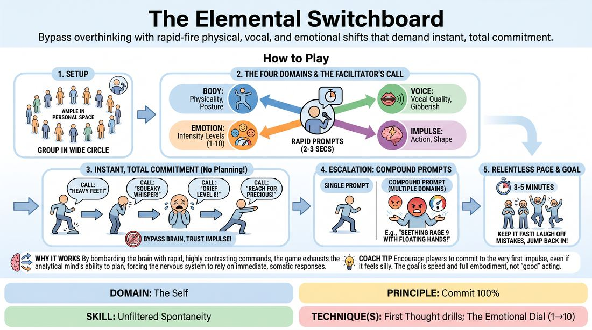

# The Expressive Switchboard

{ .game-hero }

> Bypass overthinking with rapid-fire physical, vocal, and emotional shifts that demand instant, total commitment.

## Overview
A high-energy, fast-paced drill where players instantly embody a sequence of rapid physical, vocal, and emotional prompts called out by a facilitator. By cycling through intense states with only seconds of transition time, players learn to bypass their analytical filters and trust their immediate physical impulses.

## What It Trains
- **Domain:** D1 — The Self
- **Principle(s):** Commit 100%; Fail Joyfully; Vulnerability; The First Thought Is a Gift
- **Skill(s):** Unfiltered Spontaneity; Emotional Fluidity; Physicality & Space Work; Vocal Craft; Silence & Stillness; Self-Recovery
- **Technique(s):** First Thought drills; The Emotional Dial (1→10); Emotional substitution; Character Walks/Centers; Object work; Weight & resistance mime; Projection & breath support; Vocal characterization; Gibberish; Do nothing exercises; Hold-the-beat reps
- **Focus:** skill_drill

**Objective:** To develop unfiltered spontaneity and absolute commitment to physical, vocal, and emotional choices, training the player to treat their first instinct as an undeniable gift.

## Setup
Players stand in a spacious circle facing inward, leaving enough room to move their arms and take a few steps in any direction. No props or materials are required. The facilitator stands outside the circle where they can clearly see and be heard by all participants.

## How to Play
1. Gather the group into a wide circle, ensuring everyone has enough personal space to move dynamically without colliding.
2. Explain that the facilitator will call out rapid-fire prompts categorized into four domains: Body (physicality/posture), Voice (vocal quality/gibberish), Impulse (sudden physical actions), and Emotion (specific feelings with an intensity scale from 1 to 10).
3. Instruct players that the moment a prompt is called, they must instantly and simultaneously embody it with 100% physical and vocal commitment, without a single second of hesitation.
4. Emphasize that players should not try to plan, intellectualize, or make 'good' choices; they must execute the very first physical or vocal shape that enters their mind.
5. Begin calling out single-element prompts (such as 'Heavy feet!', 'Squeaky whisper!', 'Reach for something precious!', or 'Grief level 8!') every 2 to 3 seconds, forcing players to immediately drop their previous state and adopt the new one.
6. Introduce compound prompts that combine multiple domains at once (such as 'Seething rage level 9 with floating hands!' or 'Gibberish outburst while shrinking to the floor!').
7. Keep the pace relentless for 3 to 5 minutes, encouraging players to laugh off any missed transitions and immediately jump into the next prompt.

## Facilitation Notes
- Use side-coaching cues like 'Don't think, just shape!' or 'Let the body lead the brain!' to help players bypass intellectual blocks.
- If players are 'hiding' by waiting to see what others do before committing, remind the group that simultaneous, imperfect action is the goal, or have them close their eyes for a few prompts.
- If players hold onto a previous emotion or physical state, call out 'Clear!' or clap loudly to signal a hard reset before throwing out a highly contrasting prompt.
- Keep the prompts highly contrasting (e.g., moving from 'Seething Rage' directly to 'Floating Hands') to maximize the cognitive and physical stretch of the transition.

## Variations
- The Dial-Up: The facilitator calls out a single state (such as 'Suspicion') and rapidly counts from 1 to 10, with players scaling their physical and vocal commitment to match each number.
- Pass the Switch: A player in the circle calls out a prompt, embodies it, and then points to another player who must instantly adopt it, call out a new prompt, and pass it on.
- The Environment Filter: Add a rapid environmental context (such as 'You are at a fancy gala' or 'You are on a sinking ship') that players must maintain while executing the rapid-fire physical and emotional prompts.

## Debrief
- How did the rapid pace affect your inner critic? Did you have time to judge your choices?
- Which domain (Body, Voice, Impulse, or Emotion) felt the easiest to access instantly, and which felt the most challenging?
- What did it feel like to transition instantly from a high-intensity emotion to a completely different physical state?

## Safety & Inclusion
Because this game involves rapid physical shifts and emotional scaling, remind players to honor their physical boundaries and adapt any high-energy prompts (like jumping or falling) to their own mobility level. Emphasize that emotional prompts are theatrical play, and players can always scale down the internal intensity while keeping the external physical commitment high.

## Why It Works
By bombarding the brain with rapid, highly contrasting physical and emotional commands, the game exhausts the analytical mind's ability to plan or self-censor. This forces the nervous system to rely on immediate, somatic responses, directly training unfiltered spontaneity and teaching players that their first physical impulse is a reliable, creative gift.
