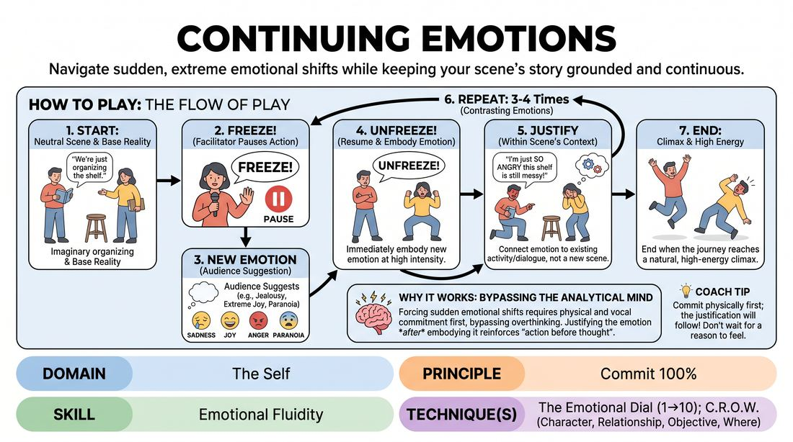

# Continuing Emotions

{ .game-hero }

> Navigate sudden, extreme emotional shifts while keeping your scene's story grounded and continuous.

## Overview
In this game, players begin a grounded, emotionally neutral scene. At random intervals, the facilitator freezes the action to introduce a new emotion suggested by the audience, which the players must instantly adopt and justify while continuing the exact same storyline.

## What It Trains
- **Domain:** D1 — The Self
- **Principle(s):** Commit 100%; Base Reality First; The Audience Is the Final Scene Partner
- **Skill(s):** Emotional Fluidity; World-Building; Room Reading
- **Technique(s):** The Emotional Dial (1→10); C.R.O.W. (Character, Relationship, Objective, Where); Reading the suggestion's intent
- **Focus:** mixed

**Objective:** Develops emotional fluidity and 100% commitment by training players to instantly shift their emotional state (using the 1-10 dial technique) without disrupting the established base reality.

## Setup
An open performance space. Two to three players stand on stage, while the rest of the group acts as the audience and facilitator.

## How to Play
1. Step 1: Ask the audience for a mundane, everyday location and a simple physical activity to establish the scene's base reality.
2. Step 2: Two players begin the scene in a completely neutral emotional state, focusing on realistic object work and logical dialogue.
3. Step 3: Once the relationship and environment are established, the facilitator calls 'Freeze!' to temporarily pause the action.
4. Step 4: The facilitator asks the audience for a specific emotion, such as jealousy, extreme joy, or paranoia.
5. Step 5: The facilitator calls 'Unfreeze!' and the players immediately resume the scene, embodying the new emotion at a high intensity.
6. Step 6: Players must justify the new emotion within the context of their existing conversation and activity, rather than starting a new scene.
7. Step 7: Repeat the freeze-and-shift process three to four times, introducing contrasting emotions to challenge the players' adaptability.
8. Step 8: End the scene when the emotional journey reaches a natural, high-energy climax.

## Facilitation Notes
- Coaching cue: 'Don't change the plot to fit the emotion; let the emotion transform how you perform your physical actions.'
- Pitfall: Players dropping their physical object work when the emotion shifts. Fix: Remind them to keep doing the task (e.g., folding laundry) but let the new emotion dictate the speed and tension of their movements.
- Coaching cue: 'Commit 100% to the physical expression of the emotion immediately—don't ease into it.'
- Pitfall: Denying the partner's emotional shift. Fix: Encourage players to match, complement, or actively react to their partner's new emotional state rather than ignoring it.

## Variations
- Individual Emotions: Instead of the whole scene shifting to one emotion, the facilitator assigns a different, contrasting emotion to each individual player.
- The Emotional Dial: The facilitator calls out intensity levels from 1 to 10 for the current emotion, forcing players to scale their expression up or down dynamically.
- Subtext Only: Players must express the assigned emotion intensely through body language and tone while keeping their spoken words completely polite and ordinary.

## Debrief
- How did changing your emotional state alter the physical reality and pacing of the scene?
- What strategies did you use to instantly justify a sudden shift in emotion without changing the story?
- How does committing 100% to an extreme emotion make scene work easier or more dynamic?

## Safety & Inclusion
Ensure that suggested emotions remain within safe, non-triggering boundaries. Players should feel free to interpret emotions metaphorically or stylistically rather than tapping into personal trauma.

## Why It Works
By forcing sudden emotional shifts, this game bypasses the analytical mind, requiring players to commit physically and vocally first. Justifying the emotion after embodying it reinforces the principle of 'action before thought' and builds deep emotional fluidity.
