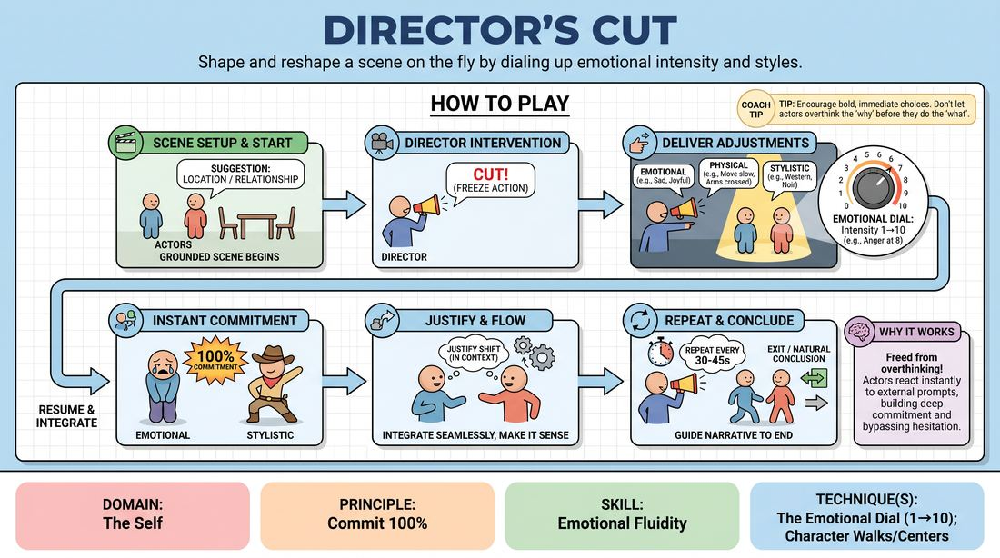

# Director's Cut

{ .game-hero }

> Shape and reshape a scene on the fly by dialing up emotional intensity and styles.

## Overview
Two actors perform a grounded scene while an off-stage Director periodically pauses the action to deliver specific performance adjustments. The actors must instantly adopt these new emotional, physical, or stylistic directions with total commitment, seamlessly integrating them into the ongoing narrative.

## What It Trains
- **Domain:** D1 — The Self
- **Principle(s):** Commit 100%; Serve the Story; Follow the Follower
- **Skill(s):** Emotional Fluidity; Physicality & Space Work; Heightening & Exploration; Justification; Pacing & Rhythm
- **Technique(s):** The Emotional Dial (1→10); Character Walks/Centers; Justify the absurd; Edits (Sweep, Tag-Out, Sound/Light)
- **Focus:** mixed

**Objective:** Develops emotional fluidity and rapid physical commitment by training actors to instantly shift their emotional intensity using a scale of 1 to 10 while maintaining narrative justification.

## Setup
Set up a clear stage area for two actors. Position a third player as the Director in front of the stage, facing the actors. The remaining players sit as active observers, ready to rotate in.

## How to Play
1. Assign two players to the stage and one player as the Director.
2. Obtain a simple suggestion of a location or relationship to initiate a grounded, realistic scene.
3. The actors begin playing the scene naturally, establishing a clear platform, relationship, and environment.
4. At any moment, the Director calls 'Cut!' to freeze the action on stage.
5. The Director delivers a specific adjustment to one or both actors, focusing on emotional states, physical constraints, or stylistic genres.
6. The Director should utilize the emotional dial technique, instructing an actor to play their current emotion at a specific intensity level from 1 to 10.
7. The actors immediately resume the scene from the exact moment of the freeze, fully embodying the new direction with 100% commitment.
8. The actors must instantly justify the sudden shift in their behavior, making it make sense within the context of their relationship.
9. The Director continues to pause and adjust the scene every 30 to 45 seconds, guiding the narrative to a natural conclusion.

## Facilitation Notes
- Coaching cue: 'Don't just change your words—let the new emotional dial setting transform your posture, breath, and vocal tone.'
- Pitfall: The Director focuses too much on plot changes (e.g., 'Now a meteor hits'). Fix: Remind the Director to focus on behavioral, emotional, and physical adjustments rather than narrative events.
- Coaching cue: 'Justify the shift! If you suddenly jump to a level 9 anger, find the reason why your partner's last line triggered that reaction.'
- Encourage the Director to explore the full spectrum of the 1-10 dial, pushing actors to subtle low numbers as well as explosive high numbers.

## Variations
- Genre Hop: The Director shifts the theatrical style of the scene, such as moving from a soap opera to a Shakespearean tragedy or a sci-fi epic.
- Tag-Team Directing: Allow any observing player to call 'Cut!' and offer a direction, sharing the directorial control.
- Internal Monologue: The Director calls 'Cut!' and asks one actor to speak their character's unspoken inner thoughts directly to the audience before resuming.

## Debrief
- How did changing your physical posture or emotional intensity alter the direction of the scene's story?
- What did it feel like to commit 100% to an extreme emotional shift without overthinking it?
- How did you justify sudden emotional changes so they still felt connected to your partner?

## Safety & Inclusion
Ensure that high-intensity emotional states (like level 10 anger or sadness) remain theatrical and do not cause personal distress. Establish a non-verbal signal for players to indicate if a directed emotion is crossing a personal boundary.

## Why It Works
By placing the control of the scene's emotional and physical dynamics in the hands of an external Director, actors are freed from their own analytical minds. They must react instantly to the prompt, which bypasses hesitation and builds deep trust in their physical and emotional impulses.
