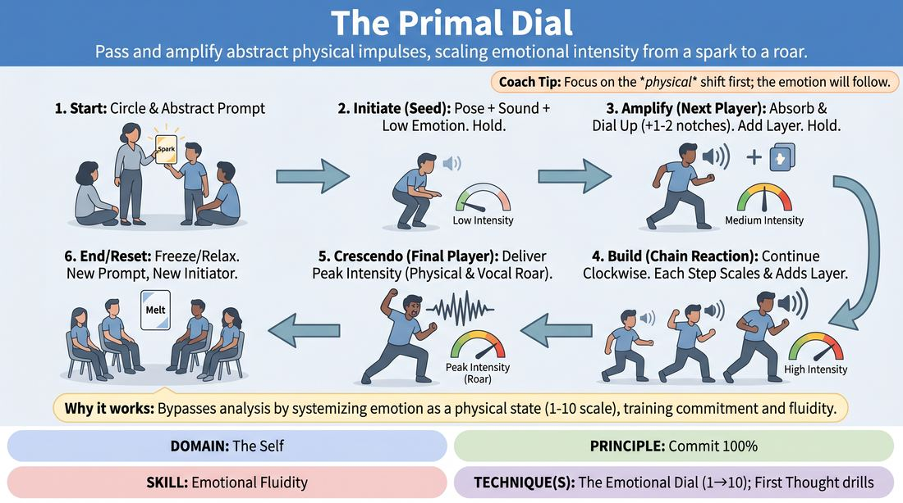

# The Primal Dial

{ .game-hero }

> Pass and amplify abstract physical impulses, scaling emotional intensity from a spark to a roar.

## Overview
The Primal Dial is an embodied ensemble exercise where players stand in a circle to collaboratively scale an abstract prompt. Starting with a subtle, low-intensity physical and vocal "seed," each subsequent player absorbs the previous expression, dials up its emotional intensity, and adds a new physical or vocal layer. The result is a highly committed, non-verbal crescendo that builds group trust and individual expressive range.

## What It Trains
- **Domain:** D1 — The Self
- **Principle(s):** Commit 100%; Vulnerability; The First Thought Is a Gift; Make Your Partner a Genius; Group Mind
- **Skill(s):** Unfiltered Spontaneity; Emotional Fluidity; Physicality & Space Work; Vocal Craft; Silence & Stillness; Active Listening; Single-Partner Empathy & Mirroring
- **Technique(s):** First Thought drills; The Emotional Dial (1→10); Character Walks/Centers; Weight & resistance mime; Projection & breath support; Gibberish; Hold-the-beat reps; Mirror exercise
- **Focus:** skill_drill

**Objective:** To build emotional fluidity and physical commitment by practicing the "Emotional Dial" technique, allowing players to consciously scale their expressive intensity from 1 to 10 without intellectual filter.

## Setup
An open, comfortable room with enough space for 4 to 8 players to stand in a circle. No props or materials are required. Ensure players have room to move their arms and shift their weight safely.

## How to Play
1. Gather the players in a circle facing inward, establishing a focused, supportive group presence.
2. The facilitator provides a single, abstract, non-narrative prompt word (e.g., 'Melt,' 'Spark,' 'Heavy,' 'Rustle').
3. The first player (the Initiator) immediately reacts to the prompt with their first physical and vocal impulse, creating the 'Primal Seed.'
4. The Initiator's expression must combine three elements: a distinct physical posture or movement, a non-verbal vocalization, and a low-intensity emotional state (around a 2 or 3 on a 1-to-10 scale).
5. The Initiator holds this complete physical, vocal, and emotional state in absolute stillness and focus for 3 to 5 seconds to let the group fully absorb it.
6. Moving clockwise, the next player steps forward to 'absorb' and 'amplify' the previous player's expression.
7. This next player must echo the core essence of the previous state, turn up the emotional dial by 1 or 2 notches (e.g., moving from curiosity to fascination), and add exactly one new physical or vocal layer (such as a hand gesture or a rhythmic breath).
8. This player holds their new, heightened state for 3 to 5 seconds, demonstrating complete physical and vocal commitment.
9. The process continues clockwise around the circle, with each player progressively scaling the emotional dial and adding a layer, until the final player delivers a highly intense, fully committed level-10 climax.
10. The facilitator calls 'freeze' or 'relax' to end the round, then resets with a new prompt and a new Initiator.

## Facilitation Notes
- Side-coaching cue: 'Don't think, just move! Let your first physical impulse dictate the emotion.'
- Side-coaching cue: 'Hold the stillness. Let us see the commitment in your eyes for three full seconds.'
- Pitfall: Players jump from a level 2 straight to a level 10 emotional intensity, leaving nowhere for the circle to build. Fix: Remind players to increment the dial by only 1 or 2 notches at a time.
- Pitfall: Intellectualizing the prompt or trying to make it funny. Fix: Coach players to focus on raw physical weight, breath, and non-verbal sound rather than comedic choices.
- Pitfall: Dropping the physical state too quickly. Fix: Encourage 'hold-the-beat' reps where the player must remain frozen in their high-intensity state until the next player steps in.

## Variations
- The Emotional Shift: Instead of just intensifying the same emotion, players must slightly shift the emotional color (e.g., from low-level sadness to mid-level frustration) while keeping the physical essence.
- Blind Echo: Players stand facing outward. When it is their turn, they spin around, instantly absorb the previous player's state, and immediately amplify it without prep time.
- Group Resonance: Every third player, instead of just one person stepping forward, the entire circle simultaneously mirrors and holds the current amplified state before the next individual player breaks off to scale it further.

## Debrief
- How did it feel to consciously control your emotional volume using the 1-to-10 dial?
- What physical changes in your body helped you access higher emotional states without relying on words?
- How did holding the expression in silence for a few seconds affect your level of commitment?

## Safety & Inclusion
Since this game involves high-intensity physical and vocal expression, remind players to respect their own physical limits and avoid straining their voices. Encourage modifications for any physical movements to ensure accessibility for all mobility levels.

## Why It Works
By breaking emotional expression down into a systematic 1-to-10 scale and pairing it with incremental physical and vocal layers, this game bypasses the analytical mind. It teaches players that emotion is a physical state that can be dialed up or down at will, building somatic confidence and radical commitment.
