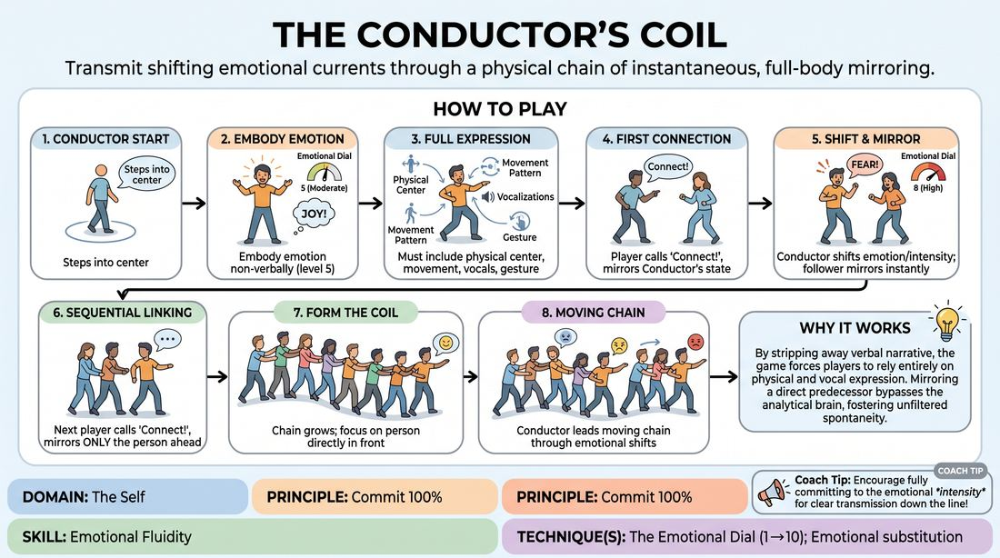

# The Conductor's Coil

{ .game-hero }

> Transmit shifting emotional currents through a physical chain of instantaneous, full-body mirroring.

## Overview
In this high-commitment physical drill, players form a moving chain where each person meticulously mirrors the non-verbal emotional expression of the player directly in front of them. Led by a central Conductor who constantly shifts emotional states and intensities, the group operates as a single, fluid organism, passing physical and vocal impulses down the line.

## What It Trains
- **Domain:** D1 — The Self
- **Principle(s):** Commit 100%; Fail Joyfully; Vulnerability; The First Thought Is a Gift; Follow the Follower
- **Skill(s):** Unfiltered Spontaneity; Emotional Fluidity; Physicality & Space Work; Vocal Craft; Silence & Stillness; Self-Recovery; Active Listening; Single-Partner Empathy & Mirroring; Peripheral Awareness
- **Technique(s):** The Emotional Dial (1→10); Emotional substitution; Character Walks/Centers; Weight & resistance mime; Projection & breath support; Vocal characterization; Gibberish; Hold-the-beat reps; Mirror exercise; Emotional-echo drills
- **Focus:** skill_drill

**Objective:** To build deep emotional fluidity and physical commitment by practicing rapid, unfiltered transitions between diverse emotional states and intensities using the Emotional Dial technique.

## Setup
An open, moderate-sized playing space free of obstacles. Players begin standing in a wide circle, leaving the center clear. No props or materials are required.

## How to Play
1. Select one player to step into the center of the circle as the Conductor, while the remaining players stand along the perimeter.
2. The Conductor announces a starting emotional state and immediately begins to embody it non-verbally at a moderate intensity, around a four or five on a one-to-ten scale.
3. The Conductor's embodiment must include a distinct physical center, a specific movement pattern or walk, non-verbal vocalizations, and a repeatable physical gesture.
4. A player from the circle makes eye contact with the Conductor, calls out 'Connect!', and steps in directly behind them, immediately mirroring their physical stance, movement, and vocal quality.
5. Once connected, the Conductor begins to shift their emotional state or adjust its intensity on the one-to-ten Emotional Dial, while the follower strives to mirror these changes instantaneously.
6. A third player then calls 'Connect!' and steps behind the second player, mirroring only the second player's immediate physical and vocal output.
7. This process continues sequentially until all players have joined the line, forming a moving coil where each participant focuses entirely on mirroring the person directly in front of them.
8. The Conductor leads the moving chain around the space, introducing subtle or abrupt emotional shifts, while the entire coil transmits these impulses down the line like a live wire.

## Facilitation Notes
- Encourage the Conductor to use the Emotional Dial explicitly, calling out or physically signaling shifts in intensity to help followers calibrate their physical scale.
- Side-coach players to avoid intellectualizing the emotion; they should mirror the physical shape and vocal pitch of their predecessor first, letting the internal feeling follow the physical form.
- Pitfall: Players looking past their immediate predecessor to watch the Conductor. Fix: Remind players they are only responsible for the person directly in front of them, which keeps the transmission organic and allows for natural mutations.
- Ensure non-verbal vocalizations remain non-verbal. If players start using words, coach them back to pure breath, sighs, gibberish, or abstract sounds to keep the focus on raw emotional resonance.

## Variations
- The Revolving Coil: Every sixty seconds, the facilitator calls 'Rotate!', prompting the player at the very back of the coil to break off, run to the front, and become the new Conductor, while the old Conductor becomes a follower.
- Blind Transmission: Followers close their eyes and must mirror the emotional state using only auditory cues and the physical touch of hands placed lightly on shoulders.
- Gibberish Stream: Allow players to use emotional gibberish instead of pure non-verbal sounds, maintaining the vocal characterization and rhythm of the current state.

## Debrief
- How did it feel to transition rapidly between contrasting emotions without having a narrative reason to do so?
- When you were in the middle of the coil, how did you balance active listening to your predecessor with the physical output needed for the person behind you?
- What did you notice about how physical posture and breath patterns directly influenced your actual internal emotional state?

## Safety & Inclusion
Ensure players are mindful of physical boundaries and personal space while moving in the coil. If close physical proximity is uncomfortable for any participant, establish a no-contact boundary where followers maintain a consistent two-foot gap behind their predecessor.

## Why It Works
By stripping away verbal narrative, the game forces players to rely entirely on physical and vocal expression. Mirroring a direct predecessor bypasses the analytical brain, fostering unfiltered spontaneity. Utilizing the one-to-ten Emotional Dial trains the nervous system to expand its expressive range, teaching players that they can dial up commitment and vulnerability instantly.
