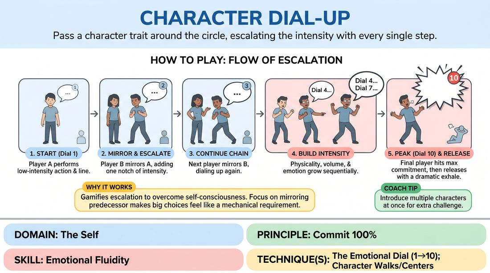

# Incremental Character Dial

{ .game-hero }

> Pass a character trait around the circle, escalating the intensity with every single step.

## Overview
Players stand in a circle and pass a simple character choice—a line of dialogue, a physical quirk, and an emotional state—to their neighbor. Each subsequent player must mirror the exact character they just witnessed but dial up the emotional intensity, physical commitment, and vocal energy by a small, distinct increment. As the character travels around the circle, it transforms from a subtle whisper or twitch into an explosive, larger-than-life performance.

## What It Trains
- **Domain:** D1 — The Self
- **Principle(s):** Commit 100%; Make Your Partner a Genius; Group Mind
- **Skill(s):** Emotional Fluidity; Physicality & Space Work; Vocal Craft; Active Listening; Single-Partner Empathy & Mirroring; Peripheral Awareness
- **Technique(s):** The Emotional Dial (1→10); Character Walks/Centers; Vocal characterization; Mirror exercise; Emotional-echo drills
- **Focus:** skill_drill

**Objective:** Develops emotional fluidity, physical commitment, and active listening. It trains players to incrementally scale their emotional expression using the 1-to-10 dial technique and fully commit to extreme physical and vocal choices without hesitation.

## Setup
Players stand in a wide, clear circle with enough space to move their bodies freely. No props or materials are required.

## How to Play
1. Arrange the group of 5 to 15 players in a standing circle, ensuring everyone has clear sightlines to all other participants.
2. Explain the concept of the Emotional Dial from 1 to 10, where 1 is a barely perceptible internal feeling and 10 is an all-consuming, explosive physical and vocal expression.
3. The first player initiates the game by turning to their neighbor and delivering a simple line of dialogue accompanied by a specific physical gesture and a low-intensity emotional state, aiming for a Level 1 or 2 on the dial.
4. The receiving player must closely observe their neighbor, then mirror the exact same line, physical posture, and emotion, but dial it up by one notch, moving from a Level 2 to a Level 3.
5. This player then turns to the next person in the circle and delivers this slightly escalated version, who must mirror it and dial it up yet another notch.
6. This chain reaction continues sequentially around the circle, with each player mirroring their immediate predecessor and escalating the physical, vocal, and emotional intensity by one increment.
7. Once the character reaches a Level 10 of maximum possible commitment, volume, and physical expression, the player who achieves this peak lets out a final, dramatic release, and the next player starts a brand-new character at Level 1.
8. To increase the challenge once the basic flow is established, the facilitator can introduce multiple characters traveling around the circle simultaneously in the same direction, requiring high peripheral awareness.

## Facilitation Notes
- Side-coach the mirroring aspect: Remind players to copy the person who just went, not the original initiator, ensuring organic evolution rather than trying to jump straight to the end state.
- Watch for premature escalation: If players jump from a Level 2 to a Level 8 immediately, pause the game and remind them that the comedy and skill lie in the slow, incremental climb.
- Encourage physical commitment: If a player is vocally loud but physically stiff, side-coach them to let the emotion inhabit their entire body, from their toes to their facial expressions.
- Manage energy levels: Keep the pace brisk. As soon as a character hits Level 10, immediately prompt the next player to start a fresh, low-level character to reset the room's tension.

## Variations
- Multi-Character Chaos: Introduce three or four different characters at different points in the circle at the same time, forcing players to track multiple emotional trajectories at once.
- The Dial-Down: Start a character at a chaotic Level 10 and pass it around the circle, with each player incrementally de-escalating the energy until it becomes a silent, microscopic micro-movement at Level 1.
- Emotional Shift: Instead of just scaling the volume and size, change the emotional flavor slightly with each pass, such as sadness slowly morphing into frustration, then into rage.

## Debrief
- How did it feel to commit to a Level 10 emotion compared to starting at a Level 1?
- What did you notice about how physical movement helped support your vocal and emotional escalation?
- Why is it important to mirror the person immediately before you rather than trying to recreate the original starting point?
- How can we use this incremental scaling of emotion to build tension in our scenic improv?

## Safety & Inclusion
Ensure players are mindful of their physical boundaries and those of their neighbors, especially as physical movements become larger and more explosive at higher dial levels. Offer low-impact alternatives for players with physical limitations, emphasizing that a Level 10 can be expressed through intense facial expressions, vocal quality, or focused energy rather than high-impact physical movement.

## Why It Works
This game works because it gamifies the process of escalation, removing the self-consciousness of making big choices by making them a mechanical requirement of the exercise. By focusing on mirroring the immediate predecessor, players practice deep empathy and active listening, while the incremental structure of the dial allows them to safely stretch their emotional and physical range step-by-step.
