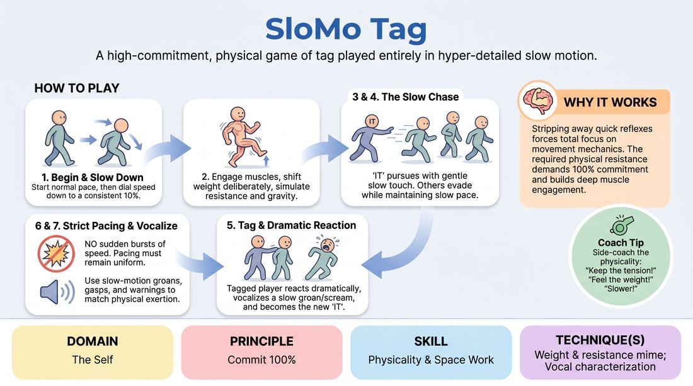

# Slow-Motion Tag

{ .game-hero }

> A high-commitment, physical game of tag played entirely in hyper-detailed slow motion.

## Overview
Players engage in a classic game of tag, but with a strict constraint: every movement, breath, and vocalization must be executed in extreme slow motion. The focus is on maintaining physical integrity, weight, and resistance while navigating the space and reacting to others. It transforms a chaotic playground game into a beautiful, dramatic, and physically demanding exercise in control.

## What It Trains
- **Domain:** D1 — The Self
- **Principle(s):** Commit 100%; Group Mind
- **Skill(s):** Physicality & Space Work; Vocal Craft; Peripheral Awareness; Pacing & Rhythm
- **Technique(s):** Weight & resistance mime; Vocal characterization; Stage-picture exercises; Timing exercises
- **Focus:** skill_drill

**Objective:** To develop physical commitment, body awareness, and spatial control by exploring weight, resistance, and pacing. It trains players to commit 100% to a physical constraint and use their entire body to convey effort and tension.

## Setup
A large, open room free of obstacles. Players spread out across the space. No props are needed.

## How to Play
1. Instruct all players to stand in the space and begin moving around the room at a normal pace, then gradually dial their speed down to a consistent 10% of normal speed (slow motion).
2. Demonstrate the physical mechanics of slow motion: shifting weight, lifting feet deliberately, and engaging muscles to simulate gravity and resistance.
3. Designate one player as 'It' (the tagger). This player must also move strictly in slow motion.
4. The goal of 'It' is to tag another player using a gentle, slow-motion touch. The goal of the other players is to evade 'It' while maintaining the slow-motion constraint.
5. If a player is tagged, they must react to the touch in slow motion, vocalize their dramatic 'defeat' in a slowed-down groan or scream, and become the new 'It.'
6. Emphasize that sudden bursts of speed to escape or tag someone are strictly forbidden; the pacing must remain perfectly uniform and slow.
7. Encourage players to use slow-motion vocalizations (groans, gasps, slow-motion warnings) to match their physical exertion.

## Facilitation Notes
- Coaching cue: 'Feel the weight of the air. Every step requires immense muscle control.'
- Coaching cue: 'Slow down your voice to match your feet. Low, drawn-out groans!'
- Pitfall: Players speeding up when 'It' gets close. Fix: Pause the game and remind them that the comedy and skill come from the agonizingly close near-misses, not from winning.
- Pitfall: Light, floaty movement that lacks weight. Fix: Side-coach them to engage their core and imagine moving through thick honey or water.

## Variations
- Viscosity Shift: Change the medium the players are moving through (e.g., moving through deep mud, outer space, or heavy syrup) to vary the resistance.
- Group Reaction: When someone is tagged, the entire room must react to the 'impact' with a slow-motion shockwave.
- Slow-Motion Commentary: Have one or two sidelined players provide slow-motion sports commentary on the action.

## Debrief
- How did slowing down change your awareness of your own body and the players around you?
- What did it feel like to resist the urge to move fast when 'It' got close?
- How does committing 100% to a physical limitation make a scene more engaging for an audience?

## Safety & Inclusion
Since this is a tag game, establish a 'gentle touch only' rule (e.g., a soft tap on the shoulder or upper arm). Ensure players are mindful of their balance, as moving slowly on one foot can be physically challenging; players can adjust their speed slightly faster if needed for physical stability.

## Why It Works
By stripping away the ability to rely on quick reflexes, players must focus entirely on the mechanics of their movement. The physical resistance required to look 'slow' forces 100% commitment and muscle engagement, which naturally builds physical presence and spatial awareness.
