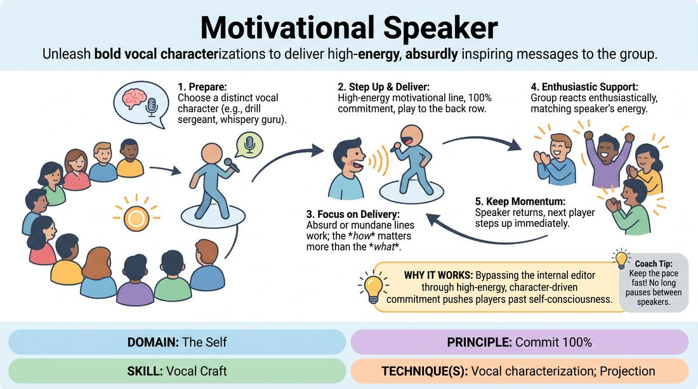

# The Rallying Cry

{ .game-hero }

> Unleash bold vocal characterizations to deliver high-energy, absurdly inspiring messages to the group.

## Overview
Players take turns stepping into the spotlight to deliver a brief, high-energy motivational statement using a distinct, fully committed vocal character. The rest of the group acts as an enthusiastic audience, absorbing the inspiration and reacting with supportive energy. It is a fast-paced, high-energy exercise that builds vocal confidence and performance presence.

## What It Trains
- **Domain:** D1 — The Self
- **Principle(s):** Commit 100%; Play for the Back Row
- **Skill(s):** Vocal Craft; Unfiltered Spontaneity; Stage Presence & Clarity
- **Technique(s):** Vocal characterization; Projection
- **Focus:** connection

**Objective:** Develops vocal characterization, projection, and uninhibited commitment by challenging players to make extreme vocal choices and play to the back row.

## Setup
Players stand in a semi-circle facing a designated performance space. No props or materials are required.

## How to Play
1. Gather the group into a semi-circle, leaving a clear 'stage' space at the open end.
2. Explain that each player will take a turn stepping into the spotlight to deliver a single, highly motivational sentence or short speech.
3. Instruct players that before they speak, they must choose a distinct vocal characterization, such as a gravelly-voiced drill sergeant, a whispery spiritual guru, a hyperactive fitness coach, or a booming Shakespearean actor.
4. The active player steps forward, establishes eye contact with the group, and delivers their motivational line with 100% commitment, playing to the back row.
5. The line can be absurd, mundane, or genuinely inspiring, focusing on the delivery rather than the literary quality of the words.
6. The rest of the group supports the speaker by reacting with enthusiastic applause, cheers, or nods, matching the speaker's energy.
7. Once the line is delivered, the speaker accepts the applause, steps back into the circle, and the next player immediately steps up to keep the momentum high.

## Facilitation Notes
- Encourage extreme vocal choices: push players to experiment with pitch, tempo, volume, and texture (gravel, breathiness, nasality) to define their character instantly.
- Side-coach commitment: If a player hesitates or plays it safe, call out 'Double down!' or 'Play to the back row!' to get them to fully inhabit the voice.
- Keep the pace rapid-fire: Do not let players overthink their message; the focus is on the vocal delivery and energy, not writing a perfect speech.
- Address the 'mumble' pitfall: If a player speaks too softly, have them repeat the line while physically throwing their voice to the far wall of the room.

## Variations
- Gibberish Inspiration: Deliver the motivational speech entirely in a passionate, expressive gibberish language, relying solely on vocal tone and body language to convey the message.
- The Tag-Team Rally: Two players step up together and alternate sentences, matching or contrasting each other's extreme vocal styles.
- Audience Suggestion: The audience shouts out a mundane object right before the speaker steps up, and the speaker must base their motivational speech on that object.

## Debrief
- How did committing to a strong vocal character change your physical presence and confidence on stage?
- What did it feel like to play to the back row, and how did the audience's high-energy support affect your performance?
- How does vocal variety help convey emotion and command attention even when the words themselves are simple or absurd?

## Safety & Inclusion
Ensure players are mindful of their vocal health; encourage them to support loud voices from their diaphragm rather than straining their throat. Offer alternative physical or rhythmic ways to show high energy for those who may have vocal limitations.

## Why It Works
By focusing on a singular, high-energy task with a supportive audience, players bypass their internal editor. The physical and vocal commitment required to play an extreme character naturally pushes them past self-consciousness, building trust in their spontaneous impulses.
