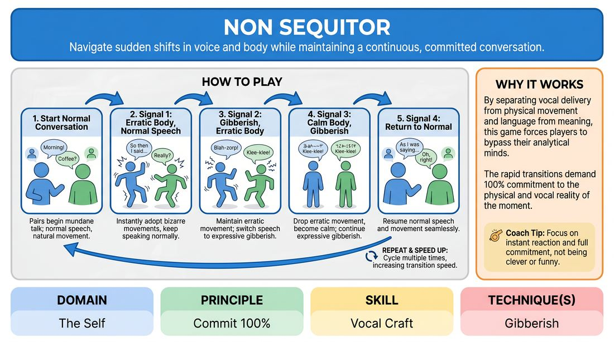

# State Shifter

{ .game-hero }

> Navigate sudden shifts in voice and body while maintaining a continuous, committed conversation.

## Overview
Players work in pairs to maintain a continuous dialogue while a facilitator triggers sudden, dramatic shifts in their physical and vocal states. By cycling through combinations of normal speech, gibberish, calm physical behavior, and erratic movement, players learn to adapt instantly without losing connection. It is a high-energy drill that demands total physical and vocal commitment.

## What It Trains
- **Domain:** D1 — The Self
- **Principle(s):** Commit 100%; Yes, And
- **Skill(s):** Physicality & Space Work; Vocal Craft; Active Listening
- **Technique(s):** Gibberish
- **Focus:** skill_drill

**Objective:** To develop vocal flexibility through gibberish, expand physical expression, and build the capacity to commit 100% to sudden, extreme shifts in performance states.

## Setup
An open room with enough space for pairs to stand opposite each other and move freely. No props or materials are required. The facilitator needs a clear way to signal transitions, such as a loud hand clap or a whistle.

## How to Play
1. Divide the group into pairs and have partners stand facing each other with comfortable space to move.
2. Instruct pairs to begin a casual, mundane conversation about an everyday topic, such as their morning routine or the weather, using normal speech and natural body language.
3. Explain that the facilitator will call out or signal transitions to guide them through four distinct phases of communication.
4. On the first signal, players must instantly adopt erratic, jerky, or bizarre physical movements while continuing to speak in their normal, everyday language.
5. On the second signal, players must maintain their erratic physical movements but instantly transition their speech from English into fluent, expressive gibberish.
6. On the third signal, players must instantly drop the erratic physical movements to become completely calm and still, while continuing to converse in expressive gibberish.
7. On the fourth signal, players must return to normal speech and calm, natural physical movements, seamlessly resuming their original conversation.
8. Run the cycle multiple times, gradually speeding up the transitions to challenge the players' reaction times and commitment.

## Facilitation Notes
- Side-coach players to maintain eye contact and emotional connection with their partner, even when the language or movement becomes bizarre.
- Pitfall: Players often pause or hesitate when a signal is given. Fix: Encourage them to make the transition instant, prioritizing immediate action over intellectualizing the change.
- Remind players that gibberish is not just random sounds; it should carry real emotional intent, inflection, and conversational turn-taking.
- Ensure physical movements remain safe and controlled, avoiding physical contact with partners during the erratic phases.

## Variations
- Randomized States: Instead of a fixed sequence, the facilitator calls out specific combinations on the fly (e.g., 'Normal Voice / Erratic Body' or 'Gibberish Voice / Calm Body').
- Emotional Overlay: Add an emotional prompt to each phase (e.g., 'You are both extremely excited' or 'You are sharing a deep secret') to deepen the commitment.
- Group Symphony: Run the exercise with the entire group in a circle, passing the focus and the state changes across the circle rather than in isolated pairs.

## Debrief
- Which phase felt the most challenging to commit to, and why?
- How did changing your physical state affect the way you used your voice, especially during the gibberish phases?
- What did you have to rely on to understand your partner when actual words were stripped away?

## Safety & Inclusion
Remind players to respect their own physical boundaries during the erratic movement phases. Offer low-impact alternatives, such as focusing the erratic movement entirely in the hands, facial expressions, or upper body, to accommodate different physical abilities.

## Why It Works
By separating vocal delivery from physical movement and language from meaning, this game forces players to bypass their analytical minds. The rapid transitions demand 100% commitment to the physical and vocal reality of the moment, which builds confidence and breaks down self-consciousness.
