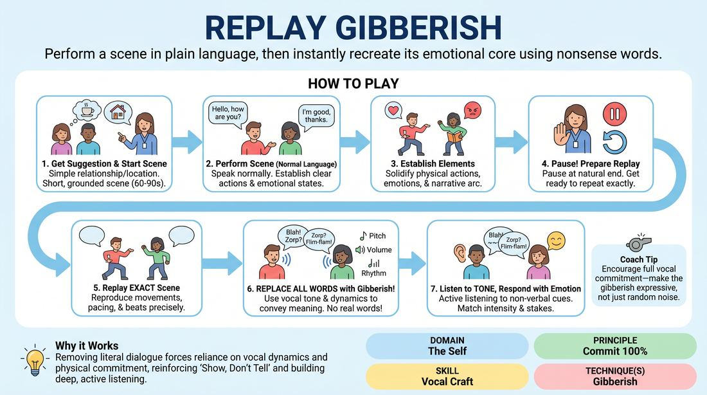

# Gibberish Replay

{ .game-hero }

> Perform a scene in plain language, then instantly recreate its emotional core using nonsense words.

## Overview
Two players perform a brief, grounded scene with clear physical actions and emotional stakes. Immediately afterward, they replay the exact same scene, beat-for-beat, but replace all spoken language with gibberish. This shifts the focus from literal dialogue to vocal tone, physical expression, and deep listening.

## What It Trains
- **Domain:** D1 — The Self
- **Principle(s):** Commit 100%; Make Your Partner a Genius; Show, Don't Tell
- **Skill(s):** Vocal Craft; Physicality & Space Work; Active Listening; Offer Reception
- **Technique(s):** Gibberish
- **Focus:** skill_drill

**Objective:** To develop vocal variety, emotional commitment, and physical storytelling by stripping away literal words, forcing players to rely on tone, tempo, and body language.

## Setup
An open playing space. Two active players stand in the performance area, while the rest of the group observes as an active audience. No props or special materials are required.

## How to Play
1. Select two players to step into the performance space and ask the group for a simple, everyday relationship or location suggestion.
2. Instruct the players to perform a short, grounded scene (approximately 60 to 90 seconds) using normal, spoken language.
3. During this first run, players must establish clear physical actions (object work), distinct emotional states, and a simple narrative arc.
4. Once the scene reaches a natural conclusion or the facilitator calls 'scene,' the players pause and prepare to replay it.
5. On the facilitator's cue, the players perform the exact same scene from the beginning, maintaining the same physical movements, emotional beats, and pacing.
6. During this replay, players must replace every spoken word with gibberish (nonsense sounds), using vocal pitch, volume, and rhythm to convey the original meaning.
7. The partner must listen actively to the non-verbal cues and respond with matching emotional intensity, ensuring the relationship and stakes remain identical to the first run.

## Facilitation Notes
- Side-coaching cue: 'Keep the physical actions identical!' Players often forget their original object work when translating to gibberish; remind them to anchor their bodies.
- Side-coaching cue: 'Commit to the sounds!' Encourage players to avoid using English-sounding words or 'charades' gestures. The gibberish itself must carry the emotional weight.
- Pitfall: Players try to literally translate their exact English lines word-for-word, leading to hesitant, choppy gibberish. Fix: Coach them to focus on the feeling and intent of the line rather than the literal translation.
- Pitfall: The replay becomes low-energy or silly. Fix: Remind players that the stakes are still 100% real; gibberish is a passionate, fully realized language, not just funny noises.

## Variations
- Reverse Replay: Perform the scene in gibberish first, then replay it in English to discover what the literal dialogue actually was.
- Gibberish Interpreter: A third player stands to the side and 'translates' the gibberish replay line-by-line for the audience, adding a layer of comedic justification.
- Emotional Dial: The facilitator calls out different emotional overlays during the gibberish replay (e.g., 'more urgent,' 'secretive') to push vocal variety further.

## Debrief
- How did removing literal language change how closely you had to watch and listen to your partner?
- What did you discover about your physical choices when you couldn't rely on words to explain what you were doing?
- How does committing 100% to nonsense sounds actually make your partner's offers clearer?

## Safety & Inclusion
Ensure players understand that gibberish should not mimic or caricature real-world languages, accents, or cultures. Encourage the use of abstract, playful, and completely invented phonetic sounds to keep the space respectful and inclusive.

## Why It Works
By removing the safety net of literal dialogue, players are forced to express intent through vocal dynamics (pitch, pace, volume) and physical commitment. This reinforces the principle of 'Show, Don't Tell' and builds deep, active listening, as players must respond to the emotional truth of their partner's delivery rather than just waiting for their turn to speak.
