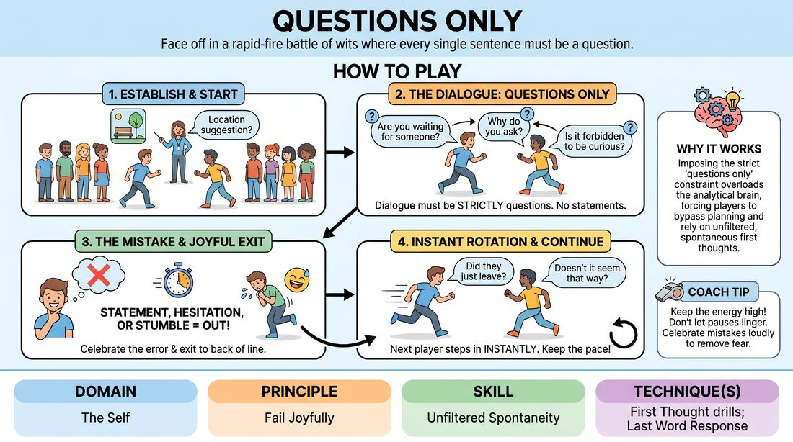

# Questions Only

{ .game-hero }

> Face off in a rapid-fire battle of wits where every single sentence must be a question.

## Overview
Two lines of players face off in a fast-paced scenic challenge where the only allowed form of communication is a question. When a player hesitates, makes a statement, or stumbles, they joyfully exit to the back of their line, allowing the next player to instantly step in and keep the scene moving. It is a high-energy, laughter-filled game of rapid-fire adaptation and celebrating mistakes.

## What It Trains
- **Domain:** D1 — The Self
- **Principle(s):** Fail Joyfully; The First Thought Is a Gift; Yes, And; Group Mind
- **Skill(s):** Unfiltered Spontaneity; Active Listening; Offer Reception; Pacing & Rhythm
- **Technique(s):** First Thought drills; Last Word Response; Edits (Sweep, Tag-Out, Sound/Light)
- **Focus:** comedy_game

**Objective:** To build unfiltered spontaneity and the ability to fail joyfully by forcing players to bypass their internal editors under strict, fast-paced constraints.

## Setup
Divide the players into two equal lines facing each other in the center of the playing space. The two players at the front of each line step forward to face each other. No props or special materials are required.

## How to Play
1. Ask the group for a simple location suggestion to establish the setting for the scene.
2. The first two players at the front of each line step forward to begin the scene.
3. Player A initiates the scene with a question, and Player B must immediately respond with another question that logically connects to the first.
4. The dialogue must continue back and forth, consisting strictly of valid questions without any statements or fragments that function as statements.
5. If a player makes a statement, hesitates for more than a second, repeats a question, or stumbles over their words, they are out.
6. Upon being eliminated, the player must joyfully celebrate their mistake with a quick bow or cheer and immediately run to the back of their line.
7. The next player in that line must instantly step forward and continue the scene with a new question, maintaining the established context.
8. The game continues at a brisk pace for about five minutes, ensuring everyone has multiple opportunities to step up and play.

## Facilitation Notes
- Side-coaching cue: 'Don't think, just ask!' Encourage players to blurt out the very first question that comes to mind, even if it sounds absurd.
- Pitfall: Players often overthink and freeze up trying to find the perfect question. Fix: Actively encourage rapid failure. When someone hesitates, lead the room in a quick cheer as they head to the back of the line to normalize and celebrate the mistake.
- Side-coaching cue: 'Listen to the last question!' Remind players that their question must build on what was just said, rather than being a completely random non-sequitur.
- Pitfall: Players making 'stealth statements' disguised as questions (e.g., 'Isn't it true that I am your father and we are at the grocery store?'). Fix: Gently call these out as statements in disguise and cycle the player out to keep the game honest and fast.

## Variations
- Emotional Questions: Players must adopt a specific, high-stakes emotion (e.g., terrified, ecstatic, suspicious) which helps fuel their questions.
- Genre Questions: Run the scene in a specific genre (e.g., Film Noir, Shakespearean, Sci-Fi), forcing players to adapt their vocabulary to the style.
- Tag-Team Questions: Instead of lines, players play in pairs on stage, and teammates can tag themselves in to rescue a partner who is struggling.

## Debrief
- How did it feel when you made a mistake and had to leave the scene? How can we bring that sense of joy to our regular scenes?
- What happened when you tried to plan your next question instead of listening to what was just asked?
- How did adopting a strong character or emotion make it easier to find questions spontaneously?

## Safety & Inclusion
Ensure the physical transition of players running to the back of the line is clear of obstacles. For players with mobility considerations, the running to the back of the line can be replaced with a simple hand gesture or step-aside, keeping the focus on the verbal play rather than physical speed.

## Why It Works
By imposing a strict, unnatural constraint (only questions), the analytical brain becomes overloaded and eventually gives up trying to plan ahead. This forces the player to rely entirely on their unfiltered, spontaneous first thoughts. Because mistakes are frequent and inevitable, the game naturally reframes failure as a fun, low-stakes moment of shared comedy, building resilience and trust.
