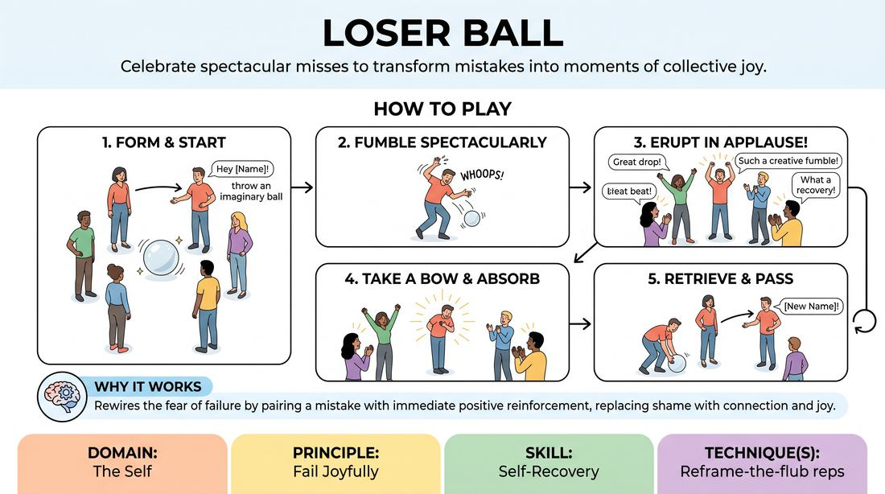

# Epic Drop

{ .game-hero }

> Celebrate spectacular misses to transform mistakes into moments of collective joy.

## Overview
A high-energy, physical warm-up where players pass an imaginary ball that must always be dropped. Instead of feeling shame, the dropper is showered with wild, specific praise by the entire group, reframing failure as a shared victory.

## What It Trains
- **Domain:** D1 — The Self
- **Principle(s):** Fail Joyfully; Group Mind
- **Skill(s):** Self-Recovery; Support Work
- **Technique(s):** Reframe-the-flub reps
- **Focus:** connection

**Objective:** To build resilience and self-recovery by practicing 'failing joyfully.' It trains players to embrace mistakes instantly, shake off self-judgment, and experience the safety of unconditional group support.

## Setup
Players stand in a circle with plenty of space to move. No physical props are needed, as the ball is entirely imaginary.

## How to Play
1. Form a standing circle with all players facing inward.
2. Explain that an imaginary, highly slippery ball is in play.
3. A player starts by making eye contact with someone across the circle, calling their name, and throwing the imaginary ball to them.
4. The receiving player must attempt to catch the ball but always fail spectacularly—fumbling, dropping, tripping, or letting it slip through their fingers.
5. Immediately upon the drop, the entire circle erupts into wild applause, cheers, and specific compliments about the quality of the fumble.
6. The player who dropped the ball takes a bow, absorbs the praise, and then retrieves the imaginary ball.
7. That player then selects a new target, calls their name, and throws the ball to continue the cycle.

## Facilitation Notes
- Coaching cue: 'Make the fumble big and dramatic! Don't just let it fall—fight to catch it and fail!'
- Coaching cue: 'Praise immediately! Don't let a single second of silence hang after the drop.'
- Pitfall: Players trying to actually catch the ball out of habit. Fix: Remind them that catching the ball is the only real mistake in this game.
- Pitfall: Generic praise like 'Good job.' Fix: Encourage highly specific, absurd compliments about the physical comedy of the drop.

## Variations
- Heavy Ball: The imaginary ball changes weight (e.g., a 100-pound bowling ball or a floating feather), changing how the fumble and the throw look physically.
- Slow-Motion Fumble: The throw, the drop, and the subsequent group celebration are all performed in exaggerated slow motion.
- The Wave of Support: The dropper must strike a dramatic 'triumph' pose while receiving the praise, leaning into the celebration.

## Debrief
- How did it feel to deliberately fail in front of the group?
- How did the immediate, enthusiastic support change your physical and emotional reaction to dropping the ball?
- How can we bring this attitude of 'celebrating the fumble' into our verbal improv scenes?

## Safety & Inclusion
Ensure players are mindful of their physical boundaries and those of others when fumbling or diving for the imaginary ball. Offer low-impact options for players with mobility limitations, such as a verbal or facial fumble rather than a physical dive.

## Why It Works
By pairing the physical experience of making a mistake (dropping the ball) with immediate positive reinforcement (cheering), the game rewires the brain's fear of failure. It replaces the instinctual shame response with joy and connection, proving that the group has your back no matter what.
