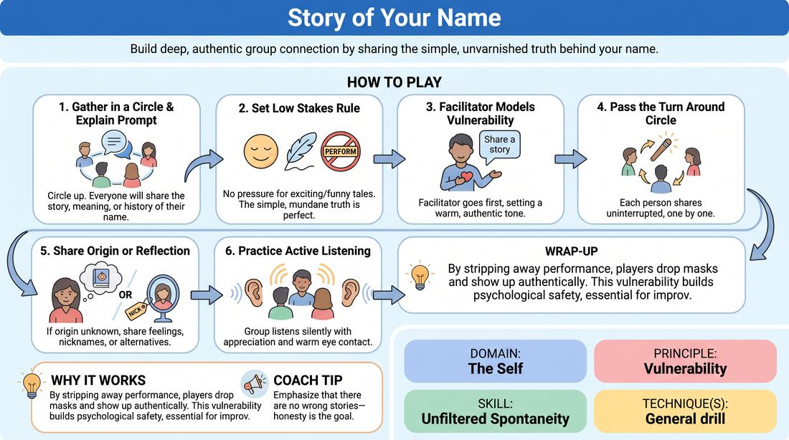

# The Story of My Name

{ .game-hero }

> Build deep, authentic group connection by sharing the simple, unvarnished truth behind your name.

## Overview
A gentle, low-stakes icebreaker where participants take turns sharing the history, meaning, or family lore behind their names. It shifts the room from performative energy to authentic presence, establishing a foundation of mutual trust and active listening.

## What It Trains
- **Domain:** D1 — The Self
- **Principle(s):** Vulnerability; Group Mind
- **Skill(s):** Unfiltered Spontaneity; Support Work
- **Focus:** connection

**Objective:** To cultivate vulnerability and unfiltered self-expression by sharing personal truth without the pressure to be funny, clever, or dramatic.

## Setup
Arrange the group in a comfortable standing or seated circle. No props or physical preparation are required.

## How to Play
1. Gather the group into a circle where everyone can see and hear each other clearly.
2. Explain that each person will share the story of how they received their name, what it means, or any personal history associated with it.
3. Explicitly state the low-pressure rule: the story does not need to be exciting, funny, or unique—the simple, mundane truth is perfect.
4. The facilitator models vulnerability by sharing the story of their own name first, setting a warm, authentic tone.
5. Pass the turn around the circle, allowing each person to speak without interruption.
6. If a participant does not know the origin of their name, invite them to share how they feel about their name, a nickname they have, or what they would have named themselves.
7. Instruct the rest of the group to practice active, supportive listening, receiving each story with silent appreciation and warm eye contact.

## Facilitation Notes
- Coaching cue: Let go of the need to entertain. The simple truth is more than enough.
- Pitfall: Players trying to make up a funny, fictional story. Fix: Gently remind them that this exercise is about authentic connection, not comedic invention.
- Coaching cue: Listen to connect, not to plan your own story.
- Pitfall: A player feeling self-conscious about a very short or boring story. Fix: Validate brief stories immediately to show that brevity is valued.

## Variations
- Middle Name Mystery: Focus specifically on middle names, which often have more obscure or family-specific origins.
- Name Evolution: Share the story of a nickname, chosen name, or a name you wish you had, highlighting personal identity shifts.
- Partner Exchange: Have players share their name stories in pairs first, then have each partner introduce the other to the larger group using the story they just heard.

## Debrief
- How did it feel to share a simple, true story without the pressure to be funny or clever?
- What did you notice about the level of attention and connection in the room as we listened to each other?
- How does knowing the story behind someone's name change how you perceive or connect with them?

## Safety & Inclusion
Be mindful of trans, non-binary, or adopted individuals who may have complex or sensitive relationships with their birth names. Explicitly invite participants to share the story of any name they go by, have chosen, or prefer, without requiring them to disclose deadnames or traumatic family histories.

## Why It Works
By stripping away the demand for performance, players drop their social masks and practice showing up as themselves. This vulnerability builds psychological safety, which is essential for spontaneous, high-support improv.
