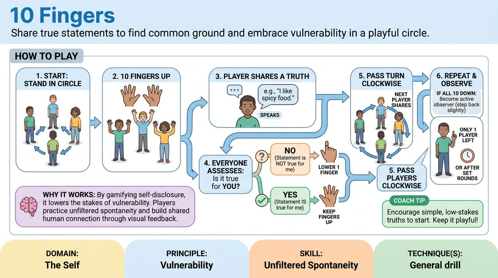

# Ten Fingers

{ .game-hero }

> Share true statements to find common ground and embrace vulnerability in a playful circle.

## Overview
Ten Fingers is an interactive warm-up where players stand in a circle with all ten fingers raised. Taking turns, players share simple, true facts about themselves, and anyone for whom the statement is not true must lower a finger. The game fosters deep connection and mutual discovery as players reveal their authentic selves.

## What It Trains
- **Domain:** D1 — The Self
- **Principle(s):** Vulnerability; Group Mind
- **Skill(s):** Unfiltered Spontaneity; Peripheral Awareness
- **Focus:** connection

**Objective:** To develop unfiltered spontaneity and vulnerability by sharing personal truths, while building group mind and peripheral awareness.

## Setup
Players stand in a circle facing inward with enough space to comfortably hold their hands up.

## How to Play
1. Gather all players into a standing circle facing inward.
2. Instruct every player to hold up both hands with all ten fingers extended.
3. Designate a starting player to share a single, true statement about themselves, such as a habit, preference, or life experience.
4. Every player in the circle assesses if the statement is true for them; if the statement is NOT true, they must lower one finger.
5. Pass the turn clockwise to the next player, who shares a new true statement about themselves.
6. Continue around the circle, with players lowering a finger each time a statement does not apply to them.
7. If a player lowers all ten fingers, they step back slightly to become active observers, continuing to support the group.
8. The game concludes when only one player has fingers remaining, or after a set number of rounds where everyone has shared.

## Facilitation Notes
- Encourage players to share genuine, unfiltered facts rather than strategic statements designed to eliminate others.
- If players offer superficial statements like 'I am breathing,' challenge them to share something slightly more personal or emotional.
- Remind the group that the goal is connection and discovery, not competitive survival.
- Watch for players overthinking their turn; coach them to say the first true thing that comes to mind.

## Variations
- Reverse Ten Fingers: Start with closed fists and raise a finger when a statement is true for you, celebrating shared experiences.
- Character Study: Play the game in character to rapidly build backstories and relationships for an upcoming scene.
- Speed Round: Increase the tempo to force rapid-fire, unfiltered responses and bypass the analytical mind.

## Debrief
- How did it feel to share personal truths with the group so early in the session?
- What did you discover about the group that surprised you?
- How does embracing vulnerability help us trust each other on stage?

## Safety & Inclusion
Remind players that they retain full agency over their personal boundaries. They should only share what they feel comfortable disclosing to the room, and they may pass their turn to speak if needed.

## Why It Works
By gamifying self-disclosure, the exercise lowers the stakes of vulnerability. Players practice unfiltered spontaneity by sharing immediate personal truths, while the visual feedback of lowering fingers builds a strong sense of shared humanity and group mind.
