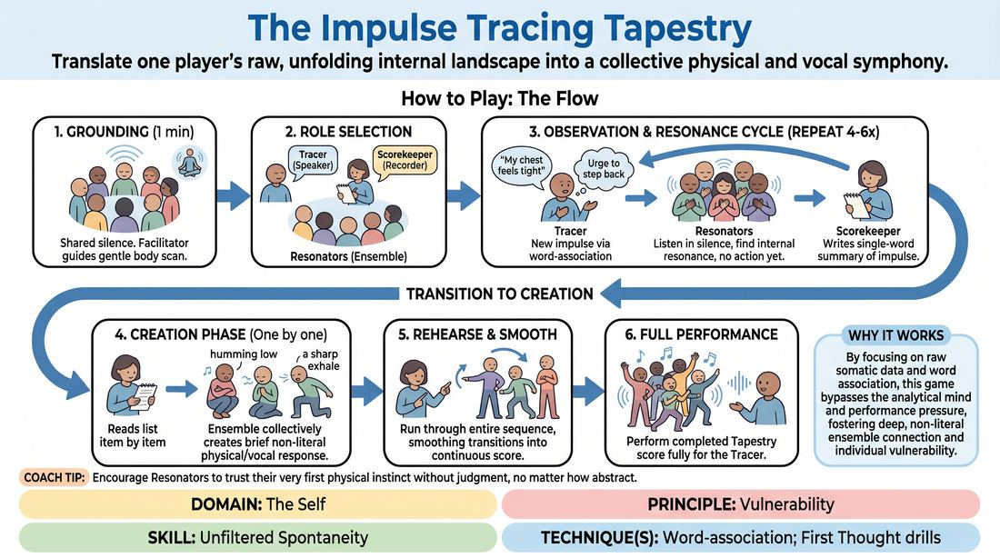

# The Impulse Tapestry

{ .game-hero }

> Translate one player's raw, unfolding internal landscape into a collective physical and vocal symphony.

## Overview
A deep, somatic ensemble exercise where a single player verbally tracks their real-time physical sensations, emotional shifts, and mental impulses. The surrounding ensemble listens deeply, internalizes these raw reports, and collectively builds a non-literal physical and vocal score that mirrors the speaker's internal journey. The result is a highly vulnerable, abstract performance of one person's inner world, built entirely on group resonance.

## What It Trains
- **Domain:** D1 — The Self
- **Principle(s):** Commit 100%; Fail Joyfully; Vulnerability; The First Thought Is a Gift; Group Mind
- **Skill(s):** Unfiltered Spontaneity; Emotional Fluidity; Physicality & Space Work; Vocal Craft; Silence & Stillness; Self-Recovery; Single-Partner Empathy & Mirroring; Peripheral Awareness; Support Work
- **Technique(s):** Word-association; First Thought drills; Emotional substitution; Projection & breath support; Vocal characterization; Gibberish; Do nothing exercises; Emotional-echo drills
- **Focus:** mixed

**Objective:** To develop unfiltered spontaneity and vulnerability by practicing real-time somatic self-observation, while training the ensemble to translate abstract emotional states into non-mimetic physical and vocal expressions.

## Setup
An open, quiet room with moderate space. The players stand in a relaxed circle. No props or materials are required. The environment should be quiet and free from external distractions to support deep concentration.

## How to Play
1. Begin with a shared minute of silence; the facilitator guides the ensemble through a gentle body scan to ground their focus and attune to their own physical and emotional states.
2. Select one player to be the 'Tracer' and another to act as the 'Scorekeeper.' The remaining players form the 'Resonators' and stand in a loose semi-circle facing the Tracer.
3. The Tracer speaks a single, unedited, real-time internal observation, such as 'My chest feels tight' or 'I have a sudden urge to step backward.'
4. The Resonators listen in silence, finding a personal, internal physical or vocal resonance with the Tracer's statement without moving or making sound yet.
5. The Scorekeeper silently writes down a single-word summary of the Tracer's observation to keep track of the sequence.
6. Repeat this process for four to six more distinct impulses; the Tracer shares each new sensation as it arises—using word-association to transition without needing logical or narrative connections—while the Scorekeeper notes each one.
7. The Scorekeeper reads the recorded list back, one item at a time. For each item, the Resonators collectively and spontaneously create a brief, non-literal physical posture and non-verbal sound that captures their shared resonance.
8. The Scorekeeper guides the ensemble to run through the entire sequence of physical and vocal responses in order, smoothing out the transitions to create a continuous, flowing performance.
9. The ensemble performs the completed 'Tapestry' score in its entirety for the Tracer, committing fully to the abstract physical and vocal movements.

## Facilitation Notes
- Coaching Cue: Remind the Tracer to avoid performing or explaining their feelings. Use side-coaching like: 'Just report the weather inside you, don't tell us why it's raining.'
- Pitfall: Resonators often fall into literal mimicry, such as rubbing their own shoulder when the Tracer mentions shoulder tension. Fix: Explicitly instruct the group to find the emotional or energetic quality of the sensation rather than copying the physical action.
- Coaching Cue: If the Tracer gets stuck or overthinks, encourage them to use transparent self-recovery: 'If you lose the thread, simply say "I lost the thread" and wait for the very next physical sensation to arrive.'
- Pitfall: The performance phase can become chaotic or rushed. Fix: Encourage the ensemble to use breath and eye contact to cue transitions, ensuring the score flows like a single, cohesive piece of music.

## Variations
- Blind Tapestry: Perform the final live score with all Resonators keeping their eyes closed, relying entirely on breath, vocal cues, and spatial intuition to transition between movements.
- Rapid Impulse: Speed up the tracing phase, requiring the Tracer to speak their impulses in rapid succession with only a few seconds of silent resonance in between to bypass intellectual filtering.
- Single-Medium Focus: Restrict the Resonators' score to either purely physical movement (no sound) or purely vocal soundscapes (no movement) to deepen mastery of a single expressive channel.

## Debrief
- Tracer, what was the sensation of seeing your private, internal landscape externalized and honored by the group?
- Resonators, how did you translate a highly specific verbal sensation into an abstract physical or vocal expression?
- How did practicing silence and stillness at the beginning change your ability to access unfiltered spontaneity?
- Where did you feel the group mind take over during the creation of the collective score?

## Safety & Inclusion
Because this exercise requires high vulnerability and close emotional attunement, establish a clear 'pass' rule before beginning. The Tracer or any participant may step back or pause the exercise at any time without explanation. Ensure the space is physically accessible for players with varying mobility, adapting the physical score to include micro-movements or purely vocal contributions as needed.

## Why It Works
This game works because it strips away the pressure of narrative and comedic timing, forcing players to rely on raw somatic data. By using word-association to link internal states, the Tracer bypasses the analytical mind. Meanwhile, the ensemble's task of creating non-mimetic responses prevents intellectualized choices, fostering deep empathy and group mind as they translate one person's vulnerability into a shared physical and vocal reality.
