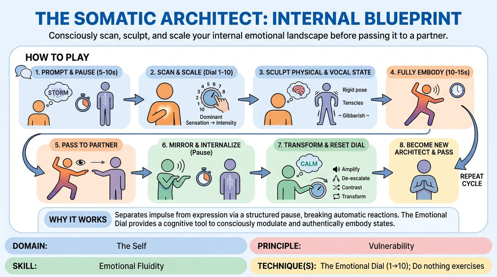

# The Somatic Blueprint

{ .game-hero }

> Consciously scan, sculpt, and scale your internal emotional landscape before passing it to a partner.

## Overview
This exercise guides players through a structured process of internal scanning, emotional scaling, and deliberate physical embodiment. Players receive abstract prompts, pause to observe their somatic impulses, and use an internal dial to consciously shape and express their emotional state. This state is then passed to a partner, who mirrors, internalizes, and intentionally transforms it.

## What It Trains
- **Domain:** D1 — The Self
- **Principle(s):** Commit 100%; Fail Joyfully; Vulnerability; The First Thought Is a Gift
- **Skill(s):** Unfiltered Spontaneity; Emotional Fluidity; Physicality & Space Work; Vocal Craft; Silence & Stillness; Self-Recovery; Single-Partner Empathy & Mirroring
- **Technique(s):** The Emotional Dial (1→10); Do nothing exercises; Hold-the-beat reps; Gibberish; Projection & breath support; Vocal characterization; Character Walks/Centers; Weight & resistance mime; Mirror exercise
- **Focus:** skill_drill

**Objective:** To develop emotional fluidity, self-recovery, and physical commitment by training players to consciously access, modulate, and transform their internal states rather than relying on automatic, unexamined reactions.

## Setup
Players stand in a comfortable, spacious circle. No props are required. The facilitator should prepare a list of evocative, abstract words such as unravel, anchor, shimmer, crystallize, or surge.

## How to Play
1. The facilitator calls out an abstract, evocative prompt word to the entire circle.
2. The active player, acting as the Architect, stands in complete silence and stillness for five to ten seconds to perform an internal scan of their immediate physical and emotional reactions to the word.
3. The Architect selects one dominant sensation or emotion from their scan and mentally assigns it an intensity rating from 1 to 10 using the Emotional Dial.
4. The Architect plans how this scaled state will manifest physically through posture, tension, and movement, and vocally through breath, tone, or gibberish.
5. The Architect fully embodies this sculpted state for ten to fifteen seconds, committing completely to the physical and vocal expression of their chosen blueprint.
6. The Architect makes direct eye contact with a Receiver in the circle and delivers a single, concentrated physical gesture and non-verbal vocalization that encapsulates their state.
7. The Receiver immediately mirrors this gesture and sound for a brief moment to absorb its quality, then drops into five to ten seconds of silent, still internal scanning.
8. The Receiver consciously chooses a new state in response, either amplifying, de-escalating, contrasting, or transforming the received energy, and sets their own Emotional Dial from 1 to 10.
9. The Receiver becomes the new Architect, fully embodying their new state and passing it to another player, continuing the cycle.

## Facilitation Notes
- Coaching Cue: Emphasize the silence. Do not rush the scan. The magic happens in the pause before the movement.
- Pitfall: Players might choose safe, generic emotions. Fix: Encourage them to focus on physical sensations first, like tightness in the chest or lightness in the fingers, and build the emotion from the body up.
- Coaching Cue: Use the dial! If you feel a 5, consciously push it to an 8 or drop it to a 2. Feel the physical shift that comes with that numerical change.
- Pitfall: The receiver might immediately react without the mandatory pause. Fix: Remind players that mirroring is brief, and must be followed by a hard stop into stillness to process their own internal response.

## Variations
- Vocalized Blueprint: Before embodying the state, the Architect states their choice and dial setting aloud, for example, 'I am building anticipation at a level 8.'
- Somatic Inquiry Prompts: The facilitator replaces single words with evocative questions, such as 'Where does your body store quiet determination?'
- Transformative Duets: Two players step forward, scan individually, and then must find a physical and vocal compromise that blends their two distinct blueprints before passing a unified state to a new pair.

## Debrief
- How did pausing in silence change your relationship to your first emotional impulse?
- What physical shifts did you notice when you adjusted your emotional dial up or down?
- How did it feel to receive an intense emotion and consciously choose to transform it rather than just react to it?

## Safety & Inclusion
This game involves deep emotional exploration. Remind players that they are in complete control of their emotional dial; they should never push themselves into genuine psychological distress. Encourage physical modifications for any movement or vocal constraints.

## Why It Works
By separating the initial impulse from the physical expression through a structured pause, this game breaks the habit of automatic, superficial reactions. Using the Emotional Dial gives players a concrete, cognitive tool to modulate their somatic states, building genuine emotional fluidity and self-recovery.
