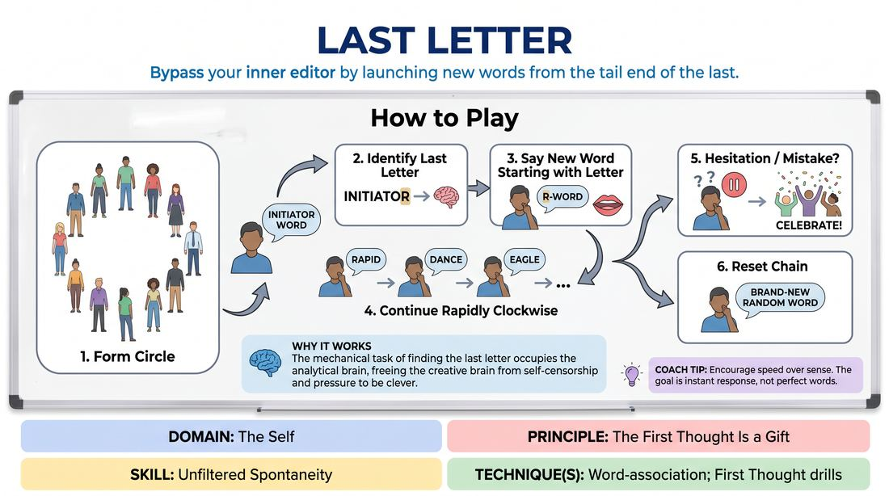

# Last Letter Association

{ .game-hero }

> Bypass your inner editor by launching new words from the tail end of the last.

## Overview
This is a rapid-fire, high-energy word association drill played in a circle. Instead of associating by meaning, players must instantly generate a word that begins with the final letter of the word just spoken. The rapid pace and mechanical constraint help players bypass self-censorship and embrace their immediate impulses.

## What It Trains
- **Domain:** D1 — The Self
- **Principle(s):** The First Thought Is a Gift; Yes, And
- **Skill(s):** Unfiltered Spontaneity; Active Listening; Offer Reception
- **Technique(s):** Word-association; First Thought drills
- **Focus:** skill_drill

**Objective:** Develops unfiltered spontaneity and active listening by forcing players to focus on the exact ending of an offer and trust their very first cognitive response without editing.

## Setup
Players stand in a circle facing inward. No props or physical materials are required. The space should be clear of obstructions to allow for comfortable standing.

## How to Play
1. Form a standing circle with all participants facing inward.
2. The facilitator or a designated starting player speaks a single, clear initiator word out loud.
3. The player directly to their left must immediately identify the final letter of that spoken word.
4. That second player must instantly say a new word that begins with that specific letter.
5. Play continues rapidly clockwise around the circle, with each player receiving a word, identifying its last letter, and immediately speaking a new word starting with that letter.
6. If a player hesitates for more than a second, gets stuck, or makes a spelling error, the entire group cheers to celebrate the mistake.
7. The player who got stuck simply throws out a brand-new random word to reset the chain and keep the momentum going.

## Facilitation Notes
- Side-coach heavily on speed: 'First thought, best thought! Do not search for the perfect word.'
- Address the spelling trap: If players pause to spell complex words in their head, encourage them to go by phonetic sound rather than perfect orthography.
- Remind players that semantic connection is not required; 'apple' leading to 'elephant' is great, but 'apple' leading to 'elbow' is just as perfect.
- Watch for physical tension; encourage relaxed posture and deep breathing to help spontaneous thoughts flow freely.

## Variations
- Cross-Circle Toss: Instead of moving sequentially in a circle, players make eye contact and throw the word to anyone across the circle, increasing focus and engagement.
- Category Lockdown: Restrict all words to a specific category, such as food, movies, or animals, which increases the cognitive challenge while maintaining the spelling rule.
- Emotional Echo: Players must deliver their word with a distinct physical or vocal emotion, which the next player must briefly mirror before delivering their own word.

## Debrief
- How did having a strict mechanical rule (the last letter) actually make it easier to speak without overthinking?
- What did it feel like when you hesitated, and how did the group's celebration of mistakes affect your anxiety?
- How does this exercise demonstrate the difference between planning your next move and truly listening to the present offer?

## Safety & Inclusion
To support players with dyslexia, learning differences, or English as a second language, explicitly state that phonetic spelling is 100% correct. If someone says a word starting with a phonetically logical letter (e.g., 'phone' ending in an 'n' sound leading to 'nature'), accept it instantly without correction.

## Why It Works
By giving the analytical left-brain a simple, mechanical task to solve (finding the last letter), the creative right-brain is freed from the pressure of being clever or funny. This structural distraction effectively silences the internal editor, allowing pure, unfiltered spontaneity to surface.
