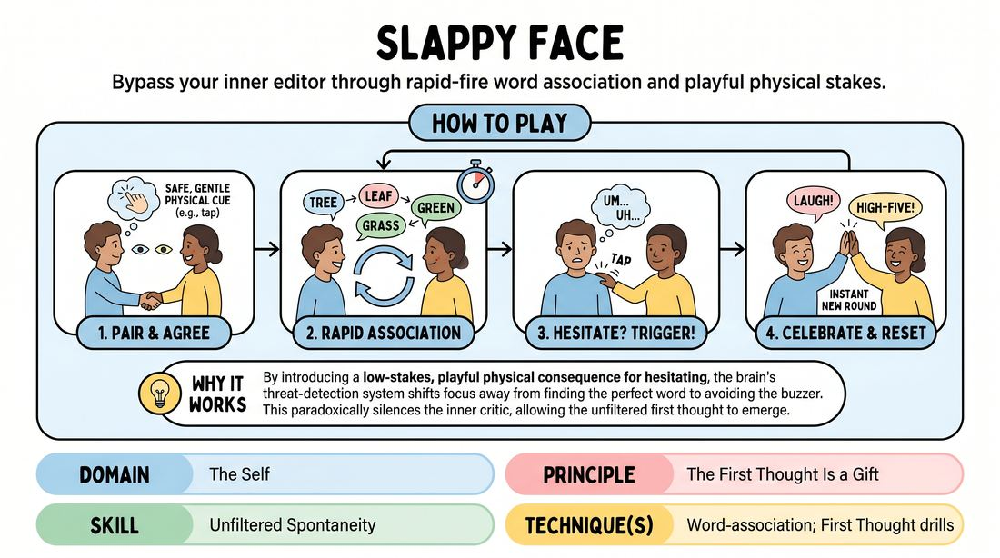

# Reflex Tap

{ .game-hero }

> Bypass your inner editor through rapid-fire word association and playful physical stakes.

## Overview
A high-energy, paired word-association drill designed to short-circuit the analytical mind. Players exchange rapid-fire words, but any hesitation, filler words, or repetition triggers a playful, consensual physical cue from their partner. This light element of consequence shifts focus from intellectualizing to pure, instinctual reaction.

## What It Trains
- **Domain:** D1 — The Self
- **Principle(s):** Fail Joyfully; The First Thought Is a Gift; Consent & Boundaries
- **Skill(s):** Unfiltered Spontaneity; Active Listening; Boundary Navigation
- **Technique(s):** Word-association; First Thought drills; Negotiating physical contact
- **Focus:** skill_drill

**Objective:** To develop unfiltered spontaneity and active listening by using a physical trigger to bypass the cognitive filter, training players to treat their first thought as a gift.

## Setup
Players stand in pairs, facing each other at arm's length in a comfortable space. Before starting, partners must explicitly negotiate and agree upon the physical contact boundary.

## How to Play
1. Stand facing your partner at a comfortable distance and establish eye contact.
2. Agree on a specific, safe, and gentle physical contact cue, such as a light tap on the shoulder or forearm, to signal hesitation.
3. Player A begins by saying a single, random word to Player B.
4. Player B must immediately respond with the very first word that enters their mind based on association, without pausing to evaluate it.
5. Continue back-and-forth word association at a rapid, rhythmic pace.
6. If a player hesitates, stutters, uses filler words like 'um', or repeats a word, their partner immediately delivers the agreed-upon gentle tap.
7. Upon receiving the tap, both players must celebrate the mistake with a quick laugh or high-five, reset, and immediately start a new round with a fresh word.

## Facilitation Notes
- Coaching cue: 'Don't think, just react! Let the word jump out of your mouth.'
- Coaching cue: 'Keep the physical cue incredibly light and playful—it is a buzzer, not a punishment.'
- Pitfall: Players hesitate because they are trying to find a clever association. Fix: Remind them that boring, obvious, or nonsensical associations are perfect; the goal is speed, not wit.
- Pitfall: The physical tap becomes too aggressive or uncomfortable. Fix: Intervene immediately to ensure the touch is feather-light, or switch to a non-contact cue like a clap or a pointing gesture.

## Variations
- Non-Contact Version: Instead of a physical tap, partners quickly point and make a funny buzzer sound like 'BZZT!' when hesitation occurs.
- Category Association: Restrict the words to a specific category, such as 'things in a kitchen' or 'emotions', to increase the cognitive load while maintaining speed.

## Debrief
- How did the presence of the physical consequence affect your internal editor? Did it make you overthink more, or did it force you to let go?
- What did it feel like to accept the first word that came to your mind without judging it?
- How did establishing clear physical boundaries before the game affect your comfort level and trust with your partner?

## Safety & Inclusion
This game relies heavily on physical touch and boundary navigation. Facilitators must emphasize that consent is paramount. Partners must explicitly agree on where and how they are comfortable being tapped, and anyone can opt for the non-contact buzzer sound variation at any time without explanation.

## Why It Works
By introducing a low-stakes, playful physical consequence for hesitating, the brain's threat-detection system shifts focus away from finding the perfect word to avoiding the buzzer. This paradoxically silences the inner critic, allowing the subconscious to deliver raw, unfiltered associations instantly. It teaches players to trust their immediate instincts as valuable offers.
