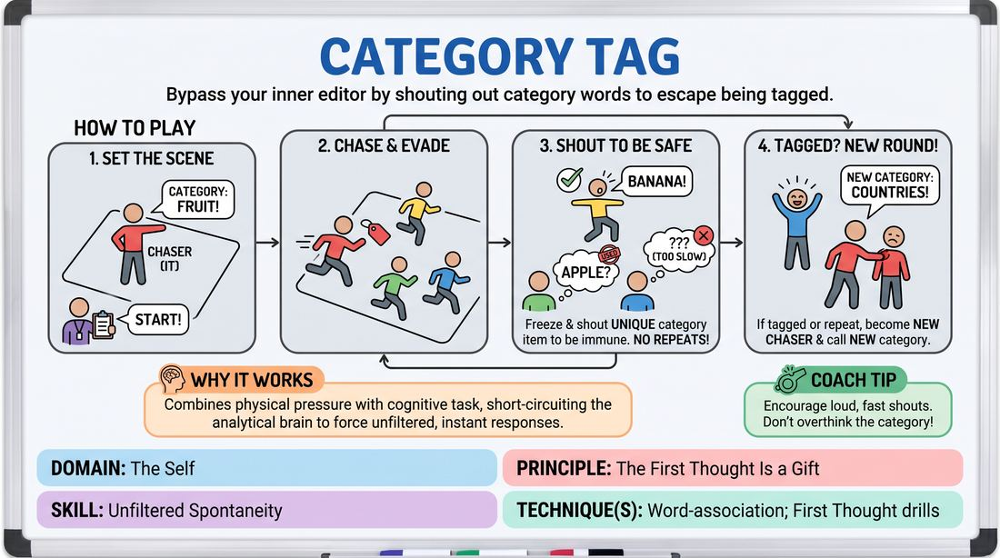

# Category Chase

{ .game-hero }

> Bypass your inner editor by shouting out category words to escape being tagged.

## Overview
This is a high-energy, physical tag game where players must think on their feet to avoid being caught. One player is 'It' and sets a category; other players can only save themselves from being tagged by shouting out a unique item that fits that category. It combines rapid-fire word association with physical agility, forcing players to bypass their internal editors under pressure.

## What It Trains
- **Domain:** D1 — The Self
- **Principle(s):** The First Thought Is a Gift; Fail Joyfully; Group Mind
- **Skill(s):** Unfiltered Spontaneity; Physicality & Space Work; Peripheral Awareness
- **Technique(s):** Word-association; First Thought drills
- **Focus:** skill_drill

**Objective:** Develops unfiltered spontaneity, rapid word association under physical pressure, and peripheral awareness by training players to trust their first thoughts.

## Setup
A large, open room free of obstacles. Players spread out across the space. No props are required.

## How to Play
1. Designate clear boundaries for the playing area and select one player to start as the Chaser ('It').
2. Before the chase begins, the Chaser must loudly announce a specific, accessible category (e.g., 'Types of Fruit' or 'Action Movies').
3. On the facilitator's signal, the Chaser begins pursuing the other players to tag them.
4. To become temporarily immune to being tagged, a player must freeze in place and loudly shout an item that fits the active category before the Chaser touches them.
5. Once an item is shouted, it is 'used' and cannot be repeated by anyone else during that round.
6. If a player is successfully tagged because they couldn't think of a word, repeated a word, or were too slow, they immediately become the new Chaser.
7. The new Chaser must instantly freeze, call out a brand-new category, and then begin chasing the other players.

## Facilitation Notes
- Side-coaching cue: 'Don't search for the perfect word! Shout the very first thing that pops into your head, even if it's silly!'
- Side-coaching cue: 'Listen closely to what has already been said so you don't repeat a word under pressure.'
- Pitfall: Players choosing categories that are too narrow (e.g., '18th-century French poets'). Fix: Intervene and coach the group to choose broad, universally understood categories.
- Pitfall: Physical collisions or overly aggressive tagging. Fix: Remind players that tags must be light, two-finger taps on the shoulder or back, and that safety is the absolute priority.

## Variations
- Physicality Match: When a player shouts a word to save themselves, they must also strike a physical pose representing that word.
- Silent Category: The Chaser acts out the category physically instead of naming it, and players must guess the category and shout a matching item to save themselves.
- Fast Walk Only: To manage energy levels or tight spaces, restrict players to a fast, heel-to-toe walk instead of running.

## Debrief
- How did the physical pressure of being chased affect your ability to access words?
- What happened when you hesitated or tried to find the 'perfect' word instead of using your first thought?
- How did you balance your physical awareness of the room with your mental focus on the category?

## Safety & Inclusion
Ensure the playing space is completely clear of tripping hazards. Establish a 'no-running' rule (fast walking only) if the space is small or the floor is slippery. Emphasize that tags must be gentle, light touches on the shoulder or back, with absolutely no pushing, grabbing, or tackling.

## Why It Works
By combining physical threat (being tagged) with a cognitive task (word association), the game forces the analytical brain to short-circuit. Players do not have time to filter, judge, or edit their thoughts; they must rely entirely on their immediate, instinctive first thoughts to survive. This builds deep trust in one's spontaneous impulses.
