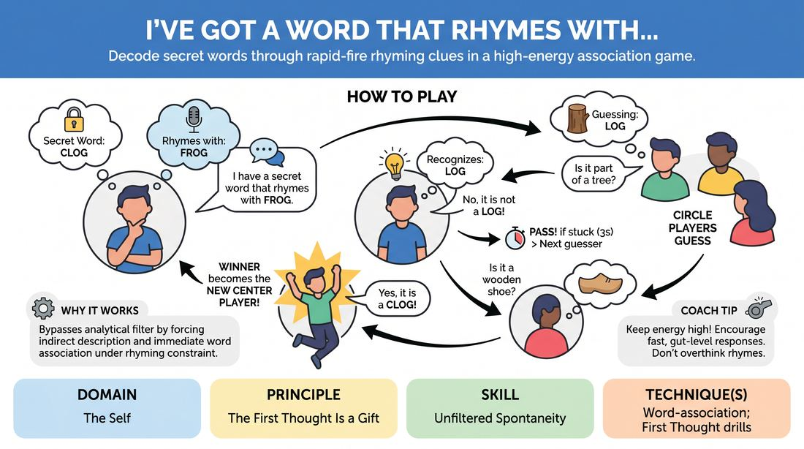

# Rhyme Association Riddle

{ .game-hero }

> Decode secret words through rapid-fire rhyming clues in a high-energy association game.

## Overview
Players form a circle to guess a secret word held by a central player using only descriptive clues and rhyming answers. The circle players describe potential rhyming words, forcing the center player to instantly identify the described word and respond with a rhyming rejection or confirmation. It is a fast-paced mental workout that demands immediate word association and bypasses the analytical filter.

## What It Trains
- **Domain:** D1 — The Self
- **Principle(s):** The First Thought Is a Gift; Make Your Partner a Genius
- **Skill(s):** Unfiltered Spontaneity; Active Listening; Offer Reception
- **Technique(s):** Word-association; First Thought drills
- **Focus:** skill_drill

**Objective:** To build unfiltered spontaneity, active listening, and rapid word-association by forcing players to trust their first instinctual thoughts under pressure.

## Setup
Players stand in a circle facing inward. One player is selected to start in the center. For virtual play, players use a designated gallery view order or a digital wheel to determine the guessing sequence, with the active guesser unmuting to speak.

## How to Play
1. The player in the center secretly selects a target word (e.g., 'clog') and thinks of a word that rhymes with it (e.g., 'frog').
2. The center player announces the rhyming clue to the circle: 'I have a secret word that rhymes with frog.'
3. Circle players try to guess the secret word, but they cannot say their guesses directly; instead, they must describe a word that rhymes with 'frog' (e.g., 'Is it a fallen tree trunk?').
4. The center player must quickly figure out what word the guesser is describing ('log') and reject it in rhyme: 'No, it is not a log!'
5. If a circle player describes the actual secret word (e.g., 'Is it a wooden shoe?'), the center player must recognize it ('clog') and enthusiastically confirm: 'Yes, it is a clog!'
6. If the center player cannot figure out the described word within three seconds, they must say 'Pass!' to keep the energy high, and another circle player immediately offers a new clue.
7. The round ends when the secret word is successfully described and identified, and the player who gave the winning clue becomes the new center player.

## Facilitation Notes
- Coaching cue: 'Trust your first thought! Say the first simple description that comes to mind instead of crafting a complex, unsolvable riddle.'
- Pitfall: Circle players try to be too clever, making clues that are impossible to decode. Fix: Remind players that the goal is to help the center player succeed, keeping clues obvious and direct.
- Coaching cue: 'Center players, keep the tempo up. If you do not know the word being described within two seconds, just say pass and move to the next clue.'
- Pitfall: The center player gets stuck trying to find the perfect rhyme. Fix: Encourage them to choose simple, common words with many easy rhymes for their secret word.
- Pacing tip: Keep the rhythm snappy. Encourage physical bouncing or clapping to establish a steady, driving tempo that discourages overthinking.

## Variations
- Virtual Adaptation: Play in a video call where the center player pins themselves. Instead of a physical circle, the center player calls out names of players with raised hands, or players use the chat to queue up their clues.
- Category Constraints: Limit the secret words to a specific category, such as animals, food, or household objects, to speed up the association process.
- Pantomime Clues: Instead of verbal descriptions, circle players must silently act out their guess, forcing the center player to translate physical movement into a rhyming word.
- Rapid Fire: The center player has a 60-second time limit to guess as many rhyming descriptions from the circle as possible, scoring points for each correct identification.

## Debrief
- How did it feel to trust the very first clue or word that popped into your head?
- What happened to the energy of the game when you tried to plan or edit your clues before speaking?
- How did active listening help you adapt when the center player did not understand your description?

## Safety & Inclusion
Ensure players choose common, accessible words. If a player has difficulty with rapid auditory processing or rhyming, they can pair up with a partner in the center to play as a team, or be allowed to use a rhyming dictionary/cheat sheet.

## Why It Works
By forcing players to communicate through indirect definitions and rhyming constraints, the game bypasses the analytical brain's filter. Players must rely on immediate word-association and active listening to bridge the gap between the clue and the rhyme, reinforcing the principle that the first thought is a valuable gift.
