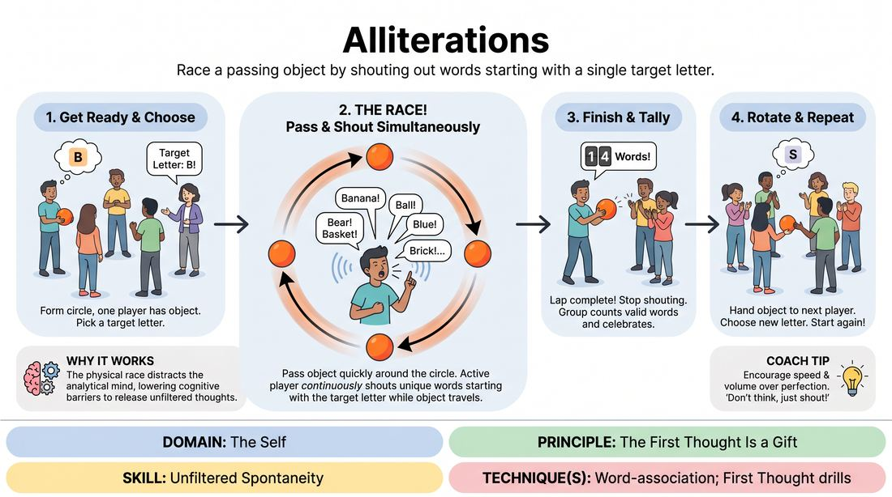

# Rapid Fire Letters

{ .game-hero }

> Race a passing object by shouting out words starting with a single target letter.

## Overview
A high-energy, fast-paced warm-up where a single player attempts to generate a stream of words starting with a designated letter before a physical object completes a lap around the circle. It creates a playful race against time that bypasses the analytical brain, forcing players to rely on their immediate, unfiltered thoughts.

## What It Trains
- **Domain:** D1 — The Self
- **Principle(s):** The First Thought Is a Gift; Fail Joyfully; Group Mind
- **Skill(s):** Unfiltered Spontaneity; Pacing & Rhythm
- **Technique(s):** Word-association; First Thought drills; Timing exercises
- **Focus:** skill_drill

**Objective:** To bypass the internal editor, embrace the first thought, and build comfort with rapid-fire spontaneity under light, playful pressure.

## Setup
Players stand in a circle. The facilitator provides a small, easily passable object, such as a tennis ball, a soft beanbag, or a knotted towel.

## How to Play
1. Form a standing circle with all players. One player starts with the physical object in hand.
2. The facilitator or the group selects a target letter of the alphabet, avoiding extremely difficult letters like Q, X, or Z for the first few rounds.
3. On the signal to start, the active player passes the object to the person to their left, who immediately passes it to their left, sending the object on a rapid lap around the circle.
4. While the object is traveling, the active player must continuously call out unique words that begin with the chosen target letter.
5. The active player continues their rapid-fire word generation until the object completes its full lap and is returned to their hands.
6. The group counts how many valid words the active player successfully called out during the lap, celebrating the final tally.
7. The object is then handed to the next player in the circle, a new letter is chosen, and the process repeats.

## Facilitation Notes
- Coaching cue: 'Don't watch the ball! Close your eyes or look at the ceiling to keep your brain from freezing as the object approaches.'
- Pitfall: Players pausing to find the 'perfect' or 'smart' word. Fix: Encourage nonsense words, simple words, or repeating similar sounds to keep the vocal momentum going. The goal is flow, not vocabulary.
- Coaching cue: 'Keep the passing rhythm steady and brisk. Don't slow down or speed up to help or hurt the speaker.'
- Pitfall: Hesitation when a duplicate word is said. Fix: Keep going! If a duplicate happens, just let it slide or shout the next word immediately without self-correcting.

## Variations
- Category Rush: Instead of a letter, the active player must name items from a specific category, such as 'things in a kitchen' or 'animals'.
- Double Lap: For smaller groups, the object must make two full laps around the circle to give the speaker more time.
- Partner Stopwatch: In pairs, one partner speaks words starting with a letter for fifteen seconds while the other partner counts, then they swap roles.

## Debrief
- What happened to your brain when you stopped watching the ball and just focused on the words?
- How did it feel when you ran out of 'good' words and had to say whatever popped into your head?
- How does this exercise help us practice accepting our 'first thoughts' in an actual scene?

## Safety & Inclusion
Ensure the passing object is soft and easy to catch to prevent injury or anxiety about dropping it. If a participant has physical limitations with catching or passing, the group can pass a verbal 'spark' (making eye contact and clapping) around the circle at a steady tempo instead of a physical object.

## Why It Works
By pairing a physical countdown (the traveling object) with a verbal task, the analytical mind gets distracted by the physical ticking clock. This distraction lowers the cognitive barrier, allowing the subconscious to release unfiltered words, directly training the 'first thought is a gift' principle.
