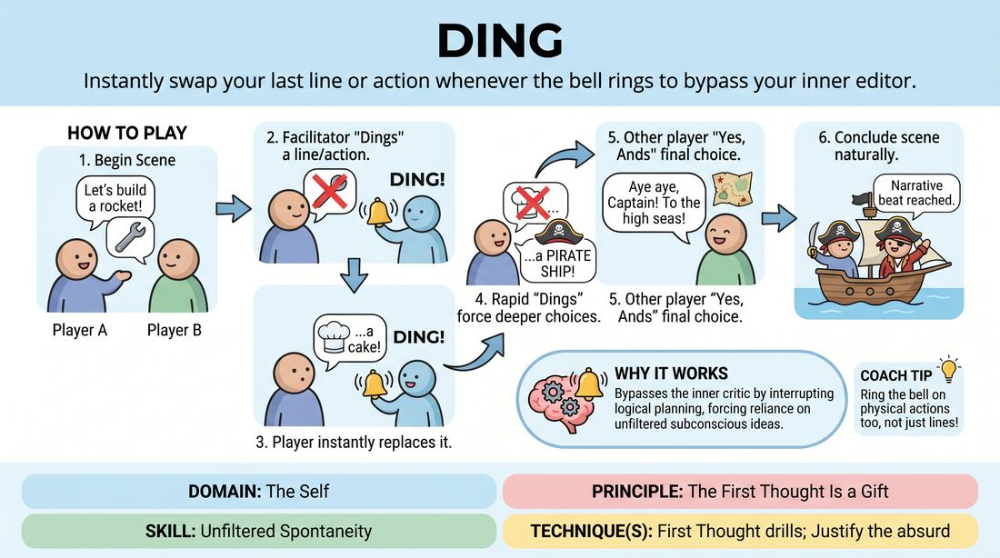

# Ding

{ .game-hero }

> Instantly swap your last line or action whenever the bell rings to bypass your inner editor.

## Overview
Two players initiate a standard scene while a facilitator stands by with a bell, buzzer, or the vocal cue 'Ding!'. Whenever the cue sounds, the active player must immediately retract their last line or physical choice and replace it with a completely new option. This fast-paced exercise forces players to abandon premeditated plans and discover the wealth of unexpected ideas waiting just beneath their conscious filter.

## What It Trains
- **Domain:** D1 — The Self
- **Principle(s):** The First Thought Is a Gift; Fail Joyfully; Yes, And; Base Reality First
- **Skill(s):** Unfiltered Spontaneity; Active Listening; Offer Reception; Justification
- **Technique(s):** First Thought drills; Justify the absurd
- **Focus:** mixed

**Objective:** To develop unfiltered spontaneity and rapid justification by forcing players to instantly discard their first choice and discover alternative, unexpected offers without hesitation.

## Setup
Two players take the stage to perform a scene. A third person (the facilitator or another player) stands nearby holding a bell, a buzzer, or prepared to shout 'Ding!'. The remaining players watch as the active audience.

## How to Play
1. Two players begin a standard, relationship-focused scene based on a simple suggestion or location.
2. At any point during the scene, the facilitator rings the bell (or calls out 'Ding!') immediately after a player makes a verbal statement or physical choice.
3. Upon hearing the cue, the player must instantly retract their last line or action and replace it with a completely different choice.
4. The facilitator can ring the bell multiple times in rapid succession for the same moment, forcing the player to dig deeper into their subconscious for consecutive new ideas.
5. Once the facilitator allows the scene to progress without a cue, the other player must accept the final choice as the new reality ('Yes, And') and justify it.
6. The scene continues with this dynamic, with the facilitator using the cue to challenge both players, keeping the pacing brisk and high-energy.
7. The scene concludes naturally after a few minutes, or when a satisfying comedic or narrative beat is reached.

## Facilitation Notes
- Avoid the 'opposite' trap: Encourage players not to just say the exact opposite of their first line (e.g., changing 'I love you' to 'I hate you'). Challenge them to find a completely different category of thought.
- Vary the rhythm: Ring the bell rapidly to force deep, unfiltered spontaneity, but also allow the scene to breathe so players can build a base reality and justify the bizarre choices that emerge.
- Side-coaching cue: If a player freezes, call out 'First thing that pops into your head, don't think!' to help them bypass their internal editor.
- Pitfall: Players trying to be clever or pre-planning backup lines. Fix this by dinging them on their backup lines until they are forced to say something truly random.

## Variations
- Physical Ding: Apply the cue strictly to physical actions or object work instead of spoken dialogue (e.g., sweeping the floor becomes juggling, which becomes practicing karate).
- Emotional Shift: Instead of changing the literal words, the player must keep the words but completely change the underlying emotion or subtext of the line.
- Audience-Driven: Let the audience or waiting players call out 'Ding!' to make the exercise highly interactive.

## Debrief
- How did it feel to have your first choice rejected, and how did you overcome the urge to freeze or plan ahead?
- What did you notice about the quality of the ideas that came out after the third or fourth 'ding' compared to your very first thought?
- How does this game help us practice 'failing joyfully' when our initial plan is disrupted?

## Safety & Inclusion
Ensure players feel safe making absurd or nonsensical choices without fear of judgment. If a rapid-fire choice accidentally crosses a personal boundary or safety limit, players are encouraged to 'ding' themselves or step out, maintaining a supportive, low-stakes environment.

## Why It Works
By interrupting the brain's logical planning loop, the cue forces the player to rely entirely on their subconscious. This bypasses the internal critic that filters out 'bad' ideas, proving that our spontaneous, unfiltered thoughts are often the most creative and entertaining. It also trains the partner to practice extreme active listening and rapid justification to make sense of the chaotic shifts.
