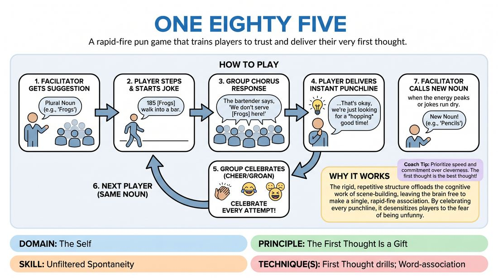

# One Eighty-Five

{ .game-hero }

> A rapid-fire pun game that trains players to trust and deliver their very first thought.

## Overview
Players stand in a line and take turns delivering fast-paced, pun-based jokes using a classic 'walks into a bar' setup. The game moves at a relentless speed, forcing participants to bypass their internal editors and celebrate whatever silly association pops into their heads first.

## What It Trains
- **Domain:** D1 — The Self
- **Principle(s):** The First Thought Is a Gift; Fail Joyfully
- **Skill(s):** Unfiltered Spontaneity; Pacing & Rhythm; Stage Presence & Clarity
- **Technique(s):** First Thought drills; Word-association; Timing exercises
- **Focus:** comedy_game

**Objective:** To build unfiltered spontaneity and rapid association skills, helping players overcome the fear of failure by celebrating every punchline, brilliant or terrible.

## Setup
Players stand in a line or a semi-circle facing the facilitator. No props, materials, or special staging are required.

## How to Play
1. The facilitator asks the group or an audience member for a plural noun suggestion, such as 'frogs' or 'pencils'.
2. Any player steps forward from the line and initiates the joke by saying: '185 [nouns] walk into a bar.'
3. The rest of the group immediately responds in unison as a chorus: 'The bartender says, "We don't serve [nouns] here!"'
4. The active player must instantly deliver a punchline representing the noun's witty, punny, or absurd response to the bartender.
5. Immediately after the punchline is delivered, the entire group cheers, laughs, or groans loudly, celebrating the attempt regardless of how funny it actually was.
6. The active player steps back into the line, and another player immediately steps forward to start a new joke using the exact same noun.
7. The round continues at a high speed until the jokes for that noun run dry or the energy peaks, at which point the facilitator calls out a new noun.

## Facilitation Notes
- Keep the tempo extremely fast; do not let players stand in silence trying to craft the perfect joke.
- If a player hesitates, have the group gently chant '185!' to nudge them into stepping forward and speaking without thinking.
- Enforce the group response and the post-joke celebration; the loud, supportive reaction is crucial for making failure feel safe and joyful.
- Encourage players to focus on wordplay, homophones, or physical attributes of the noun to find their quick punchlines.

## Variations
- Tag-Team: One player steps forward to say the setup, and a different partner must instantly step up to deliver the punchline.
- Physicalized: Players must physically embody the noun as they step forward and deliver the punchline in character.
- Alphabetical: Each subsequent punchline delivered for the noun must start with the next letter of the alphabet.

## Debrief
- How did it feel to step forward without having any idea what your punchline was going to be?
- What did you notice about the jokes that came from your absolute first instinct versus the ones you tried to plan?
- How did the group's loud support of every single joke, especially the bad ones, affect your willingness to take risks?

## Safety & Inclusion
If a player freezes completely, they can simply bow and step back, and the group must cheer just as loudly for their exit to maintain a supportive, low-stakes environment.

## Why It Works
The rigid, repetitive structure of the setup offloads the cognitive work of scene-building, leaving the brain free to make a single, rapid-fire association. By celebrating every punchline, it desensitizes players to the fear of being unfunny, reinforcing the principle that the first thought is a gift.
