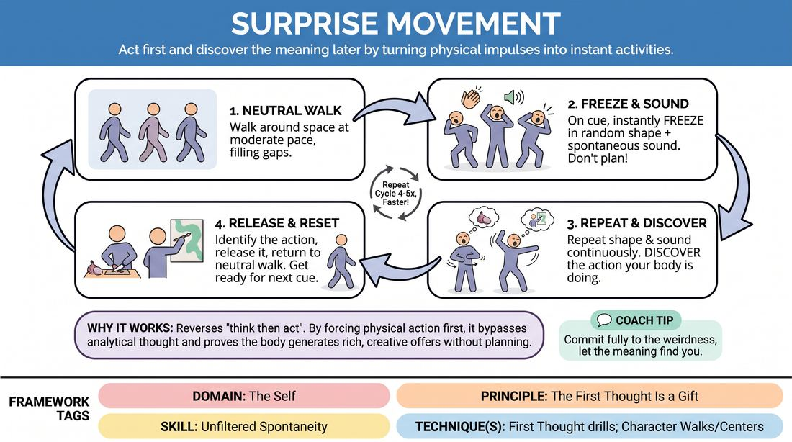

# Accidental Action

{ .game-hero }

> Act first and discover the meaning later by turning physical impulses into instant activities.

## Overview
Accidental Action is a fast-paced physical drill where players move through the space, freeze into a random physical gesture, and discover what they are doing only after they have committed to the movement. It bypasses the analytical brain to foster unfiltered spontaneity and physical commitment.

## What It Trains
- **Domain:** D1 — The Self
- **Principle(s):** The First Thought Is a Gift; Fail Joyfully; Commit 100%
- **Skill(s):** Unfiltered Spontaneity; Physicality & Space Work
- **Technique(s):** First Thought drills; Character Walks/Centers; Object work
- **Focus:** skill_drill

**Objective:** To train players to trust their physical impulses as valuable first thoughts, developing unfiltered spontaneity and physical space work by finding inspiration in somatic movement rather than intellectual planning.

## Setup
An open, safe room with cleared floor space. No chairs, props, or materials are required. Players stand scattered throughout the space.

## How to Play
1. Instruct all players to begin walking around the room at a moderate, neutral pace, filling the empty spaces.
2. On the facilitator's clap or cue, players must instantly freeze into a random, unplanned physical shape or gesture, accompanied by a spontaneous vocal sound.
3. Emphasize that players must not plan the shape; the movement must be an accidental, unfiltered physical impulse.
4. Once in the shape, players must repeat the movement and sound continuously, letting the physical repetition sink in.
5. After a few repetitions, players must 'discover' what they are doing (e.g., a chopping motion becomes chopping onions, a sweeping arm becomes painting a mural) and silently name it to themselves.
6. Once they have identified the action, they release it, return to walking neutrally around the space, and prepare for the next cue.
7. Repeat this cycle 4 to 5 times, encouraging faster transitions and weirder, more abstract initial shapes.

## Facilitation Notes
- Side-coach actively: 'Don't think, just move!' and 'Let your body surprise your brain!'
- Watch out for players doing safe, pre-planned actions like waving or brushing teeth. Fix this by coaching them to start with an abstract, weird shape first, then find the logic in it.
- If players hesitate or freeze before making the movement, coach them to make the sound first, letting the body naturally follow the voice.
- Remind players to fail joyfully if they make a movement that feels awkward; there are no wrong answers, only discoveries.

## Variations
- Partner Discovery: When the cue is given, players freeze, pair up with the nearest person, and combine their two random movements into a shared, collaborative activity.
- Vocal First: Start with a random nonsense sound, and let the body move to match the sound, then discover the activity.

## Debrief
- How did it feel to move before you knew why you were moving?
- Did your brain try to plan ahead? How did you bypass that urge?
- How does trusting your physical 'first thought' help when starting an improv scene?

## Safety & Inclusion
Ensure players move at a safe pace and adapt the physical movements to their own comfort and mobility levels. No high-impact movements are required; small gestures are just as valid as large ones.

## Why It Works
This drill reverses the traditional 'think then act' paradigm. By forcing physical action first, the analytical mind is bypassed, proving that the body can generate rich, creative offers without conscious planning. It builds deep trust in one's immediate physical impulses.
