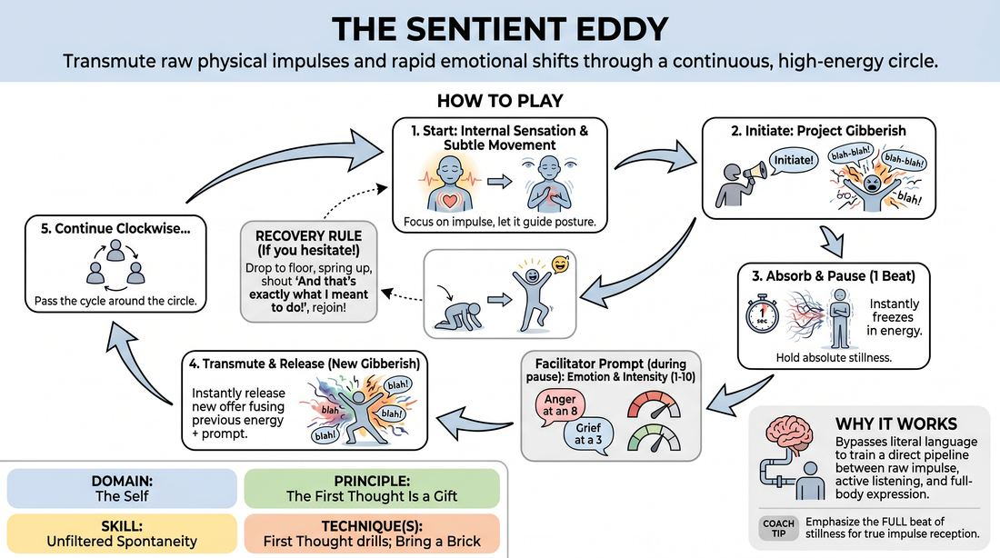

# The Resonance Eddy

{ .game-hero }

> Transmute raw physical impulses and rapid emotional shifts through a continuous, high-energy circle.

## Overview
A high-intensity circle drill where players absorb their neighbor's physical and vocal energy, pause in stillness, and instantly transform it using a facilitator-assigned emotional intensity dial. By stripping away literal language through gibberish, players bypass intellectual filters to build a direct pipeline between raw internal impulse and full-body expression.

## What It Trains
- **Domain:** D1 — The Self
- **Principle(s):** Commit 100%; Fail Joyfully; Vulnerability; The First Thought Is a Gift
- **Skill(s):** Unfiltered Spontaneity; Emotional Fluidity; Physicality & Space Work; Vocal Craft; Silence & Stillness; Self-Recovery; Active Listening; Offer Reception
- **Technique(s):** First Thought drills; Bring a Brick; The Emotional Dial (1→10); Emotional substitution; Character Walks/Centers; Object work; Weight & resistance mime; Projection & breath support; Vocal characterization; Gibberish; Do nothing exercises; Hold-the-beat reps; And that's exactly what I meant
- **Focus:** skill_drill

**Objective:** Develops unfiltered spontaneity and emotional fluidity by training players to instantly access, scale, and physically embody diverse emotional states without intellectual hesitation.

## Setup
An open, moderate-sized space. 4 to 8 players stand in a wide, comfortable circle with enough room for dynamic physical movement. No props are required. The facilitator stands outside the circle to establish a steady, medium-paced rhythm and call out emotional prompts.

## How to Play
1. Begin with all players standing in a circle with eyes closed, focusing on a specific internal physical sensation—like a heartbeat or a warm tingling—to establish their personal physical baseline.
2. Instruct players to open their eyes and begin moving subtly in place, letting this internal physical sensation guide their posture and weight distribution.
3. The facilitator designates a starting player and calls 'Initiate!'; this player immediately projects a sudden, unfiltered burst of full-body gibberish and a distinct physical gesture.
4. The player to their immediate right must instantly 'absorb' this energy, holding their own body in absolute stillness for exactly one beat to let the impulse resonate.
5. During this brief pause, the facilitator calls out an emotional state and an intensity level from 1 to 10 (e.g., 'Anger at an 8' or 'Grief at a 3').
6. The absorbing player must instantly release their stillness, projecting a new gibberish and physical offer that fuses the previous player's physical energy with the newly assigned emotional dial.
7. The cycle continues clockwise around the circle, with each player absorbing, pausing, receiving a prompt, and transmuting the energy to pass it along.
8. If a player hesitates, overthinks, or breaks character, they must immediately drop to the floor, spring back up, joyfully shout 'And that's exactly what I meant!', and immediately resume play.

## Facilitation Notes
- Keep the rhythm crisp; do not let players linger in the 'absorb' phase for more than a single beat, as hesitation invites intellectualization.
- Ensure the 'Emotion Dial' prompts are diverse and specific, scaling from subtle (level 2-3) to extreme (level 9-10) to stretch the players' expressive range.
- If players default to repetitive gibberish sounds, coach them to focus on breath and vocal placement (e.g., chest tones, nasal sounds) to diversify their vocal craft.
- Pitfall: Players might treat the emotional dial as just volume. Fix: Side-coach them to adjust the quality and physical tension of the emotion, not just their vocal loudness.
- Encourage absolute commitment to the recovery mechanic; the 'And that's exactly what I meant!' reset must be performed with high energy to remove the stigma of making a mistake.

## Variations
- Conflicting Currents: The facilitator calls out two contrasting emotions at different levels (e.g., 'Joy at a 9, Fear at a 3') for the player to embody simultaneously.
- The Silent Eddy: Remove all vocalizations; players must transmit and transmute the energy using only physical movement, facial expression, and silent breath.
- Chaotic Flow: Instead of moving sequentially around the circle, the facilitator points randomly to the next player, requiring constant, hyper-vigilant focus from everyone.
- Sensory Overlays: Add environmental constraints to the emotional prompt, such as 'You are freezing cold' or 'The floor is sticky,' to layer physical resistance.

## Debrief
- How did the brief moment of stillness affect your ability to receive your partner's energy without planning your response?
- What did you notice about your physical and vocal habits when forced to express an emotion instantly at a high intensity?
- How did the joyful recovery mechanic change your relationship with making mistakes or hesitating during the drill?

## Safety & Inclusion
Ensure the physical space is clear of tripping hazards for the recovery drop. Players with physical limitations can adapt the recovery mechanic to a dramatic bow, a hand gesture, or a vocal exclamation instead of dropping to the floor.

## Why It Works
By combining gibberish with rapid-fire emotional prompts, the game removes the safety net of literal language and forces players to rely entirely on physical and vocal expression. The structured pause trains active listening and offer reception, while the immediate transition to a scaled emotion bypasses the analytical mind, directly reinforcing the principle that the first thought is a gift.
