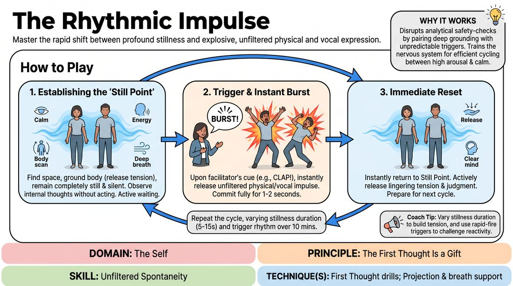

# Rhythmic Impulse

{ .game-hero }

> Master the rapid shift between profound stillness and explosive, unfiltered physical and vocal expression.

## Overview
A somatic training drill where players cycle between absolute, mindful stillness and instantaneous, unedited physical or vocal bursts triggered by a facilitator's cue. This high-contrast exercise builds a performer's dynamic range, training them to access raw impulses and immediately return to a neutral, grounded state. It is an active practice in self-recovery and trusting the first thought.

## What It Trains
- **Domain:** D1 — The Self
- **Principle(s):** Commit 100%; Fail Joyfully; Vulnerability; The First Thought Is a Gift
- **Skill(s):** Unfiltered Spontaneity; Emotional Fluidity; Physicality & Space Work; Vocal Craft; Silence & Stillness; Self-Recovery
- **Technique(s):** First Thought drills; Projection & breath support; Gibberish; Do nothing exercises; Hold-the-beat reps
- **Focus:** skill_drill

**Objective:** To develop intrapersonal mastery by training unfiltered spontaneity, emotional fluidity, and rapid self-recovery, helping players bypass intellectual self-censorship and embrace their immediate physical and vocal impulses.

## Setup
A clear, open room with enough space for all participants to stand comfortably without bumping into one another. No props are required. The facilitator stands where they can be heard clearly by all.

## How to Play
1. Instruct all players to find a personal space in the room, standing comfortably with their eyes open or softly focused, establishing the 'Still Point'.
2. Guide players to actively ground themselves during this stillness: scanning their bodies, releasing tension in the shoulders and jaw, and focusing on deep, natural breathing.
3. Explain that they must remain completely still and silent, observing any internal thoughts or impulses without acting on them, cultivating a state of active 'doing nothing'.
4. Introduce the trigger cue: explain that when you make a sharp, sudden sound like a single loud clap or calling out 'Burst!', they must instantly release their very first physical or vocal impulse.
5. Emphasize that the 'Burst' must last only one to two seconds, requiring absolute commitment to whatever sound or movement emerges first.
6. Instruct players to immediately snap back to the 'Still Point' the moment the burst ends, actively releasing any lingering physical tension or mental judgment about what they just did.
7. Run the cycle repeatedly, keeping the 'Still Point' lasting anywhere from 5 to 15 seconds, followed by the instantaneous trigger cue for the 'Burst'.
8. Vary the rhythm of the cycles over a ten-minute period, sometimes lingering in stillness to build tension, and other times triggering rapid-fire bursts to challenge cognitive processing.

## Facilitation Notes
- Side-coach actively with cues like: 'Don't plan! Let the sound or movement surprise you.' This helps players bypass the cognitive delay of trying to be clever or funny.
- If players are hesitating or producing polite, calculated responses, model a raw, weird, or simple burst yourself to normalize raw expression.
- Address the pitfall of players holding onto the energy of their burst or laughing afterward by reminding them that the 'Self-Recovery' phase is just as important as the burst; coach them to 'inhale the impulse, exhale and let it dissolve back to zero'.
- Encourage physical safety by reminding players to keep their bursts within their own personal space bubble, avoiding physical contact with others.

## Variations
- Vocal-Only Isolation: Restrict the burst phase strictly to vocalizations like sounds, sighs, gibberish, or single words while keeping the body completely still.
- Physical-Only Isolation: Restrict the burst phase strictly to physical movements or facial expressions, keeping the voice completely silent.
- Emotional Resonance: During the 'Still Point', ask players to identify a subtle internal emotion they are currently feeling, and use the 'Burst' to instantly amplify and release that specific emotion.

## Debrief
- How did it feel to transition instantly from absolute stillness to explosive action without any time to plan?
- What strategies did you use to quiet the inner critic during the 'Still Point' and let go of judgment during 'Self-Recovery'?
- Did you notice a tendency to plan your burst during the stillness? How did you handle or bypass that urge?
- How can practicing this rapid reset to neutral help you during a live, unpredictable scene?

## Safety & Inclusion
Ensure players maintain a safe physical distance from one another to prevent accidental collisions during high-energy physical bursts. Encourage participants to honor their physical limits; bursts do not need to be high-impact to be fully committed. If vocalizing is stressful or physically uncomfortable, silent physical bursts are a fully valid alternative.

## Why It Works
By pairing deep somatic grounding with an unpredictable, instantaneous trigger, this game disrupts the brain's analytical safety-checks. The rapid return to stillness trains the nervous system to cycle efficiently between high arousal and calm recovery, building the muscle of self-recovery and teaching players that their first instinct is not only safe but highly creative.
