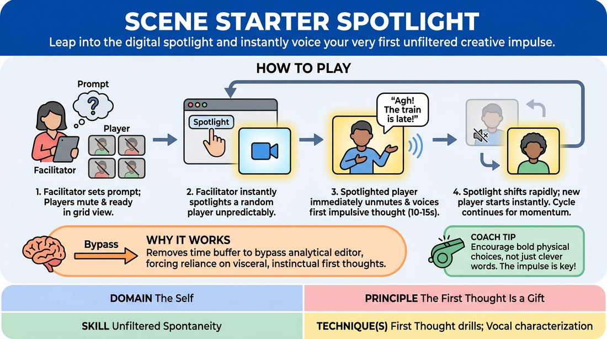

# Flashpoint Spotlight

{ .game-hero }

> Leap into the digital spotlight and instantly voice your very first unfiltered creative impulse.

## Overview
A high-octane virtual warm-up where a facilitator uses the platform's spotlight feature to unexpectedly highlight individual players. Once spotlighted, the chosen player must instantly unmute and deliver a rapid-fire, ten-second character monologue or scene initiation based on a central theme. It is a thrilling, fast-paced drill that strips away overthinking and builds comfort with immediate, unfiltered expression.

## What It Trains
- **Domain:** D1 — The Self
- **Principle(s):** Fail Joyfully; The First Thought Is a Gift; Start in the Middle
- **Skill(s):** Unfiltered Spontaneity; Vocal Craft; World-Building; Peripheral Awareness
- **Technique(s):** First Thought drills; Vocal characterization; C.R.O.W. (Character, Relationship, Objective, Where)
- **Focus:** skill_drill

**Objective:** To train unfiltered spontaneity and the ability to trust one's first creative impulse without self-censorship, while developing vocal presence and peripheral awareness in a virtual environment.

## Setup
An online video meeting room with 8 to 15 participants. All players must be in grid view with cameras turned on and microphones muted. The facilitator must have host privileges to control the platform's spotlight or focus feature, which forces a specific participant's video to become large for all attendees.

## How to Play
1. The facilitator introduces a broad, open-ended prompt or scenario, such as waiting for a train that is three hours late or discovering a mysterious glowing object.
2. All players sit in grid view, muted, keeping their eyes on the screen and maintaining high physical and mental readiness.
3. The facilitator randomly and unpredictably selects a player and applies the platform's spotlight feature to make their video feed fill everyone's screen.
4. The moment a player sees themselves spotlighted, they must immediately unmute and deliver a 10-to-15-second monologue, character reaction, or scene initiation inspired by the prompt.
5. Players are instructed to speak their very first thought without editing, filtering, or trying to make it clever or connected to previous players' turns.
6. After roughly 10 to 12 seconds, the facilitator removes the spotlight from that player, who immediately mutes themselves again.
7. The facilitator instantly spotlights a new player, keeping the momentum fast and unpredictable to prevent players from pre-planning their responses.
8. The cycle continues rapidly for 3 to 5 minutes, ensuring every participant is spotlighted at least once or twice.

## Facilitation Notes
- Side-coaching cue: 'Don't plan! Let the spotlight be the trigger that opens your mouth. Speak first, think second!'
- Pitfall: Technical lag or delay in unmuting. Fix: Run a 30-second practice round where you spotlight people just to have them unmute and shout their favorite color, getting them used to the physical interface.
- Side-coaching cue: 'Embrace the silence if you freeze—just make a sound or a physical choice, and the words will follow!'
- Pitfall: Players trying to build a continuous, logical story from the previous person's turn. Fix: Remind the group that each spotlight is a completely fresh universe; there is no narrative connection required.
- Facilitator tip: Keep your mouse hovering over the next target. The speed of your technical transitions directly dictates the energy and success of the game.

## Variations
- Emotional Shift: The facilitator calls out a new emotion right before spotlighting a player, forcing them to filter the prompt through that specific state.
- The Duo Spotlight: The facilitator spotlights two players simultaneously, giving them 15 seconds to initiate a rapid, high-stakes two-person exchange before cutting away.
- Sensory Add-on: The facilitator injects a sensory prompt mid-round, such as a sudden strange smell or extreme temperature change, to instantly shift the physical environment.

## Debrief
- How did it feel to speak before your brain had time to plan or judge your idea?
- What physical or vocal changes did you notice in yourself when the spotlight suddenly hit you?
- How does letting go of the need to be 'clever' actually make your initiations more interesting?
- In what ways did keeping your mic muted yet staying physically active help you support the group?

## Safety & Inclusion
Since this game relies on rapid, unpredictable spotlighting, it can induce mild performance anxiety. Facilitators should establish a high-support, low-stakes atmosphere beforehand, celebrating glorious failures or freezes with applause. If a player has physical or cognitive barriers to rapid unmuting, they can keep their microphone unmuted throughout the game, or use physical gestures to initiate.

## Why It Works
By removing the time buffer between selection and execution, the game bypasses the analytical editor brain, forcing players to rely entirely on their immediate, instinctual impulses. The physical act of being spotlighted serves as a visceral trigger for action, while the short duration ensures low stakes—if an idea falters, it is over in ten seconds. This builds deep trust in one's first thoughts as valuable creative gifts.
