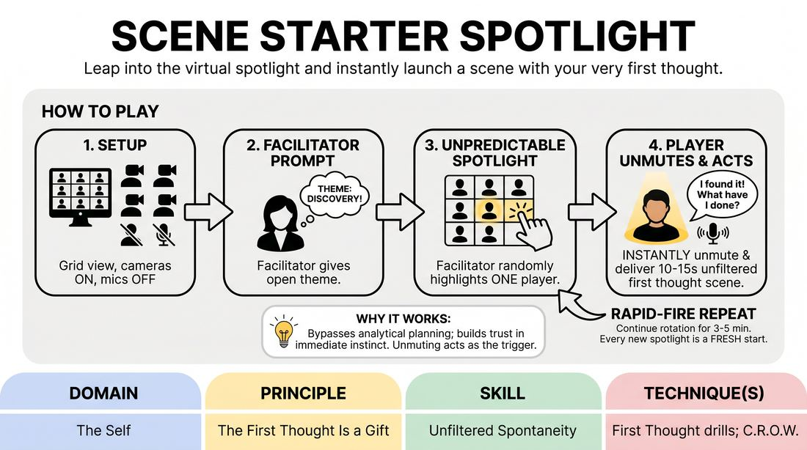

# The Spontaneity Spotlight

{ .game-hero }

> Leap into the virtual spotlight and instantly launch a scene with your very first thought.

## Overview
A high-energy, rapid-fire virtual drill designed to bypass self-censorship and build absolute trust in your immediate instincts. By using the video platform's spotlight feature, the facilitator unpredictably thrusts players into the solo spotlight, demanding an instant, unfiltered 10-to-15-second character initiation based on a central theme.

## What It Trains
- **Domain:** D1 — The Self
- **Principle(s):** The First Thought Is a Gift; Commit 100%; Start in the Middle
- **Skill(s):** Unfiltered Spontaneity; World-Building; Peripheral Awareness
- **Technique(s):** First Thought drills; C.R.O.W. (Character, Relationship, Objective, Where)
- **Focus:** skill_drill

**Objective:** To develop unfiltered spontaneity and rapid scene initiation by practicing the principle that the first thought is a gift, while sharpening peripheral awareness and virtual presence.

## Setup
An online video meeting room with all participants on camera in grid view. All players must start with their microphones muted. The facilitator must have host privileges to use the platform's spotlight or pin-for-everyone feature. No physical props or materials are required.

## How to Play
1. Instruct all players to turn on their cameras, switch to grid view, and mute their microphones.
2. Provide a broad, open-ended prompt or theme (such as 'discovering something you shouldn't have' or 'waiting for life-changing news') that allows for diverse character interpretations.
3. Explain that the facilitator will act as the director, using the platform's spotlight feature to rapidly and unpredictably highlight one player at a time.
4. The moment a player is spotlighted, they must immediately unmute and deliver a 10-to-15-second monologue, character reaction, or scene starter inspired by the theme.
5. Emphasize that players must use their very first instinctual thought without planning, starting directly in the middle of the action or emotion.
6. Clarify that each spotlight burst is a completely fresh start; players do not need to connect their scene to what the previous player did.
7. After 10 to 15 seconds, the facilitator removes the spotlight from the active player and immediately spotlights a new, unsuspecting player, who must instantly unmute and begin.
8. Continue this rapid-fire rotation for 3 to 5 minutes, ensuring every player gets spotlighted at least once, maintaining a relentless, high-energy pace.

## Facilitation Notes
- As the facilitator, practice the technical mechanics of spotlighting beforehand to ensure transitions are seamless and do not lag.
- If a player hesitates or freezes, side-coach them with supportive prompts like 'What is your character feeling right now?' or 'Speak your very first thought!'
- Encourage non-spotlighted players to remain highly engaged in grid view, offering silent, exaggerated physical support and reactions to the active player.
- Pitfall: Players trying to write a perfect story in their heads while waiting. Fix: Remind them that they cannot prepare because they don't know when the spotlight will hit; they must remain in a state of relaxed readiness.
- Keep the energy high by throwing in occasional micro-prompts during transitions, such as 'Now the stakes are doubled!' or 'Add a physical sensation!'

## Variations
- The Relay Chain: Instead of completely disconnected scenes, each spotlighted player must build directly on the environment or relationship established by the player immediately before them.
- Emotional Shift: The facilitator calls out a new emotion (such as joy, terror, or suspicion) right before spotlighting the next player, forcing them to instantly adopt that emotional state.
- Object Work Focus: Players must immediately begin their spotlight turn by performing a specific, clear physical action or object work, establishing their environment before they speak.

## Debrief
- How did it feel to have zero time to plan your response? What did you discover about your first thoughts?
- What strategies helped you stay present and ready rather than anxious while waiting for the spotlight?
- How does starting in the middle of an emotion or action make initiating a scene easier than trying to build a premise from scratch?

## Safety & Inclusion
Ensure players know they can use a simple non-verbal gesture (like a hand wave or head shake) if they experience a sudden technical glitch or need to pass their turn, allowing the facilitator to smoothly transition to the next player without shame.

## Why It Works
By removing the time needed to plan, this drill forces the brain to bypass its analytical editor and rely entirely on instinct, proving that the first thought is always enough to build a world. The physical act of unmuting acts as a trigger for immediate commitment, while the unpredictable spotlight keeps the entire group in a state of active, supportive peripheral awareness.
