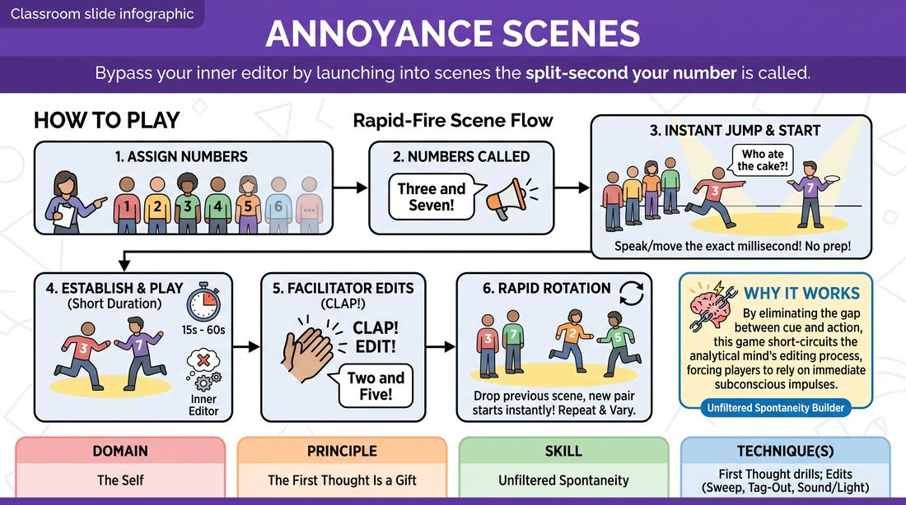

# Rapid Number Duos

{ .game-hero }

> Bypass your inner editor by launching into scenes the split-second your number is called.

## Overview
A high-octane, fast-paced scene drill where players are assigned numbers and must instantly initiate a scene the moment their number is called. By removing suggestions, preparation time, and transition delays, players learn to trust their immediate physical and verbal impulses. The facilitator keeps the energy high with rapid edits, pushing players into a state of pure, unfiltered flow.

## What It Trains
- **Domain:** D1 — The Self
- **Principle(s):** The First Thought Is a Gift; Fail Joyfully; Start in the Middle
- **Skill(s):** Unfiltered Spontaneity; Offer Reception; World-Building; Pacing & Rhythm
- **Technique(s):** First Thought drills; Edits (Sweep, Tag-Out, Sound/Light)
- **Focus:** skill_drill

**Objective:** To develop unfiltered spontaneity and trust in one's first impulses (The First Thought Is a Gift), while practicing rapid offer reception and starting scenes in the middle without intellectualizing.

## Setup
Have 5 to 12 players stand in a straight line along the back wall of the playing space. Assign each player a unique number starting from one (e.g., 1 through 8). Ensure the performance space in front of the line is clear of obstacles.

## How to Play
1. Assign each player in the back line a unique number from 1 to the total number of participants.
2. Explain that when two numbers are called, those two players must instantly step forward into the playing space and begin a scene.
3. Emphasize that there is no suggestion, no preparation, and no delay; players should start speaking or moving the exact millisecond they step forward, even if they talk over each other initially.
4. The facilitator calls out two random numbers (e.g., 'Three and Seven!') to initiate the first scene.
5. The designated players jump forward and immediately establish a reality using their very first physical or verbal impulse.
6. After a short duration (ranging from 15 seconds to a minute), the facilitator edits the scene by clapping loudly and calling out two different numbers.
7. Upon hearing the clap and new numbers, the active players must instantly drop their scene and step back into the line, while the newly called players instantly leap forward to start a brand-new scene.
8. Continue this rapid-fire rotation, varying the pairings and the length of the scenes to keep players on their toes and out of their heads.

## Facilitation Notes
- Side-coaching cue: 'Don't think, just speak!' or 'Move your body first, find the words second!'
- Common pitfall: Players waiting for their partner to initiate. Fix: Encourage both players to initiate simultaneously. Overlapping dialogue at the start is completely fine and actually helps build immediate energy.
- Keep the edits unpredictable. Call the same person twice in a row (e.g., '2 and 5' followed by '2 and 8') to prevent players from relaxing or planning while in the back line.
- If a player hesitates, gently call them out with playful encouragement: 'Go, go, go! Trust your first thought!'

## Variations
- Emotional Starts: The facilitator calls out two numbers plus an emotion (e.g., 'Four and One, extreme jealousy!'), which the players must embody instantly.
- Physical Initiations: Players must start the scene with a physical contact or a shared physical activity before any words are spoken.
- Three-Player Chaos: Call three numbers instead of two to practice navigating busier, high-energy group dynamics under the same rapid constraints.

## Debrief
- How did it feel to start a scene with absolutely zero time to plan or think?
- What happened when you let your body move or your mouth speak before your brain could judge the idea?
- How did you handle the moments of overlap or chaos when both of you initiated at the same time?

## Safety & Inclusion
Because of the rapid physical movement into the space, remind players to be mindful of physical boundaries and collision risks. Offer a non-verbal alternative (like a hand raise or step-forward gesture) for players with mobility considerations, ensuring the group adjusts its pacing to accommodate everyone safely.

## Why It Works
By eliminating the gap between the cue and the action, this game short-circuits the analytical mind's editing process. Players are forced to rely on their immediate, subconscious impulses (the 'first thought'), proving that any initiation is viable if committed to fully. The rapid editing structure builds a supportive environment where failure is low-stakes and joyfully bypassed by the next round.
