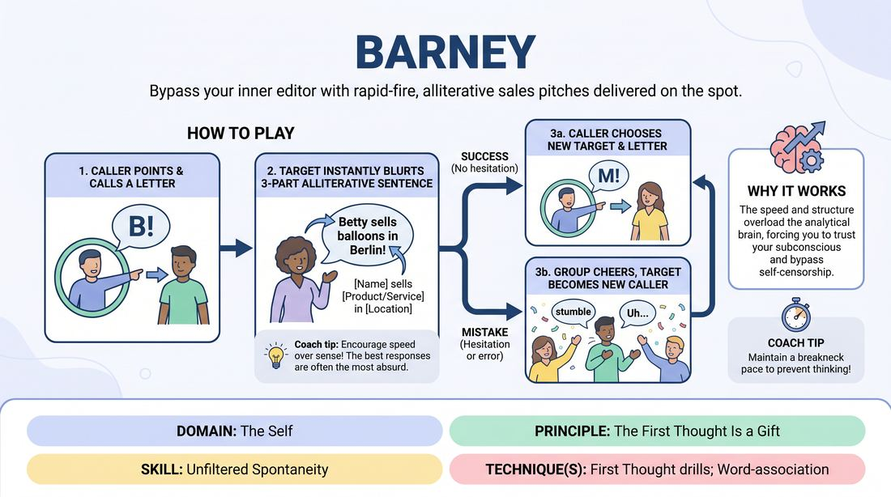

# Alphabet Vendor

{ .game-hero }

> Bypass your inner editor with rapid-fire, alliterative sales pitches delivered on the spot.

## Overview
Players stand in a circle while a central caller challenges individuals to instantly invent a three-part alliterative sentence based on a single letter. The game moves at a breakneck pace, forcing players to speak before they think and embrace whatever nonsense spills out. It is a high-energy, low-stakes warm-up that celebrates spontaneous mistakes.

## What It Trains
- **Domain:** D1 — The Self
- **Principle(s):** The First Thought Is a Gift; Fail Joyfully
- **Skill(s):** Unfiltered Spontaneity; Peripheral Awareness
- **Technique(s):** Word-association; First Thought drills
- **Focus:** skill_drill

**Objective:** To develop unfiltered spontaneity and cognitive agility by training players to trust their immediate instincts and fail joyfully without self-censorship.

## Setup
An open space where all players can stand in a clear circle facing inward. One player volunteered or selected to start in the center as the Caller. No props or materials are required.

## How to Play
1. Arrange the group in a standing circle with one player designated as the Caller in the center.
2. The Caller makes direct eye contact, points clearly at a player in the circle, and loudly calls out a single letter of the alphabet.
3. The targeted player must immediately deliver a complete sentence following the formula: '[Name] sells [Product/Service] in [Location].'
4. Every key word in the sentence (the Name, the Product/Service, and the Location) must begin with the letter called out by the Caller.
5. The response must be delivered instantly, without pausing, hesitating, or self-correcting (e.g., if given 'P', the player might blurt out 'Peter sells pickles in Paris!').
6. If the player successfully completes the sentence without a noticeable pause, the Caller must quickly choose a new target and a new letter.
7. If the targeted player hesitates, stumbles, or fails to use the correct letter, the group lets out a good-natured cheer to celebrate the mistake, and that player swaps places with the Caller.
8. The new Caller immediately selects a new target and calls out a new letter to keep the momentum high.

## Facilitation Notes
- Coaching cue: 'Blurt it out! Don't search for the perfect word, take the first one that hits your brain!'
- Coaching cue: 'Embrace the nonsense. Speed is your friend, accuracy is secondary.'
- Pitfall: Players pausing to think of a 'good' or 'funny' answer. Fix: Encourage the group to gently snap their fingers or chant 'First thought!' to keep the tempo brisk.
- Pitfall: The Caller picking overly difficult letters (like Q, X, or Z) too early, stalling the game. Fix: Instruct the Caller to stick to common letters (B, M, S, T, P) to build rhythm before introducing harder ones.

## Variations
- Rhythm Tap: The circle maintains a steady, slow collective clap-snap beat that the targeted player must speak in rhythm with.
- Emotional Delivery: The Caller specifies an emotion along with the letter (e.g., 'Angry B!'), and the player must deliver the line with that emotional choice.
- Reverse Vendor: The player in the circle calls out a letter, and the person in the center must answer before pointing to the next player.

## Debrief
- What did it feel like when you tried to plan your answer versus when you just let the words fly out?
- How does the fear of making a mistake or saying something 'silly' slow down our spontaneous reactions?
- How can we apply the 'first thought' principle to our scene work when we are handed an unexpected offer?

## Safety & Inclusion
Ensure the physical space is clear of tripping hazards as players swap places in the center. For players with processing differences or speech hesitations, allow a 'pass' option or a three-second grace period without penalty, focusing the celebration on participation rather than strict speed.

## Why It Works
By combining a strict structural constraint (alliteration) with a demand for immediate speed, the game overloads the analytical brain. This forces the player to rely entirely on their subconscious, bypassing the internal editor and demonstrating that their 'first thought' is always enough to keep the play moving.
