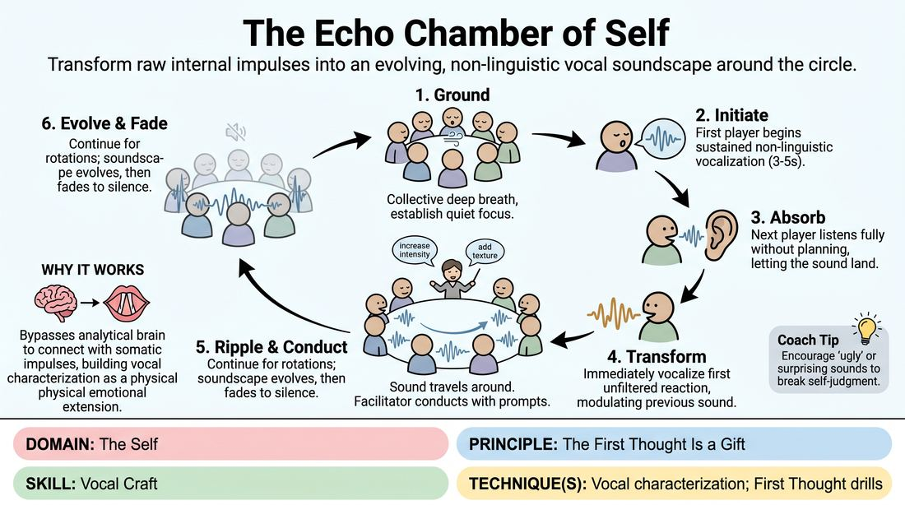

# Vocal Resonance Ripple

{ .game-hero }

> Transform raw internal impulses into an evolving, non-linguistic vocal soundscape around the circle.

## Overview
A somatic group exercise where players stand in a circle and pass a continuous, evolving chain of non-verbal vocalizations. Each player receives the sound of their neighbor, lets it land internally, and immediately transforms it into a new vocal expression based on their first instinct. The facilitator acts as a conductor, introducing emotional and physical prompts to guide the soundscape's evolution.

## What It Trains
- **Domain:** D1 — The Self
- **Principle(s):** Commit 100%; Vulnerability; The First Thought Is a Gift; Yes, And
- **Skill(s):** Unfiltered Spontaneity; Emotional Fluidity; Vocal Craft; Silence & Stillness; Active Listening; Offer Reception
- **Technique(s):** First Thought drills; The Emotional Dial (1→10); Projection & breath support; Vocal characterization; Gibberish; Hold-the-beat reps
- **Focus:** skill_drill

**Objective:** To develop vocal characterization and vocal craft by bypassing intellectual filters, allowing raw emotional impulses to directly shape pitch, tone, and resonance.

## Setup
Players stand in a comfortable, shoulder-to-shoulder circle facing inward. The space should be quiet and free of distractions to allow for deep listening. No props or materials are required.

## How to Play
1. Begin with the group standing in a circle, taking a collective deep breath to ground themselves and establish a quiet, focused atmosphere.
2. The first player initiates a single, sustained, non-linguistic vocalization (such as a hum, sigh, groan, or click) lasting 3 to 5 seconds, rooted in an immediate physical or emotional sensation.
3. The player to their left actively listens, absorbing the sound without planning their response, practicing silence and stillness until the sound is complete.
4. Upon receiving the sound, the second player immediately vocalizes their first unfiltered reaction, transforming or modulating the previous sound's pitch, volume, or texture rather than mimicking it.
5. This vocal transformation ripples sequentially around the circle, with each player building upon the sound of the person directly to their right.
6. As the sound travels, the facilitator acts as a conductor, calling out side-coaching directives (such as 'increase intensity to an 8 out of 10' or 'make the sound fragile') to instantly shift the group's vocal qualities.
7. The game continues for several full rotations of the circle, allowing the soundscape to organically evolve, deepen, and eventually fade into silence on the facilitator's cue.

## Facilitation Notes
- Side-coaching cues: 'Don't plan your sound—let the previous sound hit your body and speak from that impact.' 'Vary your resonance—try nasal, chest, or throat tones.'
- Pitfall: Players mimicking the previous sound exactly instead of transforming it. Fix: Remind them that they are a filter, not a mirror; the sound must change based on how it makes them feel.
- Pitfall: Hesitation or intellectualizing ('What sound should I make?'). Fix: Encourage 'failing joyfully' by making any immediate noise, even a simple breath, to keep the momentum going.
- Facilitator timing: Introduce directives right before a player begins their turn, or gently call them out to the whole circle to shift the overall climate of the soundscape.

## Variations
- Rapid-Fire Resonance: Speed up the pass, limiting each vocalization to a sharp 1-2 seconds to force instant, instinctual responses.
- Physical Integration: Instruct players to adopt a specific physical posture (such as hunched, expansive, or rigid) and explore how that physical constraint alters their vocal production.
- Gibberish Transition: On the facilitator's cue, transition the pure sounds into emotional gibberish, adding a layer of non-verbal dialogue while keeping the core feeling.

## Debrief
- How did it feel to let go of words and rely entirely on raw sound to communicate an emotional state?
- What physical sensations did you notice in your body when you stopped planning your response and just reacted?
- How did the facilitator's directives (like shifting the emotional dial) change your vocal mechanics?

## Safety & Inclusion
Ensure players know they can adjust the volume and pitch of their sounds to match their physical comfort. If a player is uncomfortable making loud or intense vocalizations, they can participate using quiet, breath-based sounds or whispers.

## Why It Works
By stripping away language, the game forces players to bypass the analytical brain and connect directly with their somatic impulses. This builds vocal characterization because the voice becomes a physical extension of an internal emotional state, training the actor to use pitch, timbre, and breath as primary tools of expression.
