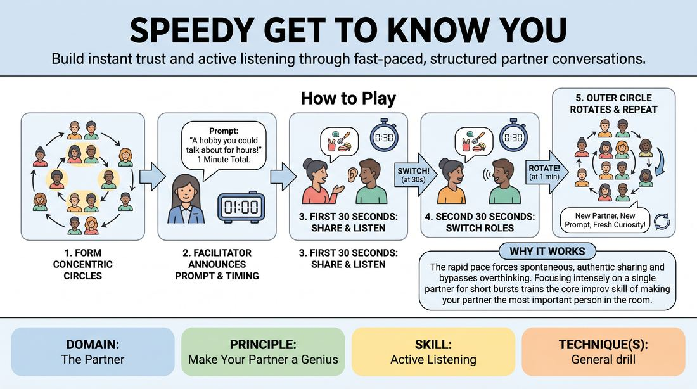

# Rapid Connection Rounds

{ .game-hero }

> Build instant trust and active listening through fast-paced, structured partner conversations.

## Overview
This dynamic icebreaker pairs participants for rapid-fire, timed conversations guided by specific, engaging prompts. As the facilitator signals rotations, players quickly adapt to new partners, practicing immediate presence, deep listening, and spontaneous sharing.

## What It Trains
- **Domain:** D2 — The Partner
- **Principle(s):** Make Your Partner a Genius; Vulnerability; Group Mind
- **Skill(s):** Active Listening; Single-Partner Empathy & Mirroring; Unfiltered Spontaneity; Peripheral Awareness
- **Focus:** connection

**Objective:** Develops active listening, rapid empathy, and unfiltered spontaneity by stripping away the time to overthink or plan responses.

## Setup
An open room with enough space for players to form two concentric circles facing each other (or two parallel lines). The facilitator needs a stopwatch and a list of engaging, low-to-medium stakes prompts.

## How to Play
1. Divide the group into two equal halves and have them form two concentric circles facing each other, creating face-to-face pairs.
2. Explain that pairs will have exactly one minute to converse based on a prompt provided by the facilitator.
3. Instruct players that the goal is to practice active listening, focusing entirely on their partner's words rather than planning their own next sentence.
4. Announce the first prompt (e.g., 'A hobby or interest you could talk about for hours') and start the one-minute timer.
5. At the thirty-second mark, call out 'Switch!' to ensure both partners get equal time to share and listen.
6. When the minute is up, call 'Rotate!' and instruct the outer circle to move one person to the right, pairing everyone with a new partner.
7. Announce a new prompt and repeat the process, encouraging players to bring fresh curiosity to each new interaction.
8. Run the rotation for five to eight rounds, gradually moving from lighthearted topics to slightly more creative or revealing prompts.

## Facilitation Notes
- Side-coach active listening: 'Listen to understand, not to reply. Notice your partner's facial expressions and energy.'
- Pitfall: One partner dominates the entire minute. Fix: Strictly enforce the thirty-second 'Switch!' cue so both players get equal airtime.
- Pitfall: Players fall into polite, generic small talk. Fix: Provide highly specific, imaginative prompts (e.g., 'A minor pet peeve that secretly delights you' instead of 'What do you do for work?').
- Encourage physical presence: Remind players to maintain comfortable eye contact and open body language to build instant rapport.

## Variations
- The Echo Round: Before answering the prompt, the second speaker must briefly paraphrase or echo back what their partner just shared.
- Silent Mirroring: Spend one round where partners must answer the prompt using only physical gestures, gibberish, or facial expressions.
- Third-Party Introductions: After rotating, players must introduce their previous partner's answer to their new partner, testing their retention and listening accuracy.

## Debrief
- How did the tight time limit affect your ability to listen versus your urge to plan what to say next?
- What did it feel like when your partner was fully locked in and listening to you without distraction?
- How did your energy or comfort level shift as you moved from the first partner to the last?

## Safety & Inclusion
Ensure the physical setup accommodates all mobility levels; players can easily sit in chairs facing each other instead of standing. Remind participants that they always have the right to pass or share only what they feel comfortable disclosing.

## Why It Works
The rapid pace bypasses the analytical mind's social filters, forcing players into spontaneous, authentic sharing. By focusing intensely on a single partner for a short burst, players practice the core improv skill of making their partner the most important person in the room.
