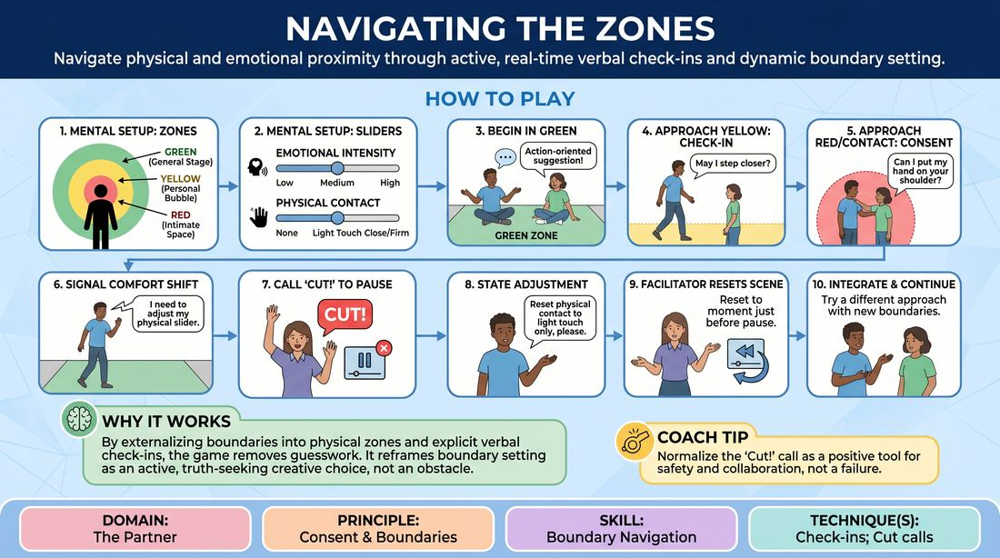

# Boundary Zones

{ .game-hero }

> Navigate physical and emotional proximity through active, real-time verbal check-ins and dynamic boundary setting.

## Overview
Boundary Zones is an interactive, safety-focused improv game where players establish concentric physical zones and internal comfort levels. As a scene unfolds, players must use explicit verbal check-ins and real-time adjustments to navigate their partner's personal space. The game introduces a collaborative pause-and-reset mechanic to normalize boundary management as an active, creative choice.

## What It Trains
- **Domain:** D2 — The Partner
- **Principle(s):** Consent & Boundaries; Truth Over Pandering
- **Skill(s):** Boundary Navigation; Active Listening; Emotional Fluidity
- **Technique(s):** Check-ins; Cut calls; Negotiating physical contact; The Emotional Dial (1→10)
- **Focus:** connection

**Objective:** To develop precise boundary navigation, active listening, and emotional fluidity by practicing explicit verbal check-ins and prioritizing personal comfort over narrative expectations.

## Setup
Clear a moderate playing space. No physical props are required. Players stand in the space and mentally map three concentric circles around themselves: Green (outer/public), Yellow (arm's reach/personal), and Red (close proximity/intimate).

## How to Play
1. Each player mentally establishes their three concentric personal zones: Green (general stage area), Yellow (personal bubble, roughly arm's reach), and Red (intimate space, close contact).
2. Players internally set two personal 'comfort sliders' for the scene: Emotional Intensity (Low, Medium, or High) and Physical Contact (None, Light Touch, or Close Contact). These sliders can be adjusted dynamically as the scene progresses.
3. Two to three players begin a scene based on a simple, action-oriented suggestion, starting in their respective Green Zones where movement and verbal interaction are free.
4. To enter another player's Yellow Zone, the moving player must make an in-character or out-of-character verbal check-in (e.g., 'May I step closer to look at that?'). The other player must verbally accept or decline.
5. To enter another player's Red Zone or initiate physical contact, the player must ask for explicit, specific consent (e.g., 'Can I put my hand on your shoulder?'). The partner must respond with clear, affirmative consent or a clear 'No.'
6. If a player's internal comfort level shifts during the scene, they must signal this shift non-verbally (e.g., stepping back, shrinking) or verbally (e.g., 'I need to take a step back'). Partners must immediately adjust their intensity or proximity.
7. Any player or the facilitator can call 'Cut!' at any moment to pause the scene if a boundary is crossed, approached too quickly, or if a player feels uncomfortable.
8. Upon a 'Cut!' call, the player who called it briefly states the boundary adjustment needed (e.g., 'I need to reset my physical contact slider to light touch only').
9. The facilitator resets the scene to a moment just before the pause, allowing the players to integrate the new boundary information and try a different, safer approach.
10. The scene continues until the objective is met or the facilitator calls time, prioritizing safety and mutual comfort over narrative completion.

## Facilitation Notes
- Normalize the 'No': Remind players that saying 'no' or setting a boundary is a gift to the scene that reveals character truth, not a block to the narrative.
- The 'Cut' is a Tool, Not a Failure: Frame the 'Cut!' mechanic as a positive, collaborative calibration tool rather than a mistake or disruption.
- Watch for Ambiguity: If a player responds to a check-in with hesitation (e.g., 'I guess so' or 'Sure...'), coach the initiator to treat it as a 'No' and maintain distance.
- Facilitator Modeling: Actively call 'Cut!' yourself during early rounds to demonstrate how to pause, adjust, and restart without shame or loss of momentum.

## Variations
- The Silent Slider: Players adjust their comfort sliders dynamically without verbalizing, forcing partners to rely entirely on physical cues and active listening to detect shifts.
- Varying Objectives: Introduce high-stakes scene objectives (e.g., a high-pressure sales pitch) to test how players maintain boundaries under narrative pressure.

## Debrief
- How did it feel to explicitly ask for and grant consent in the middle of an active scene?
- Did you experience a moment where you wanted to say 'no' but felt pressure to say 'yes' for the sake of the story? How did you handle it?
- What did you notice about your partner's non-verbal cues when their comfort sliders shifted?
- How did the 'Cut!' mechanic affect your sense of safety and creative freedom on stage?

## Safety & Inclusion
This game is highly safety-sensitive. Establish a firm rule before playing that any player has absolute autonomy over their physical space and emotional limits. No player is ever required to justify their boundaries or 'Cut!' calls. Ensure the group understands that a 'No' is final and must be respected instantly without negotiation.

## Why It Works
By externalizing personal boundaries into physical zones and explicit verbal check-ins, the game removes the guesswork from physical and emotional safety. It reframes boundary setting not as a narrative obstacle, but as an active, truth-seeking dialogue that builds deep trust and connection between partners.
