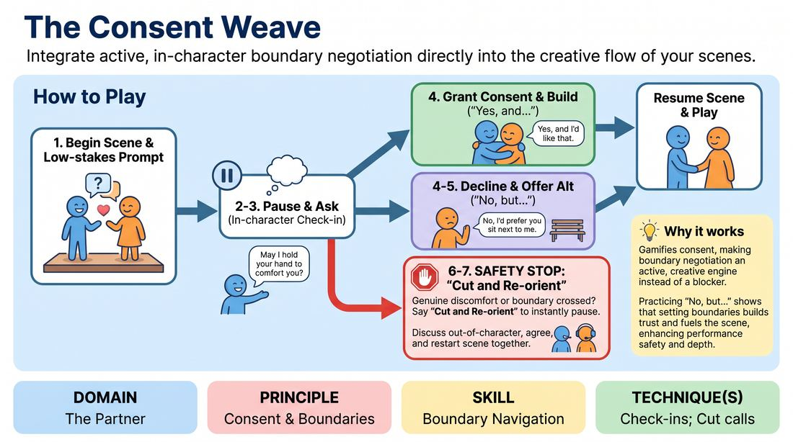

# The Consent Weave

{ .game-hero }

> Integrate active, in-character boundary negotiation directly into the creative flow of your scenes.

## Overview
A structured scene-work exercise where players practice setting and respecting boundaries in real-time. By weaving explicit, in-character check-ins and a collaborative pause-and-resume mechanic into the performance, players learn to navigate physical touch and emotional vulnerability safely. The experience balances creative play with absolute personal agency, proving that respecting boundaries enhances rather than halts narrative momentum.

## What It Trains
- **Domain:** D2 — The Partner
- **Principle(s):** Consent & Boundaries; Yes, And; Truth Over Pandering
- **Skill(s):** Boundary Navigation; Active Listening; Offer Reception
- **Technique(s):** Check-ins; Cut calls; Negotiating physical contact
- **Focus:** connection

**Objective:** To develop practical skills in active boundary navigation and ongoing consent negotiation, training players to use in-character check-ins and constructive "No, but..." responses to prioritize personal safety and authentic character choices over people-pleasing.

## Setup
Two to four players stand in a clear, minimal performance space. No props or special materials are required. The facilitator prepares a few low-stakes, relationship-focused scene prompts (e.g., two neighbors dividing a garden plot, coworkers organizing a breakroom).

## How to Play
1. Two players step forward to begin a scene based on a simple, low-stakes relationship prompt provided by the facilitator.
2. Whenever a player wants to initiate physical contact, introduce a high-stakes emotional choice, or significantly shift the power dynamic, they must pause the physical action and perform an in-character check-in.
3. The check-in must be delivered in-character, explicitly asking the partner for permission to take the action (e.g., "May I hold your hand to comfort you, Sarah?").
4. The receiving player must respond immediately using either "Yes, and..." to grant consent and build on the action, or "No, but..." to decline while offering a creative alternative.
5. If a "No, but..." is used (e.g., "No, I don't want to hold hands, but you can sit next to me on the bench"), the initiating player must accept the alternative immediately and continue the scene without hesitation.
6. At any point, if a player feels genuine personal discomfort or senses a real-world boundary is crossed, they can call "Cut and Re-orient" to instantly pause the scene.
7. Upon a "Cut and Re-orient" call, both players step out of character, briefly discuss the boundary out-of-character, collaboratively agree on a new direction, and then resume the scene from that point with the adjustment.

## Facilitation Notes
- Frame "Cut and Re-orient" as a tool of empowerment and high-level skill, never as a failure or a disruption to the scene's flow.
- Ensure that "No, but..." responses are generative; coach players to make the "but" a genuine, active offer that gives their partner a clear path forward.
- Watch for subtle physical cues like hesitation, pulling back, or closed body language, and side-coach players to initiate a check-in when they notice these signs.
- Keep the initial prompts low-stakes to let players master the mechanics of checking in before introducing emotionally intense scenarios.
- Intervene if a player uses "No, but..." to completely shut down the scene's narrative progression rather than redirecting it constructively.

## Variations
- Non-Verbal Cues: Play the scene where check-ins and responses must be negotiated entirely through deliberate, physical gestures and eye contact before any physical contact is made.
- The Silent Shadow: A third player stands behind the scene and can call "Check-in" if they notice a boundary negotiation opportunity that the active players missed.

## Debrief
- How did it feel to explicitly ask for consent while remaining in character? Did it hinder or help your connection?
- When you received a "No, but..." response, how did it challenge you to find a more creative or truthful direction for the scene?
- What did you notice about your partner's non-verbal cues that signaled it was time to initiate a check-in?
- How does knowing you have the "Cut and Re-orient" tool affect your willingness to take creative risks in a scene?

## Safety & Inclusion
This game is highly safety-sensitive. The facilitator must establish a firm contract before playing: personal boundaries always override theatrical choices. Players have absolute autonomy to call "Cut and Re-orient" at any time without explanation or apology. Physical contact is strictly opt-in and must be explicitly negotiated beforehand.

## Why It Works
This game works because it gamifies consent, transforming boundary negotiation from an external, clinical rule into an active, creative engine. By practicing "No, but...", players learn that setting boundaries does not block a scene; instead, it provides clear, truthful parameters that inspire deeper character intimacy and trust.
