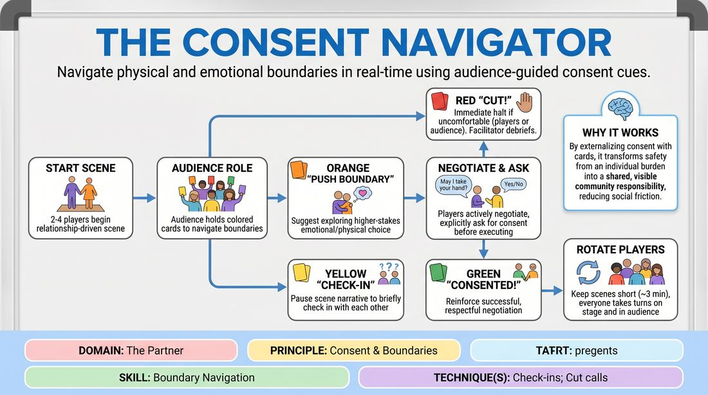

# The Boundary Compass

{ .game-hero }

> Navigate physical and emotional boundaries in real-time using audience-guided consent cues.

## Overview
A structured, audience-interactive training drill where players perform a scene while navigating real-time boundary prompts from the crowd. Using color-coded cards, the audience signals when players should check in, explore a boundary, or stop the scene entirely. This exercise builds a shared vocabulary for physical and emotional safety, training improvisers to prioritize personal comfort over performance pressure.

## What It Trains
- **Domain:** D2 — The Partner
- **Principle(s):** Consent & Boundaries; Truth Over Pandering
- **Skill(s):** Boundary Navigation; Room Reading
- **Technique(s):** Check-ins; Cut calls; Negotiating physical contact
- **Focus:** skill_drill

**Objective:** To develop real-time boundary navigation and explicit check-in techniques, training players to prioritize personal safety and authentic comfort ('Truth Over Pandering') over audience pleasing.

## Setup
An in-person playing space with a clear stage area and an audience seating area. Prepare four sets of colored cards for the audience: Yellow ('CHECK-IN'), Orange ('PUSH BOUNDARY'), Red ('CUT!'), and Green ('CONSENTED!'). Distribute these cards among the audience members. Establish a universal, non-verbal physical gesture (e.g., crossing wrists) or a verbal safe word that any player can use to instantly pause the scene.

## How to Play
1. Select two to four competent players to step onto the stage to begin a standard, relationship-driven scene based on a simple suggestion.
2. Instruct the remaining participants to act as the active audience, holding their colored cards ready to assist in navigating the scene's boundaries.
3. When an audience member holds up a Yellow 'CHECK-IN' card, the active players must briefly pause the scene's narrative flow to explicitly check in with each other, either verbally ('Are you comfortable with me getting closer?') or non-verbally (eye contact and a nod).
4. When an audience member holds up an Orange 'PUSH BOUNDARY' card, it acts as a suggestion to explore a higher-stakes emotional or physical choice (e.g., a hug, a confrontation, or a secret).
5. Upon seeing the Orange card, the players must actively negotiate the proposed boundary before executing it, explicitly asking for consent (e.g., 'May I take your hand?') and waiting for a clear response.
6. Emphasize that players must practice 'Truth Over Pandering': if an Orange card suggests a boundary push that a player is genuinely uncomfortable with, they must decline, modify the action, or redirect the scene.
7. If any audience member or player holds up a Red 'CUT!' card (or uses the pre-established physical gesture), the scene must immediately halt, and the facilitator will step in to supportively reset the space.
8. If the players successfully and respectfully negotiate a boundary push with clear communication, audience members may hold up the Green 'CONSENTED!' card to reinforce the positive practice.
9. Keep each scene short (approximately 3 minutes) to maintain focus, then rotate players so everyone has a turn both on stage and in the audience.

## Facilitation Notes
- Clarify the Orange Card: Explicitly instruct the audience that 'PUSH BOUNDARY' is an invitation to explore, never a command. Players always have the absolute right to say no.
- Normalize the Red Card: Frame the 'CUT!' card not as a failure or a punishment, but as a vital safety valve. Celebrate its use as a sign of a healthy, functional creative environment.
- Manage Cognitive Load: Remind players that it is completely fine to break character or drop the theatrical reality for a moment to conduct a clean, clear check-in.
- Watch for Pandering: If you notice a player agreeing to a physical touch or emotional escalation with visible hesitation or discomfort just to keep the scene 'entertaining,' gently pause the scene and coach them to honor their boundary.
- Keep Debriefs Supportive: Ensure that any discussion following a 'CUT!' card is focused on learning and system mechanics, avoiding any blame, shame, or personal exposure.

## Variations
- Silent Negotiations: Run the game where all check-ins and boundary negotiations must be done entirely through non-verbal cues, such as eye contact, open palms, or physical distance.
- The Director's Cut: Instead of the entire audience holding cards, designate two 'Safety Directors' who sit in the front row and manage the cards, allowing the rest of the audience to watch normally.

## Debrief
- How did it feel to have the audience actively participate in maintaining the safety of the scene?
- What internal signals did you notice when an Orange 'PUSH BOUNDARY' card was raised, and how did you decide whether to accept or decline?
- How did practicing explicit check-ins affect the pacing and trust between you and your scene partner?
- For the audience, what specific cues made a boundary negotiation feel safe, clear, and successful?

## Safety & Inclusion
This game is highly safety-sensitive. Before starting, establish a firm rule that any player can veto any physical contact or topic without needing to explain why. Ensure the physical gesture for 'CUT!' is highly visible (such as crossed wrists over the chest) so players with vocal strain or soft voices can easily halt the action. Participation on stage must be entirely voluntary; players who prefer to remain in the audience holding cards should be fully supported.

## Why It Works
By externalizing the consent process through audience cards, the game removes the social friction of initiating a boundary check-in. It transforms safety from an individual burden into a shared, visible community responsibility. Forcing players to negotiate boundaries in real-time breaks the habit of automatic compliance ('yes-and' without boundaries) and builds the muscle memory of prioritizing personal comfort over theatrical performance.
