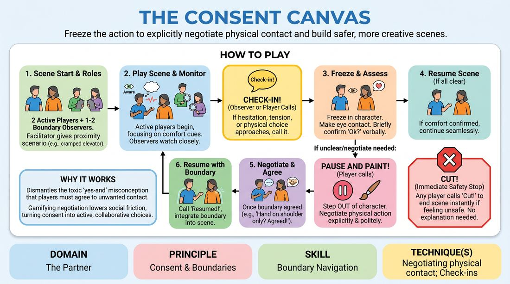

# The Boundary Canvas

{ .game-hero }

> Freeze the action to explicitly negotiate physical contact and build safer, more creative scenes.

## Overview
A skill-building exercise where players practice pausing scenes to explicitly negotiate physical boundaries and contact. By introducing a dedicated observer role and a structured pause-and-negotiate mechanic, players learn to prioritize authentic comfort over polite compliance. The resulting scenes become richer and more creative because boundaries are treated as inspiring narrative choices rather than interruptions.

## What It Trains
- **Domain:** D2 — The Partner
- **Principle(s):** Consent & Boundaries; Truth Over Pandering
- **Skill(s):** Boundary Navigation; Active Listening; Support Work
- **Technique(s):** Check-ins; Cut calls; Negotiating physical contact
- **Focus:** skill_drill

**Objective:** Develops proactive boundary navigation, active listening, and physical contact negotiation. It trains players to value Truth Over Pandering by making explicit consent a collaborative tool that enhances scene work.

## Setup
A clear, open physical space. No props. Divide the group so that two players are active on stage, one or two players act as Boundary Observers on the sidelines, and the rest observe.

## How to Play
1. Designate two active players to start a scene, and one or two off-stage players as Boundary Observers.
2. The facilitator provides a scenario that naturally implies close physical proximity or potential physical contact, such as sharing a cramped elevator during a power outage.
3. The active players begin the scene, focusing on physical storytelling and maintaining high awareness of their partner's non-verbal comfort cues.
4. At any point, if a Boundary Observer notices subtle hesitation, physical tension, or an approaching physical choice, they call out Check-in!
5. Upon hearing Check-in!, the active players freeze in character, make eye contact, and briefly assess their comfort levels before verbally confirming they are okay to proceed or adjusting their positioning.
6. If any player (active or observer) feels a boundary is unclear or wants to negotiate a physical choice, they call Pause and Paint!
7. The active players immediately step out of character and engage in a brief, explicit, and polite verbal negotiation regarding the physical action.
8. Once both players agree on the physical boundary, they say Agreed!, step back into character, call Resumed!, and continue the scene, seamlessly integrating the negotiated physical choice.
9. At any point, any player can call Cut! to immediately end the scene if they feel unsafe or if a boundary is crossed, with no explanation required.

## Facilitation Notes
- Coaching Cue: Watch the shoulders and breath—if you see your partner tense up, proactively offer a check-in before they have to ask.
- Pitfall & Fix: Players might feel that pausing ruins the flow of the scene. Fix: Remind them that a clear, negotiated boundary actually unlocks deeper, more committed physical choices because both players now feel completely safe to commit.
- Coaching Cue: Be specific in your negotiations. Instead of saying don't touch me, try I am comfortable with contact on my forearms, but not my waist.
- Pitfall & Fix: The Boundary Observer might hesitate to interrupt. Fix: Encourage observers to call Check-in! even for minor moments of curiosity, framing it as a supportive tool rather than a correction.

## Variations
- In-Character Telegraphing: Players must verbally telegraph their physical intentions in-character before executing them (e.g., I am going to place my hand on your shoulder now to steady you).
- Silent Cues: Instead of verbal calls, players use a specific non-verbal physical gesture (like a raised open palm) to signal a Pause and Paint moment.

## Debrief
- How did stepping out of character to negotiate affect your physical commitment once the scene resumed?
- Did you feel any internal pressure to pander or agree to contact you weren't fully comfortable with? How did you handle it?
- For the observers, what physical cues helped you identify when a check-in was needed?
- How does explicit boundary negotiation actually expand our creative choices rather than limiting them?

## Safety & Inclusion
This game deals directly with physical contact and personal boundaries. Establish a firm no-shame policy for setting boundaries. Ensure players know they have absolute autonomy over their bodies, and that saying no or requesting an adjustment is a celebrated, creative contribution to the room.

## Why It Works
It dismantles the toxic yes-and misconception that players must agree to physical contact they do not want. By gamifying the pause-and-negotiate process, it lowers the social friction of boundary setting, turning consent into an active, collaborative design choice that builds trust and physical freedom.
