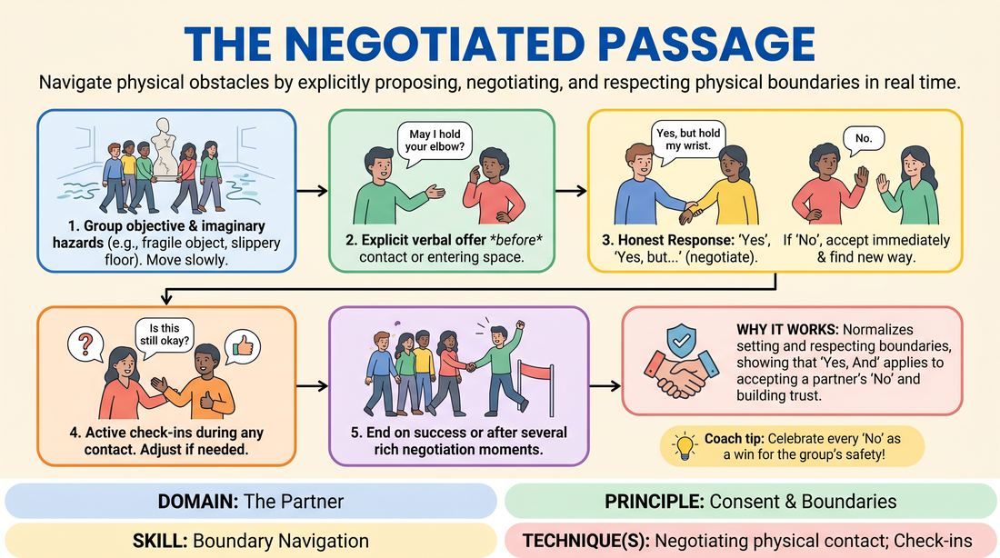

# The Negotiated Passage

{ .game-hero }

> Navigate physical obstacles by explicitly proposing, negotiating, and respecting physical boundaries in real time.

## Overview
A physical ensemble exercise where players collaborate to cross a space or move an object while navigating imaginary hazards. To overcome these obstacles, players must explicitly negotiate any physical contact or close proximity, prioritizing personal comfort over theatrical convenience. It creates a safe, structured environment to practice setting, respecting, and adapting to physical boundaries.

## What It Trains
- **Domain:** D2 — The Partner
- **Principle(s):** Consent & Boundaries; Yes, And; Truth Over Pandering
- **Skill(s):** Boundary Navigation; Active Listening; Offer Reception; Support Work
- **Technique(s):** Check-ins; Cut calls; Negotiating physical contact
- **Focus:** skill_drill

**Objective:** To develop practical skills in negotiating physical contact, navigating personal boundaries, and prioritizing personal truth over scene-pleasing (Truth Over Pandering) during physical collaboration.

## Setup
A clear, open playing space free of physical hazards. No props are required. The facilitator stands where they can observe all players' physical interactions and facial expressions clearly.

## How to Play
1. Establish a simple, low-stakes physical objective for the group, such as moving an imaginary fragile sculpture from one side of the room to the other.
2. Instruct players to begin moving across the space to complete the objective, maintaining a slow, deliberate pace.
3. Introduce imaginary environmental hazards dynamically (e.g., a narrow ledge, a patch of slippery ice, a low-hanging canopy) that naturally invite physical support or proximity.
4. Require players to make an explicit verbal offer before initiating any physical contact or entering another player's intimate space (e.g., 'May I hold your elbow to steady you?').
5. The receiving player must respond with absolute personal honesty, choosing 'Yes' (enthusiastic agreement), 'Yes, but...' (negotiated contact, e.g., 'Yes, but hold my shoulder instead'), or 'No, thank you' (boundary set).
6. If a player says 'No' or requests an alternative, the group must immediately accept the boundary without question or defense, and collaboratively find a different physical solution to the obstacle.
7. Encourage active check-ins during any sustained physical contact, with the initiator asking questions like 'Is this still okay?' and adjusting immediately based on the response.
8. End the round once the group successfully navigates the space, or when the facilitator calls 'scene' after several rich negotiation moments have occurred.

## Facilitation Notes
- Pre-game briefing: Explicitly state that 'No' is a complete, celebrated sentence and that personal safety always overrides narrative momentum.
- Watch for 'pandering': If a player hesitates, grimaces, or reluctantly agrees to contact, pause the game immediately to check in and validate their right to say no.
- Model the behavior: Demonstrate clear, specific verbal offers and graceful, non-defensive responses to a 'No' before the players begin.
- Keep the physical stakes low: Ensure the imaginary task is simple so players focus entirely on the communication and consent mechanics rather than 'winning' the game.

## Variations
- Silent Invitations: Players must negotiate boundaries using only clear, slow physical gestures and eye contact, waiting for an explicit physical nod or counter-gesture before touching.
- In-Character Integration: Run the same exercise but have players maintain their improvised characters, practicing how to negotiate real-world personal boundaries while staying in the scene's fiction.

## Debrief
- How did it feel to explicitly ask for permission before touching someone, compared to doing it instinctively?
- When receiving an offer, did you feel any internal pressure to say 'yes' just to keep the game moving? How did you handle that?
- For those who set a boundary or said 'no,' how did it feel to have that boundary immediately accepted and celebrated?
- How can we bring this level of explicit physical care and negotiation into our regular, fast-paced improv scenes?

## Safety & Inclusion
This game is highly safety-sensitive. Participation must be entirely voluntary. Ensure players know they can step out at any time. Respect all physical boundaries immediately without requiring explanation. For players with mobility or physical accessibility needs, adapt the imaginary obstacles to focus on proximity, verbal guidance, or alternative supportive gestures.

## Why It Works
By gamifying the act of boundary-setting and celebrating the word 'No,' this exercise dismantles the traditional improv pressure to always agree physically. It teaches players that 'Yes, And' applies to accepting a partner's boundaries, showing that respecting a boundary actually opens up new, creative, and safe narrative pathways.
