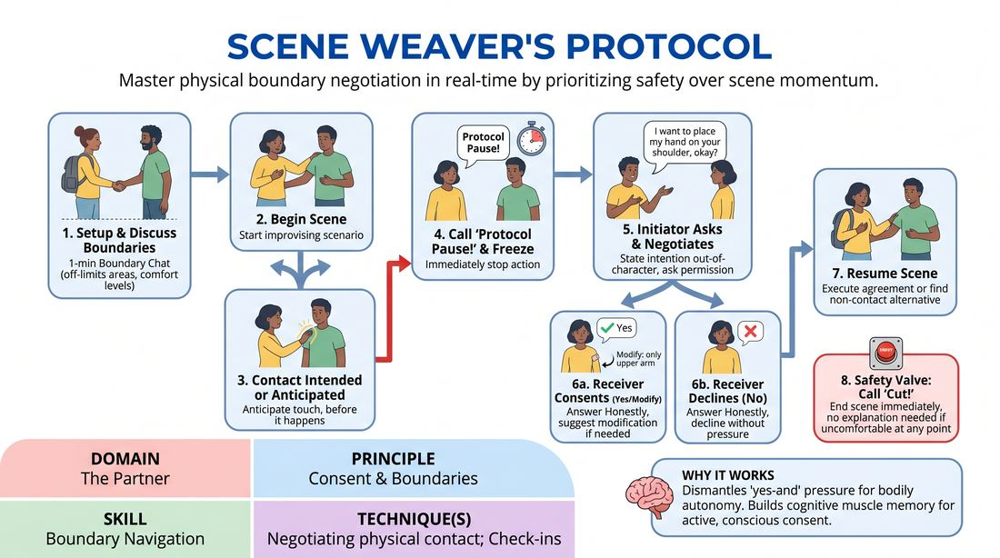

# The Touch Protocol

{ .game-hero }

> Master physical boundary negotiation in real-time by prioritizing safety over scene momentum.

## Overview
The Touch Protocol is a structured scene-work drill where players deliberately interrupt their own scenes to negotiate physical contact before it occurs. By normalizing out-of-character pauses, players build muscle memory for active consent and learn to prioritize personal boundaries over theatrical flow. The experience shifts the focus from performing to establishing a safe, collaborative physical space.

## What It Trains
- **Domain:** D2 — The Partner
- **Principle(s):** Consent & Boundaries; Truth Over Pandering
- **Skill(s):** Boundary Navigation; Active Listening
- **Technique(s):** Check-ins; Cut calls; Negotiating physical contact
- **Focus:** skill_drill

**Objective:** To develop practical skills in negotiating physical contact, navigating personal boundaries, and practicing 'Truth Over Pandering' by asserting comfort levels in real-time.

## Setup
Players stand in a circle. The facilitator introduces the concept of physical safety, the 'Protocol Pause', and the 'Cut' command. Players are paired up and given a simple scenario that naturally invites physical proximity or contact.

## How to Play
1. Pair up players and assign each pair a scenario that naturally suggests physical contact, such as comforting a sad friend or helping someone pack a heavy box.
2. Before starting the scene, partners spend one minute out-of-character discussing their physical boundaries, stating what areas are off-limits and what types of touch they are comfortable with.
3. The players begin improvising the scene in the designated performance space.
4. At any moment, if a player intends to initiate physical contact, or anticipates that contact is about to occur, they must call out 'Protocol Pause!' and freeze.
5. The initiating player must clearly state their physical intention out-of-character, such as 'I want to place my hand on your shoulder to comfort you.'
6. The initiator asks, 'Is that okay?' The receiving partner must answer honestly with 'Yes', 'No', or a modified agreement like 'Yes, but only on my upper arm.'
7. If consent is given or modified, the players resume the scene, executing only the agreed-upon contact. If the answer is 'No', they resume the scene but must find a non-physical way to express the dynamic.
8. At any point, if a player feels surprised, uncomfortable, or has a boundary crossed, they can call 'Cut!' to immediately end the scene with no explanation required.

## Facilitation Notes
- Embrace the Clunkiness: Remind players that interrupting the scene is the entire point of the drill; we are prioritizing safety over artistic flow.
- Validate the 'No': Actively praise players who say 'No' or offer modifications, reinforcing that setting boundaries is a successful improv choice.
- Model Specificity: Encourage players to be highly specific with their requests, such as 'a light tap on the forearm' instead of 'touching you'.
- Watch for Pandering: Intervene if you notice a player agreeing to contact they clearly look hesitant about; remind them of 'Truth Over Pandering'.

## Variations
- In-Character Negotiation: Advanced players can attempt to negotiate physical boundaries while remaining in character, using dialogue that fits the scene's reality.
- The Shadow Director: A third player stands on the sideline and can call 'Protocol Pause!' on behalf of the actors if they sense physical tension or unnegotiated proximity.

## Debrief
- How did it feel to intentionally break the scene's momentum to ask for permission?
- Did you feel any internal pressure to say 'Yes' when you wanted to say 'No' or modify the touch? How did you handle that?
- How does knowing you have an absolute 'Protocol Pause' affect your freedom to move and act in a scene?

## Safety & Inclusion
This exercise is highly safety-sensitive. Emphasize that boundaries can change mid-scene; a 'Yes' at the start can become a 'No' at any time. Ensure players know that calling 'Cut!' is a tool of empowerment, not a failure, and must be respected instantly without debate or defense.

## Why It Works
By forcing players to step out of the fictional narrative to negotiate physical touch, the game dismantles the pressure of 'yes-and' when it comes to bodily autonomy. It builds cognitive muscle memory, making consent an active, conscious habit rather than an afterthought.
