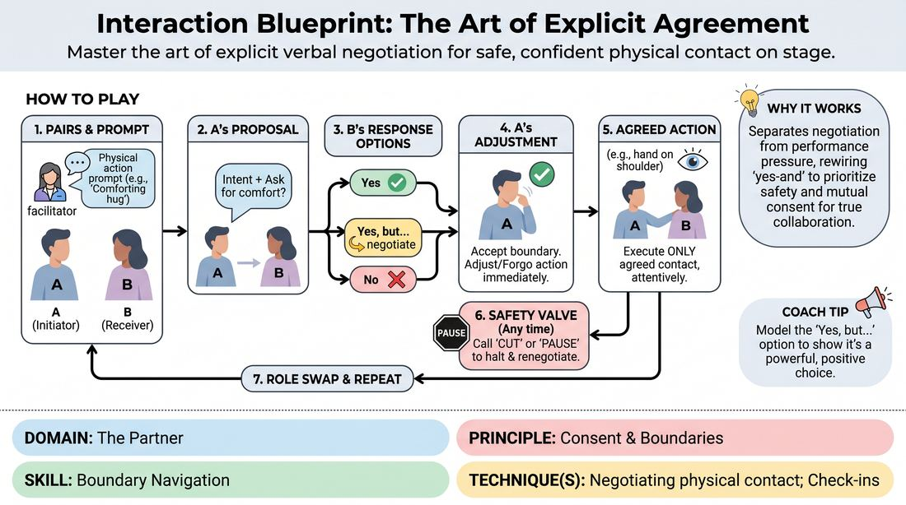

# The Agreement Blueprint

{ .game-hero }

> Master the art of explicit verbal negotiation for safe, confident physical contact on stage.

## Overview
This structured exercise provides a safe, low-stakes environment for players to practice negotiating physical touch. By explicitly verbalizing intentions and boundaries before any physical contact occurs, participants build trust and establish clear communication channels. The experience shifts the focus from pleasing a partner to honoring personal comfort and agency.

## What It Trains
- **Domain:** D2 — The Partner
- **Principle(s):** Consent & Boundaries; Truth Over Pandering
- **Skill(s):** Boundary Navigation
- **Technique(s):** Check-ins; Cut calls; Negotiating physical contact
- **Focus:** skill_drill

**Objective:** To develop practical skills in boundary navigation and physical contact negotiation, ensuring players can confidently initiate, modify, or decline physical touch while prioritizing personal safety over performance pressure.

## Setup
An open room with enough space for players to work in pairs without crowding. No props or materials are required. The facilitator should prepare a list of common physical interactions (e.g., a hand on the shoulder, a high-five, a comforting hug, guiding someone by the elbow).

## How to Play
1. Divide the group into pairs and designate one person as Player A (the Initiator) and the other as Player B (the Receiver) for the first round.
2. The facilitator calls out a specific physical interaction prompt, such as offering a comforting hug or placing a hand on a shoulder to guide someone.
3. Player A must verbally propose the physical action to Player B, explicitly stating their character's intent and asking for Player B's comfort level and specific preferences before making any physical movement.
4. Player B must respond with absolute honesty, choosing one of three options: a direct Yes, a conditional Yes, but... (negotiating the touch, e.g., Yes, but only on my forearm), or a clear No, thank you.
5. If Player B negotiates or declines, Player A must immediately accept the boundary without question, adjusting the physical action to match the agreed terms or finding a non-physical alternative to convey their character's intent.
6. If agreement is reached, Player A carefully executes the physical interaction, remaining highly attentive to Player B's verbal and non-verbal cues throughout the movement.
7. At any point during the physical interaction, either player can call Cut or Pause to immediately halt the action, allowing them to adjust, renegotiate, or safely end the contact.
8. After completing the interaction, partners reset, swap roles (Player B becomes the Initiator), and wait for the facilitator to announce a new physical prompt.

## Facilitation Notes
- Actively celebrate the No: Praise players who set clear boundaries or decline offers, framing a No as a gift of clarity that strengthens the partnership.
- Watch for non-verbal mismatch: If a player verbally says Yes but shows physical hesitation or tension, gently pause the exercise to check in and remind them to prioritize truth over pleasing their partner.
- Model the behavior first: Demonstrate a clear, specific verbal check-in and a graceful negotiation (the Yes, but...) with a volunteer before letting the group begin.
- Keep the pace brisk but mindful: Ensure pairs do not over-analyze the scene itself; the focus is on the mechanical loop of proposal, negotiation, and execution.
- Gradually scale intensity: Start with very low-stakes touch (e.g., a high-five or handshake) before moving to more personal interactions (e.g., a hand on the back or a hug).

## Variations
- In-Character Integration: Run the same negotiation loop, but players must stay in their improvised characters while checking in, blending the boundary negotiation seamlessly into the scene's dialogue.
- The Silent Echo: Players use subtle, non-verbal physical offers (like extending an open hand) and wait for an explicit physical acceptance (like placing a hand on top) before proceeding, practicing physical listening.

## Debrief
- How did it feel to explicitly ask for permission before touching your partner, and did it hinder or help your sense of play?
- What was the internal experience of saying No or Yes, but...? Did you feel any pressure to pander or just say Yes?
- How did having the Cut or Pause option affect your level of comfort and willingness to take physical risks?
- How can we carry this level of explicit safety and boundary awareness into fast-paced, spontaneous scene work?

## Safety & Inclusion
This exercise is highly safety-sensitive. Participation must be entirely voluntary, and players must be reminded that they have absolute sovereignty over their bodies. If a participant prefers not to engage in physical touch, they can participate by practicing verbal boundary setting or acting as an active observer/coach for a pair.

## Why It Works
By separating the negotiation of physical touch from the pressure of performance, this game rewires the traditional yes-and instinct to prioritize personal safety. It teaches players that true collaboration requires mutual consent, and that setting a boundary actually increases trust, allowing for freer and more confident physical choices on stage.
