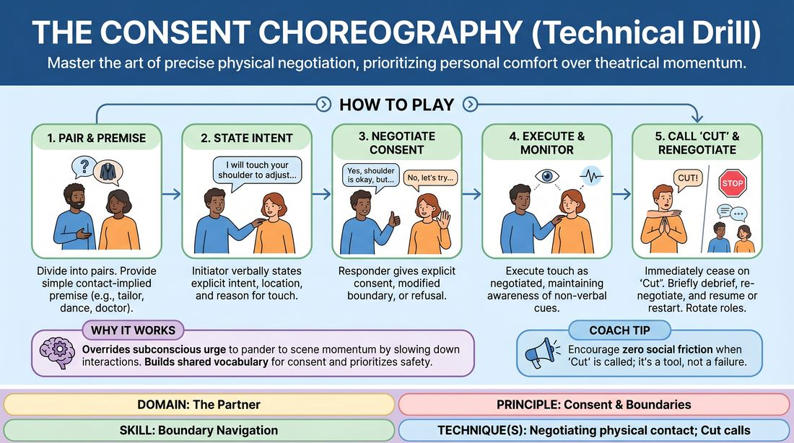

# The Physical Agreement Drill

{ .game-hero }

> Master the art of precise physical negotiation, prioritizing personal comfort over theatrical momentum.

## Overview
A structured, low-stakes technical drill where players practice explicit, granular verbal negotiation before making any physical contact. It normalizes setting clear boundaries, calling 'Cut' when comfort levels shift, and collaboratively re-routing scenes to prioritize player safety.

## What It Trains
- **Domain:** D2 — The Partner
- **Principle(s):** Consent & Boundaries; Truth Over Pandering
- **Skill(s):** Boundary Navigation; Active Listening; Offer Reception
- **Technique(s):** Negotiating physical contact; Cut calls; Check-ins
- **Focus:** skill_drill

**Objective:** To build muscle memory for negotiating physical contact, establishing clear boundaries, and confidently revoking consent in real-time without disrupting creative collaboration.

## Setup
An open, comfortable space. Players work in pairs or small groups of three. No props are required.

## How to Play
1. Divide players into pairs (or trios) and assign one player as the 'Initiator' and the other as the 'Responder.'
2. Provide a simple scene premise that naturally implies physical contact, such as a tailor fitting a suit, a dance instructor guiding a turn, or a doctor examining a sprained wrist.
3. Instruct the Initiator to identify a specific physical objective that requires touching the Responder, such as adjusting a collar, guiding a hip, or holding a hand.
4. Before making any physical contact, the Initiator must verbally state exactly what they intend to do, where they will touch, and why, leaving no room for ambiguity.
5. The Responder must listen actively and respond with explicit verbal consent, a modified boundary, or a clear refusal (e.g., 'Yes, you can touch my shoulder,' or 'Please don't touch my waist, but you can guide my elbow instead').
6. The Initiator must execute the physical contact exactly as negotiated, maintaining active awareness of their partner's non-verbal cues.
7. At any point during the interaction, if the Responder feels uncomfortable or if the touch feels different than expected, they must immediately call 'Cut' or say 'Stop.'
8. Upon hearing 'Cut,' all physical contact and scene action must immediately cease with zero social friction or defense.
9. The pair pauses to briefly debrief what occurred, re-negotiate the physical boundary, and either resume the scene with the new agreement or restart the interaction entirely.
10. Rotate roles so every player experiences both initiating requests and setting boundaries.

## Facilitation Notes
- Frame as a Technical Drill: Remind players that this is a mechanics-focused exercise, not a performance. Awkwardness is a natural and valuable part of learning this vocabulary.
- Celebrate the 'No' and 'Cut': Actively praise players who set firm boundaries or halt the action. Make boundary-setting the celebrated 'win' of the exercise.
- Enforce Hyper-Specificity: Do not let players make vague requests like 'Can I touch you?' Push them to specify the exact location, pressure, and duration (e.g., 'May I place two fingers on your collarbone to adjust this strap?').
- Address the 'Yes-And' Trap: Explicitly coach players that 'Truth Over Pandering' means their real-world physical comfort always overrides the improv rule of agreement.
- Monitor Non-Verbal Cues: Encourage players to watch for hesitation, tensing, or pulling back, and treat those physical cues as an invitation to pause and check in verbally.

## Variations
- The Sequence Negotiation: Instead of negotiating single touches, the Initiator must negotiate a multi-step sequence of physical actions before starting (e.g., 'First I will take your hand, then spin you, then place my hand on your shoulder blade. Are you comfortable with that sequence?').
- The Blind Check-In: The Responder closes their eyes, and the Initiator must verbally describe the proposed touch, allowing the Responder to focus entirely on their internal comfort level without visual influence.

## Debrief
- How did it feel to ask for consent with such extreme specificity compared to how we normally interact?
- What internal pressures did you feel to say 'yes' when you actually wanted to set a boundary, and how did you navigate that?
- How does knowing you can call 'Cut' at any moment affect your sense of creative freedom in a physical scene?
- What non-verbal signals did you notice that helped you gauge your partner's comfort level before or during the touch?

## Safety & Inclusion
This exercise is highly safety-sensitive. Establish a firm, zero-judgment container before starting. Remind players that they have absolute autonomy over their bodies; no player is ever required to accept physical contact, and setting a boundary is a gift of clarity to their partner. If a player prefers not to engage in physical touch at all, they can participate as an observer or practice purely verbal boundary-setting.

## Why It Works
By slowing down physical interactions and forcing explicit verbal negotiation, this drill overrides the subconscious urge to 'pander' to the scene's momentum at the expense of personal safety. It builds a shared vocabulary for consent, transforming boundary navigation from an awkward interruption into a collaborative, supportive tool that actually increases creative trust.
