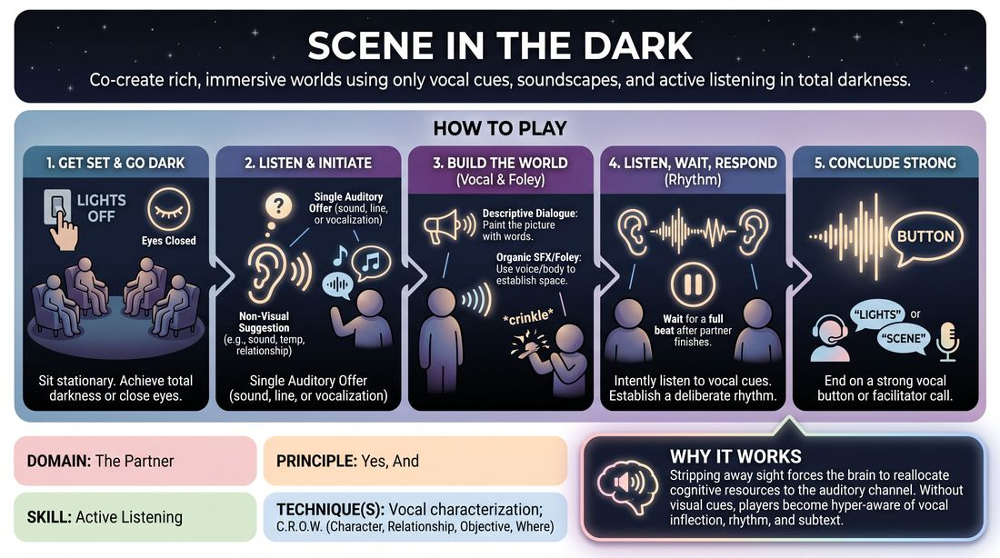

# Scene in the Dark

{ .game-hero }

> Co-create rich, immersive worlds using only vocal cues, soundscapes, and active listening in total darkness.

## Overview
In this sensory-deprivation exercise, players perform an entire scene without any visual input, either by turning off the lights or closing their eyes. By stripping away physical gestures and facial expressions, participants must rely entirely on vocal tone, pacing, and self-generated sound effects to co-create their environment. The result is a highly focused, auditory experience that sharpens sensory awareness and deepens partner connection.

## What It Trains
- **Domain:** D2 — The Partner
- **Principle(s):** Yes, And; Show, Don't Tell; Group Mind
- **Skill(s):** Active Listening; Vocal Craft; World-Building; Pacing & Rhythm
- **Technique(s):** Vocal characterization; C.R.O.W. (Character, Relationship, Objective, Where)
- **Focus:** mixed

**Objective:** To cultivate hyper-focused active listening, vocal variety, and collaborative world-building under the 'Yes, And' principle by removing visual cues, forcing players to build scenes purely through sound, and mastering the pacing of auditory hand-offs.

## Setup
A room that can be made completely dark, or where players can comfortably sit with their eyes closed. Ensure the floor is entirely clear of obstacles, chairs, and bags before beginning. For online play, players prepare to turn off their cameras and use high-quality audio settings.

## How to Play
1. Position two to four players in stationary, comfortable seated positions within the performance space to prevent any physical movement or tripping hazards.
2. Extinguish the lights to achieve total darkness, or instruct all players and audience members to close their eyes and remain completely still.
3. Obtain a non-visual suggestion from the group, such as a specific temperature, a relationship dynamic, or an ambient sound, to inspire the scene.
4. Begin the scene with a single auditory offer, which can be a line of dialogue, a non-verbal vocalization, or a physical sound effect.
5. Listen intently to the pitch, volume, and emotional subtext of your partner's voice, accepting their vocal choices as absolute reality.
6. To prevent overlapping dialogue, establish a deliberate rhythm: wait for a full beat of silence after your partner finishes speaking before initiating your response.
7. Use descriptive dialogue to paint a picture of physical actions and the environment, explicitly stating movements that would normally be seen.
8. Incorporate organic sound effects (foley) using your voice or gentle body percussion to establish the physical space.
9. Conclude the scene on a strong vocal button, or when the facilitator calls 'lights' or 'scene' to end the play.

## Facilitation Notes
- Side-coaching cue: 'Listen to the space between the words. What does the silence tell you about the relationship?'
- Side-coaching cue: 'Describe your physical actions through natural dialogue, rather than just narrating what you do.'
- To manage overlapping dialogue, coach players to inhale audibly before speaking, or use a 'pass-the-baton' vocal cue, ensuring only one person speaks at a time.
- Strictly enforce the stationary rule: players must remain seated. If they wish to simulate movement, they must do so entirely through vocal projection (e.g., fading their voice out to sound far away).
- For online platforms, have all players turn off their video feeds. Instruct them to use headphones to capture subtle vocal inflections and prevent audio echo or clipping.

## Variations
- The Virtual Radio Play: Conducted over video conferencing software with all cameras turned off. Players use high-quality microphones and headphones to create a highly polished, spatial audio experience.
- The Foley Crew: Non-performing players sit on the sidelines and provide live, organic sound effects to support the main actors' scene.
- Spatial Distance: Players stand in different corners of the room and must use vocal volume and directional projection to simulate moving closer together or further apart.

## Debrief
- How did the absence of sight change how quickly or slowly you responded to your partner?
- What specific vocal techniques did you use to make the physical environment feel real to the listener?
- How did you handle pauses and silence differently than you would in a fully lit scene?
- For those playing online or with eyes closed, how did the lack of visual feedback affect your sense of connection?

## Safety & Inclusion
Complete darkness can trigger anxiety, disorientation, or claustrophobia. Always offer the option to keep eyes closed instead of turning off the lights, and allow players to sit near an exit. Ensure the floor is completely clear of wires, chairs, or bags before starting. For physical safety, players must remain seated throughout the exercise.

## Why It Works
Stripping away sight forces the brain to reallocate cognitive resources to the auditory channel. Without facial expressions or body language to rely on, players must become hyper-aware of vocal inflection, rhythm, and subtext. This builds a pure form of 'Yes, And' where every sound is treated as a vital brick in the imaginary world.
