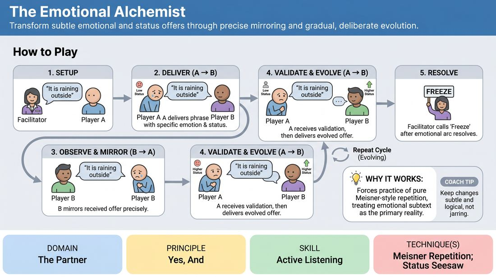

# Subtext Alchemy

{ .game-hero }

> Transform subtle emotional and status offers through precise mirroring and gradual, deliberate evolution.

## Overview
Two players engage in a focused, repetitive verbal exchange using a single neutral phrase to explore the invisible currents of subtext. By mirroring their partner's emotional state and relative status before subtly shifting it, players learn to deeply receive and consciously evolve interpersonal offers. The experience is intimate, highly focused, and reveals how much communication happens beneath literal words.

## What It Trains
- **Domain:** D2 — The Partner
- **Principle(s):** Yes, And; Make Your Partner a Genius; Assume Competence
- **Skill(s):** Active Listening; Status Modulation; Single-Partner Empathy & Mirroring; Offer Reception; Active Gifting; Emotional Fluidity
- **Technique(s):** Meisner Repetition; Status Seesaw; Emotional-echo drills; Endowment-acceptance; Endowment-gifting drills; Give them the answer
- **Focus:** connection

**Objective:** To develop deep active listening, precise offer reception, and controlled status modulation by isolating non-verbal subtext from narrative content.

## Setup
Players stand or sit facing each other in pairs. This can be done with one pair performing for the group or with the entire room working in simultaneous pairs. No props or special staging are required; it functions equally well in physical spaces or video-conferencing grids.

## How to Play
1. The facilitator provides a short, completely neutral phrase that carries no inherent dramatic weight, such as 'The door is closed' or 'It is raining outside'.
2. Player A delivers the phrase to Player B, intentionally imbuing it with a specific, subtle emotional state (e.g., quiet anxiety) and a clear relative status (e.g., slightly subordinate).
3. Player B actively observes Player A's vocal tone, facial expressions, and physical posture to fully absorb the emotional and status cues.
4. Player B repeats the exact same phrase back to Player A, attempting to mirror the received emotion, status, and physical energy as precisely as possible.
5. Player A receives their own offer reflected back to them, validating that the subtext was successfully communicated and accepted.
6. Player A then delivers the phrase a third time, but introduces a subtle, logical evolution of the emotion or status (e.g., shifting from quiet anxiety to defensive frustration) rather than a sudden, disconnected jump.
7. Player B mirrors this new, evolved offer, and the cycle continues back and forth, with players taking turns to mirror and then incrementally transform the subtext.
8. The facilitator calls 'freeze' or 'scene' once a compelling emotional arc has naturally resolved or after a few minutes of sustained connection.

## Facilitation Notes
- Encourage microscopic shifts: Remind players that the exercise loses its power if they jump from 'mild sadness' to 'manic joy.' The transformation should feel like a natural chemical reaction.
- Focus on the physical: If players struggle to find the emotion, coach them to mirror their partner's physical posture, breathing pattern, or head tilt first; the emotional alignment will follow.
- Isolate the text: Ensure players do not alter the words of the phrase. Keeping the text identical forces them to rely entirely on vocal dynamics, pacing, and body language.
- Pitfall: Over-intellectualizing. If players pause too long to analyze what emotion is being offered, coach them to respond immediately based on their gut physical sensation of the partner's energy.

## Variations
- Silent Alchemy: Run the entire cycle without any spoken words, relying purely on facial expressions, posture shifts, and breathing to mirror and transform the connection.
- Status-Only Focus: Restrict the transformation phase so that players keep the emotional tone completely constant while only modulating their relative status up or down.
- The Third-Party Observer: In groups of three, the third player acts as a real-time translator, quietly whispering the perceived subtext (e.g., 'defensive pride') to the audience while the pair plays.

## Debrief
- How did it feel to have your subtle emotional offers perfectly mirrored back to you before they were changed?
- What physical or vocal cues were the easiest to read, and which ones required the most intense focus?
- How does this exercise change how you approach 'Yes, And' when a partner makes a non-verbal choice in a scene?

## Safety & Inclusion
Because this exercise requires sustained eye contact and close emotional observation, players should establish comfort levels beforehand. Participants may opt to focus on a point near their partner's face (like the forehead or nose) if direct eye contact feels overstimulating or uncomfortable.

## Why It Works
By stripping away the cognitive load of inventing new dialogue, this game forces players to practice pure Meisner-style repetition. It operationalizes 'Yes, And' by treating a partner's emotional subtext as the primary reality of the scene, proving that true agreement is felt and embodied rather than just spoken.
