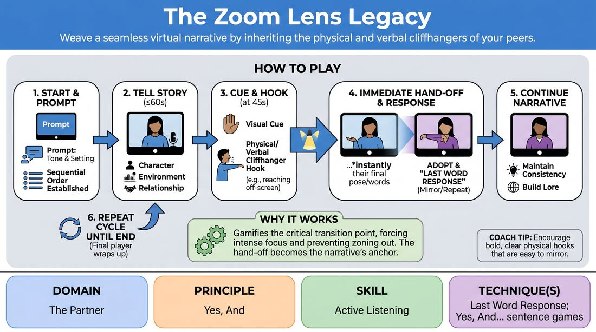

# Legacy of the Frame

{ .game-hero }

> Weave a seamless virtual narrative by inheriting the physical and verbal cliffhangers of your peers.

## Overview
Legacy of the Frame is a collaborative, sequential storytelling game designed for virtual spaces where players co-create a continuous narrative. Taking turns, each player delivers a short monologue that must seamlessly inherit the exact physical posture, gesture, or final words of the preceding storyteller. The result is a highly focused, cinematic chain reaction that transforms isolated webcam feeds into a unified, living story.

## What It Trains
- **Domain:** D2 — The Partner
- **Principle(s):** Yes, And; Serve the Story; Group Mind
- **Skill(s):** Active Listening; Offer Reception; Narrative Architecture; Physicality & Space Work; Pacing & Rhythm
- **Technique(s):** Last Word Response; Yes, And… sentence games; Story Spine; Object work
- **Focus:** narrative

**Objective:** To train active listening, immediate offer reception, and narrative continuity in a digital environment. Players practice the 'Last Word Response' technique physically and verbally, learning to suppress pre-planning by treating the previous player's final moment as the mandatory foundation for their own scene.

## Setup
Players join a virtual meeting room with cameras enabled. The facilitator prepares a single, evocative visual image (the 'Legacy Prompt') to share on screen, and establishes a clear, sequential player order in the chat. Players adjust their camera setups to ensure they have a small amount of physical space to move within their frame.

## How to Play
1. The facilitator displays the visual 'Legacy Prompt' on screen to inspire the narrative's tone and setting, then establishes a clear, sequential player order in the chat.
2. The first player begins the story, delivering a monologue of up to 60 seconds that establishes their character, their environment, and their relationship to the prompt.
3. To manage pacing, the facilitator uses a non-disruptive visual cue (like raising a hand or typing a 10-second warning in chat) as the player approaches the 45-second mark.
4. The active player must conclude their turn with a highly specific, high-stakes physical or verbal 'hook' (e.g., reaching off-screen, gasping at an unseen object, or ending on a cliffhanger sentence).
5. The transition to the next player occurs immediately. If the platform supports spotlighting, the facilitator switches the spotlight; if not, the next player simply unmutes and speaks, or players use 'Hide Non-Video Participants' to auto-focus on the active speaker.
6. The incoming player must instantly adopt the previous player's final state, using the 'Last Word Response' technique by repeating the last word spoken, or physically mirroring the exact posture and gesture of the hand-off.
7. The new player continues the narrative from their character's perspective, building on the established lore while maintaining physical and narrative consistency.
8. This cycle repeats through the established order until all players have contributed, culminating in a final player who wraps up the narrative arc.

## Facilitation Notes
- To prevent monologues from dragging, establish a strict visual time-keeping system. Use a physical colored card (yellow for 'wrap up', red for 'stop') held to the camera, or a gentle chime sound to signal the 15-second wrap-up window without breaking the player's flow.
- If manual spotlighting is too slow or unavailable on your platform, instruct all non-speaking players to turn off their cameras and select 'Hide Non-Video Participants.' The active player simply turns their camera off at the end of their turn, and the next player turns theirs on, creating an instant, automated transition.
- Watch out for players who clearly planned their entry and ignored the previous player's hook. If this happens, gently pause the scene and ask the incoming player: 'What was the very last word or movement you saw? Start exactly there.'
- Encourage players to play with depth (moving close to or far from the camera) and levels (sitting, standing, crouching) to make the virtual frames feel dynamic and three-dimensional rather than static talking heads.

## Variations
- The Last Word Relay: A stricter verbal constraint where the incoming player's very first sentence must begin with the exact last word spoken by the previous player, reinforcing literal active listening.
- The Object Pass: A physical variation where each transition must involve passing a physical object (like a pen, cup, or book) out of the right side of the frame, and the next player must 'receive' it from the left side of their frame, matching the speed and trajectory.
- Large Group Scaling: For groups larger than 10, split players into 'Performers' and 'Directors.' Directors can use the chat to drop mid-scene environmental shifts (e.g., 'The room is filling with water!') that the active performer must immediately justify.

## Debrief
- How did having to inherit the exact physical or verbal end-state of the previous player change your focus while listening?
- What strategies did you use to let go of your pre-planned ideas when the incoming hook didn't match your expectations?
- How did we make the separate, isolated video frames feel like a single, interconnected physical world?

## Safety & Inclusion
Be mindful of camera comfort and home privacy. Allow players to use virtual backgrounds or blur their screens if they prefer not to show their living space. For players with physical mobility limitations, emphasize that 'physical hooks' can be purely facial expressions, eye-line shifts, or small hand gestures close to the camera, ensuring equal participation without physical strain.

## Why It Works
This game works because it gamifies the transition point, which is where virtual collaboration often falters. By making the hand-off the most critical narrative and physical moment, players cannot afford to zone out or plan ahead. It forces absolute presence, turning the technical limitations of video grids into a creative asset that demands rigorous 'Yes, And' commitment.
