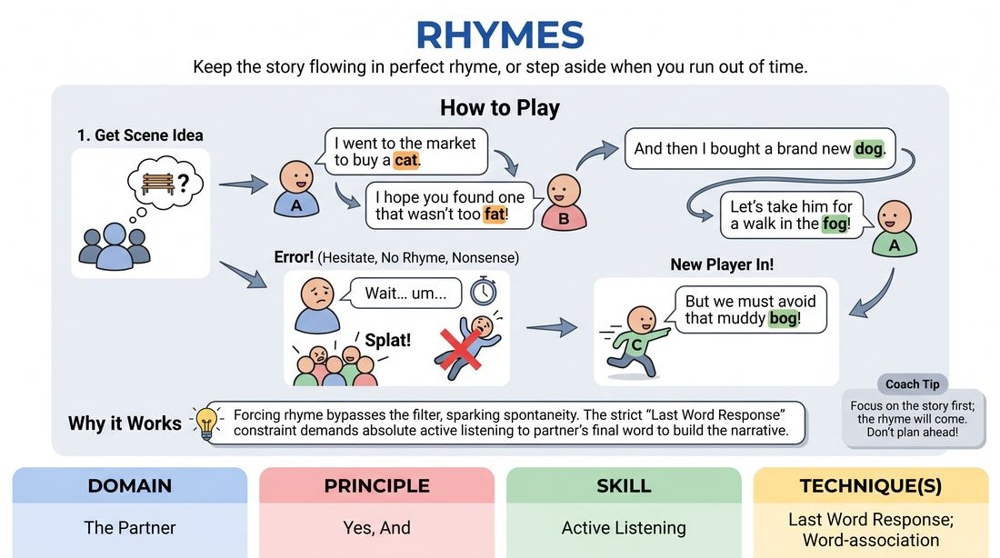

# Rhyming Couplets

{ .game-hero }

> Keep the story flowing in perfect rhyme, or step aside when you run out of time.

## Overview
A fast-paced, narrative-driven elimination game where players perform a scene in rhyming couplets. Players must listen closely to their partner's final word, deliver a rhyming response that advances the plot, and then set up a new rhyme for their partner. If a player hesitates, misses a rhyme, or breaks the story, they exit with a dramatic 'death' and are immediately replaced.

## What It Trains
- **Domain:** D2 — The Partner
- **Principle(s):** Yes, And; Fail Joyfully; Serve the Story
- **Skill(s):** Active Listening; Unfiltered Spontaneity; Narrative Architecture; Pacing & Rhythm
- **Technique(s):** Last Word Response; Word-association; Timing exercises
- **Focus:** comedy_game

**Objective:** Develops intense active listening, rapid-fire verbal spontaneity, and narrative pacing under strict structural constraints, teaching players to prioritize story progression over personal perfection.

## Setup
Players stand in a line or semi-circle facing the performance space. Two players step forward to begin the scene. No props or special staging are required.

## How to Play
1. Ask the group for a simple scene suggestion, such as a location or a relationship, to kick off the narrative.
2. Player A initiates the scene with a single, clear line of dialogue ending in an easily rhymable word.
3. Player B must immediately deliver a line that rhymes with Player A's line, completing the first couplet while advancing the scene's action.
4. Player B then delivers a second, new line of dialogue with a new ending word, setting up the next rhyme.
5. Player A must rhyme with Player B's new line, then deliver another new line to pass the rhyme back to Player B.
6. This alternating pattern continues (A1-B1 rhyme, B2-A2 rhyme, A3-B3 rhyme) to build a cohesive, logical story.
7. If a player hesitates for more than two seconds, fails to rhyme, or delivers a rhyme that makes absolutely no narrative sense, the waiting players shout 'Splat!' or 'Die!'
8. The eliminated player exits the stage dramatically, and the next player in line rushes in to immediately pick up the scene, rhyming with the last line spoken before the elimination.

## Facilitation Notes
- Encourage players to prioritize the story over the rhyme. A simple, obvious rhyme that moves the plot forward is infinitely better than a clever, obscure rhyme that stalls the action.
- Side-coach the waiting players to keep the energy high and call out the elimination word instantly and joyfully, ensuring the exiting player feels celebrated rather than punished.
- Pitfall: Players often try to write ahead in their heads. Remind them to practice active listening by focusing entirely on the partner's last word before formulating their response.
- If a new player enters, they must rhyme with the unrhymed line left hanging by the departing player, keeping the narrative chain unbroken.

## Variations
- Non-Elimination Flow: Play without elimination. If a player gets stuck, their partner or the group can shout out a rhyming word to help them, keeping the same two players on stage.
- Musical Verse: Perform the game to a steady, slow drumbeat or metronome click to enforce a strict rhythmic tempo.
- Genre Switch: Challenge the players to perform the rhyming scene in a specific genre, such as Shakespearean tragedy, sci-fi, or a Western.

## Debrief
- How did the pressure of rhyming affect your ability to listen to your partner's actual story offers?
- What did it feel like to 'fail' and exit the scene? How did celebrating that failure change the energy of the room?
- How does focusing on the very last word spoken by your partner help you stay present in the moment?

## Safety & Inclusion
Ensure the elimination word (e.g., 'Splat!' or 'Out!') is agreed upon by the group; players can substitute a less violent word if preferred. Ensure the physical exit is safe and accessible for all physical abilities, avoiding actual trips or falls.

## Why It Works
By forcing players to rhyme, the game bypasses the analytical brain's filter, sparking unfiltered spontaneity. The strict constraint of the 'Last Word Response' technique demands absolute active listening, as players cannot plan their lines in advance. The elimination mechanic gamifies failure, turning mistakes into high-energy comedy and reinforcing the principle of serving the story over individual ego.
